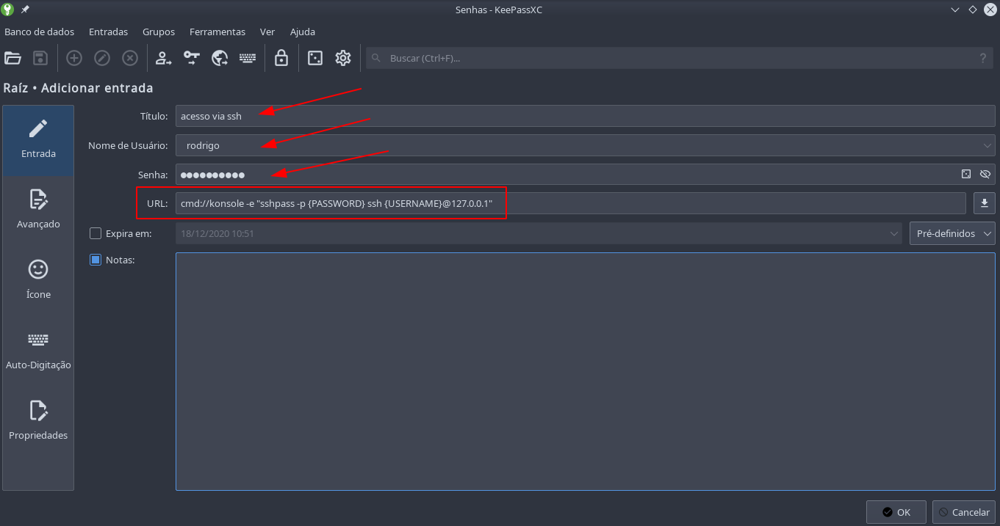
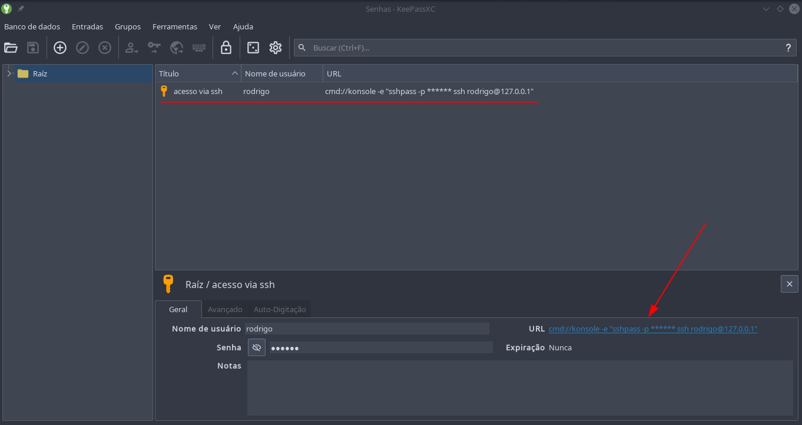
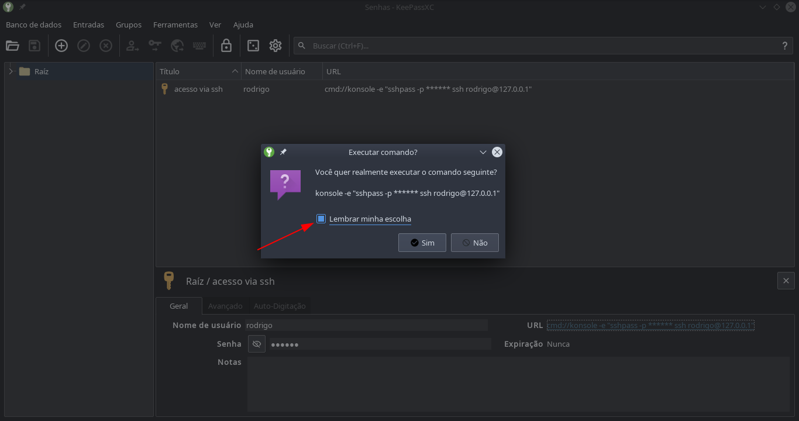
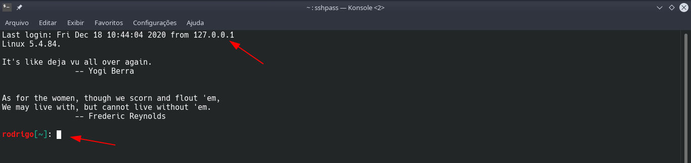
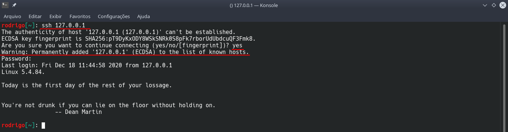
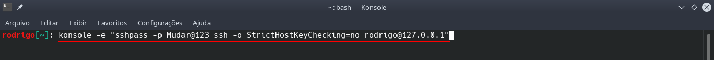

Salve Salve Pessoal!

Algumas pessoas sempre chegam até mim e perguntam qual programa de acesso remoto para Linux que eu uso para acessar os servidores remotamente, seja via RDP (Windows) ou SSH (Linux, BSD, etc).

A resposta é sempre a mesma, **KeePassXC**!

Mas o **KeePassXC** não é um gerenciador de senhas? Sim, mas ele faz mais que isso! :D

Se você não sabe o que é um gerenciador de senhas leia o ótimo artigo de **Vitor Melo**, segue o link:

[https://vitormelo.blog.br/vamos-usar-um-gerenciador-de-senhas/](https://vitormelo.blog.br/vamos-usar-um-gerenciador-de-senhas/)

Com o **KeePassXC** podemos passar como parâmetro comandos na opção de URL, dessa forma podemos abrir um outro programa diretamente por ele.

Nesse post vou mostrar como configurar o **KeePassXC** para abrir o **Konsole** que é o emulador de terminal do **KDE** e acessar um servidor via **SSH**.

Crie uma nova entrada e preencha os campos como na imagem abaixo:

 [ que eu uso para](images/keepass-01.png)

**Título:** é um nome comum para identificar sua entrada.

**Nome de usuário:** nome do usuário que você vai acessar remotamente.

**Senha:** a senha do usuário.

**URL:** normalmente um endereço **IP** ou o **FQDN** do servidor a ser acessado.

Mas como falei anteriormente aqui nós vamos chamar um programa, vamos entender melhor toda essa linha.

**cmd://konsole -e "sshpass -p {PASSWORD} ssh {USERNAME}@127.0.0.1"**

**cmd://** (parâmetro para chamar o programa, nesse caso o **konsole**)

**konsole -e** (o programa, podemos usar qualquer outro aqui, terminator, putty, xterm, etc, a opção **\-e** faz com que o **konsole** chame um comando a ser executado)

**"sshpass -p {PASSWORD} ssh {USERNAME}@127.0.0.1"** ( o comando executado pelo **konsole**, com o **sshpass** podemos passar a senha diretamente para o **ssh**)

O que está entre as chaves **{PASSWORD}** e **{USERNAME}** faz com que usemos o usuário e senha definidos nas opções da entrada.

Pronto, agora que temos a nossa entrada criada basta selecionar ela e clicar em **URL** que o **konsole** será aberto já chamando o **sshpass/ssh**.

[](images/keepass-02.png)

Ao clicar em **URL** pela primeira vez será aberto uma nova aba perguntando se deseja executar o comando, marque **Lembrar minha escolha** para não abrir mais essa aba e clique em **Sim**.

[](images/keepass-03.png)

O **konsole** abrirá logado no servidor.

[](images/keepass-04.png)

**OBS:** Se você nunca acessou o servidor via SSH o **konsole** vai abri e fecha imediatamente dando a impressão de erro, porém isso acontece devido as chaves do servidor remoto não estar presente no arquivo **known\_host** do seu sistema, para resolver isso temos duas possibilidades.

**Primeira** opção é você abrir o **konsole** e acessar o servidor via SSH, como na imagem abaixo:

[](images/keepass-05.png)

A **segunda** opção é colocar o parâmetro **\-o StrictHostKeyChecking=no** comando para o SSH não checar a chave do servidor remoto.

```
cmd://konsole -e "sshpass -p {PASSWORD} ssh -o StrictHostKeyChecking=no {USERNAME}@127.0.0.1"
```

Na verdade nós podemos passar qualquer parâmetro do SSH, como a porta por exemplo.

```
cmd://konsole -e "sshpass -p {PASSWORD} ssh -p35000 -o StrictHostKeyChecking=no {USERNAME}@127.0.0.1"
```

Caso algo ainda esteja dando errado, tente executar o comando diretamente no konsole e veja como se comporta.

[](images/keepass-06.png)

Dessa forma o erro será exibido na tela.

Também uso da mesma forma com o **xfreerdp** para acesso via **RDP**, só ler o manual que você verá como configurar de forma semelhante.

O **KeePassXC** é repleto de possibilidades e ferramentas, acessem a documentação e descubra tudo o que você pode fazer com ele.

[https://keepassxc.org/docs/KeePassXC\_UserGuide.html](https://keepassxc.org/docs/KeePassXC_UserGuide.html)

Até o próximo post!

:D
