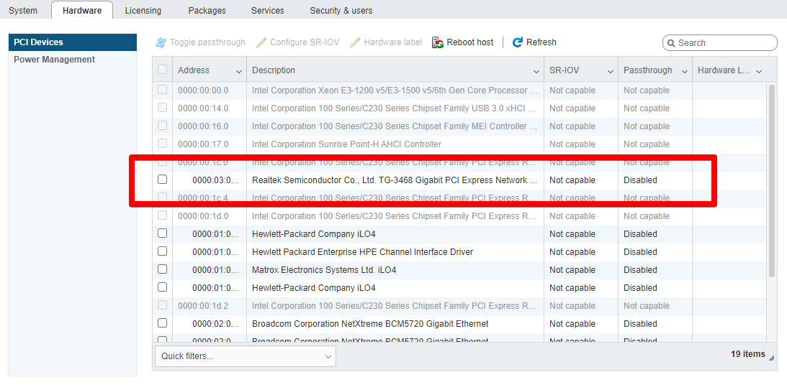
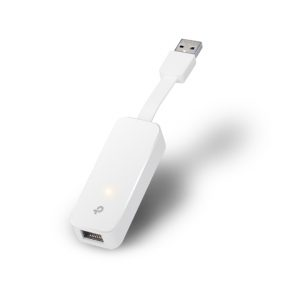
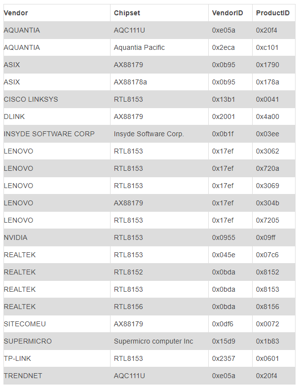
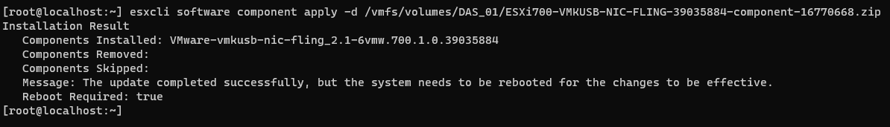
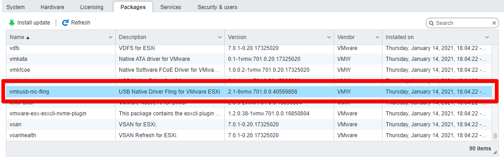
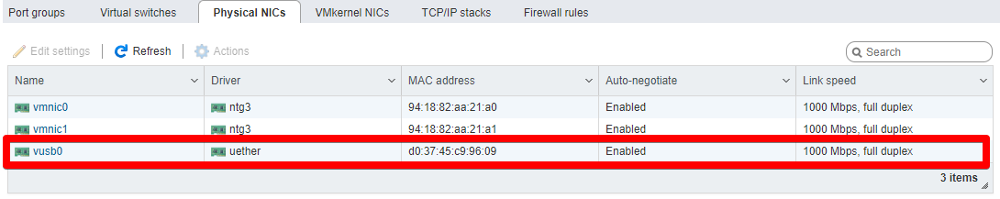
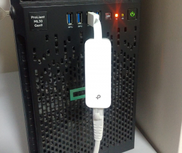

Salve Salve Pessoal!

Muita gente sabe que com o **ESXi 7** não podemos mais usar placas de rede do tipo PCI não homologadas pela VMware, normalmente essas placas de rede vem com chipsets **Realtek**, precisamos instalar os drivers manualmente e eram usadas em labs ou pequenos ambientes, particularmente tenho vários clientes usando.

Para entender um pouco mais porque isso não é possível leia o post abaixo.

https://rodrigolira.eti.br/isos-customizadas-do-esxi-7

E agora, não poderemos atualizar nossos ambientes para o **ESXi 7**?

Sim e Não!

**Sim** é possível atualizarmos para o ESXi 7, mas **Não** poderemos mais usar essas placas de rede PCI no **ESXi 7**.

O ESXi 7 até reconhece as placas de rede , mas não é possível a utilização pelo próprio ESXi 7, veja a imagem abaixo ela exibe uma placa de rede **TP-Link TG-3486**.

[](images/esxi7-01.png)

Uma alternativa é usa-la dedicando apenas a uma VM, fazendo um **Passthrough**, mas isso ficará para um próximo post. ;)

Então se você estiver usando uma placa de rede PCI não homologada é melhor ficar na versão do **ESXi 6.7** ou **inferior**.

Porém o pessoal da comunidade vem desenvolvendo desde fevereiro de 2019 drivers para **Placas de Rede USB** ou **Adaptadores USB para Ethernet**(depende de como você gosta de chamar), com isso existe a possibilidade de usarmos essas placas/adaptadores não homologados no ESXi 7.

Para quem não sabe como é esses adaptadores segue um modelo abaixo.

[](images/tplink.jpg)

Não existe drivers para todos os adaptadores, até o momento os adaptadores suportados são os seguintes.

[](images/esxi7-02.png)E as versões do **ESXi** suportadas são **6.5**, **6.7** & **7.0** com arquitetura **x86**.

Com isso usar essas placas/adaptadores de rede usb se torna uma ótima alternativa e com baixo custo.

Agora vamos para a melhor parte.

Vamos ver como podemos instalar os drivers para esses dispositivos.

Faça o download do driver de acordo com a versão do seu ESXi em um dos links abaixo.

**7.0.3** (update 3)

[https://download3.vmware.com/software/vmw-tools/USBNND/ESXi703-VMKUSB-NIC-FLING-55634242-component-19849370.zip](https://download3.vmware.com/software/vmw-tools/USBNND/ESXi703-VMKUSB-NIC-FLING-55634242-component-19849370.zip)

**7.0.2** (update 2)

[https://download3.vmware.com/software/vmw-tools/USBNND/ESXi702-VMKUSB-NIC-FLING-47140841-component-18150468.zip](https://download3.vmware.com/software/vmw-tools/USBNND/ESXi702-VMKUSB-NIC-FLING-47140841-component-18150468.zip)

**7.0.1** (update 1)

[https://download3.vmware.com/software/vmw-tools/USBNND/ESXi701-VMKUSB-NIC-FLING-40599856-component-17078334.zip](https://download3.vmware.com/software/vmw-tools/USBNND/ESXi701-VMKUSB-NIC-FLING-40599856-component-17078334.zip)

**7.0**

[https://download3.vmware.com/software/vmw-tools/USBNND/ESXi700-VMKUSB-NIC-FLING-39035884-component-16770668.zip](https://download3.vmware.com/software/vmw-tools/USBNND/ESXi700-VMKUSB-NIC-FLING-39035884-component-16770668.zip)

**6.7**

[https://download3.vmware.com/software/vmw-tools/USBNND/ESXi670-VMKUSB-NIC-FLING-39203948-offline\_bundle-16780994.zip](https://download3.vmware.com/software/vmw-tools/USBNND/ESXi670-VMKUSB-NIC-FLING-39203948-offline_bundle-16780994.zip)

**6.5**

[https://download3.vmware.com/software/vmw-tools/USBNND/ESXi650-VMKUSB-NIC-FLING-39176435-offline\_bundle-16775917.zip](https://download3.vmware.com/software/vmw-tools/USBNND/ESXi650-VMKUSB-NIC-FLING-39176435-offline_bundle-16775917.zip)

Faça o upload para o seu ESXi, normalmente para dentro de um datastore.

Execute o seguinte comando para o **ESXi 7**:

```
# esxcli software component apply -d /CAMINHO/PACOTE
```

Exemplo:

```
# esxcli software component apply -d /vmfs/volumes/DAS_01/ESXi700-VMKUSB-NIC-FLING-39035884-component-16770668.zip
```

[](images/esxi7-03.png)

Pronto, conecte o adaptador e reinicie o ESXi.

Se você estiver instalando no **ESXi 6.5** ou **6.7** o comando é o seguinte.

```
# esxcli software vib install -d /CAMINHO/PACOTE
```

Depois de reiniciar podemos verificar se o pacote foi instalado corretamente.

[](images/esxi7-05.png)

Também podemos verificar se a interface física ficou disponível para uso no ESXi.

[](images/esxi7-06.png)

Como podemos ver nas imagens o adaptador foi instalado e está disponível para uso.

Sendo assim um adaptador de USB para ethernet é uma boa alternativa para podermos continuar usando as versões mais novas do ESXi em nossos laboratórios e em clientes de pequenos porte.

Agora que já sabemos tudo isso quais os adaptadores conseguimos encontrar aqui no Brasil.

Dei uma boa pesquisada, para mim o melhor custo benefício foi o **TP-Link UE300**, ele usa o chipset **RTL8153** e custa em média **R$ 100,00**, também podemos encontrar ele com muita facilidade.

Este é o modelo que estou usando em casa no meu laboratório.

[](images/tplink010.png)

Vi que outros adaptadores como os **Dell** e **Lenovo** também usam o mesmo chipset, porém não encontrei nada na documentação oficial, vi essas informações no fórum de suporte deles, então não tenho como confirmar que irá funcionar.

Por enquanto é isso, se tiverem dúvidas só escrever nos comentários ou me mandar via e-mail, e me ajudem compartilhando o post. :D

Até o próximo post!

Referências sobre o projeto no link abaixo.

[https://flings.vmware.com/usb-network-native-driver-for-esxi/](https://flings.vmware.com/usb-network-native-driver-for-esxi/)
