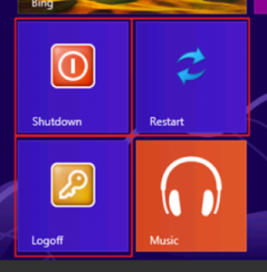

Salve Salve Galera!

Hoje vou mostrar a você como adicionar os botões de deligar, reiniciar e fazer logoff no windows 8 via power shelll.

Primeiro de tudo você precisara baixar um modulo aparte na galeria da TechNet, porque o power shell não vem com esse modulo nativo:

Baixe o modulo: [http://bit.ly/10jWIu0](http://bit.ly/10jWIu0).

 Feito isso descompacte o arquivo e entre dentro dele via power shell, importe o modulo com o seguinte comando:

 Import-Module C:ScriptCreateWindowsTile.psm1

 Caso você não consiga porque esta sem permissão para executar scripts, execute o seguinte comando:

 Set-ExecutionPolicy –Unrestricted

Pronto, agora basta importar o modulo de novo e executar os seguintes comandos:

New-OSCWindowsTile – para instalar as 3 opções: Shutdown, Restart e Logoff.

New-OSCWindowsTile –ShutdownTile para instalar o botão Shutdown

New-OSCWindowsTile –RestartTile para instalar o botão Restart

New-OSCWindowsTile –LogoffTile para instalar o botão Logoff

Pronto, até a próxima.
