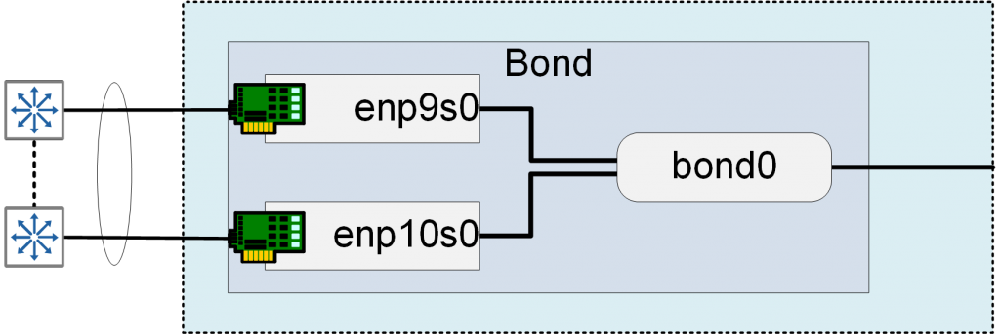

Salve Salve Pessoal!

Faz tempo que queria falar sobre agregação de interfaces no Linux, para começar vamos falar da agregação nas versões do Linux CentOS 6, Red Hat 6, Oracle Linux 6 e derivados, as configurações são as mesmas visto que todos usam a mesma estrutura de diretórios, arquivos e configurações.

Nas versões 6.x dos sistemas falados anteriormente, para trabalhar com a agregação de interfaces precisamos utilizar o Bond.

O Bond é o método que agrega duas ou mais interfaces físicas em uma única interface virtual, a imagem abaixo exemplifica bem esse cenário.

[](images/Bond-1.png)

Esse método de agregação pode funcionar de diversas formas, as mais comuns são:

**Active Backup** - Uma interface fica ativa e outra em stand-by, caso a interface ativa falhe a stand-by assume seu lugar.

**Load Balance** - Distribui a carga entre as duas interfaces.

**802.3ad (LACP)** - Combina os links, ou seja, se tivermos 2 links de 1Gigabit cada, a velocidade do nosso bond passa a ser 2 Gigabit, os switches devem suportar LACP e serem configurados também.

Então vamos colocar isso em prática :D

**1** - Crie um arquivo chamado **ifcfg-bondN** no diretório **/etc/sysconfig/network-scripts**, onde **N** é o número da interface desejada, normalmente começamos com **bond0**.

```
# touch /etc/sysconfig/network-scripts/ifcfg-bond0
```

**2** - Edite o arquivo **ifcfg-bond0**,  deixe as configurações semelhante a uma interface ethernet padrão, exceto que **DEVICE**, que deve ser definido como **bond0** e **BONDING\_OPTS=""**.

```
DEVICE="bond0"
IPADDR=192.168.0.1
NETMASK=255.255.255.0
ONBOOT=yes
BOOTPROTO=none
USERCTL=no
TYPE=Ethernet
BONDING_OPTS="mode=active-backup miimon=100 primary=eth0"
```

Vamos entender um pouco as opções que devemos colocar na linha **BONDING\_OPTS=""**.

Por exemplo, se desejamos utilizar o bond como Actibe Backup, podemos utilizar a seguinte opção:

**BONDING\_OPTS="mode=active-backup miimon=100 primary=eth0"**

**mode=active-backup** (método utilizado, também poderia ser mode=1)

**miimon=100** (especifica a frequência de monitoramento do link em milissegundos, isso determina com que frequência o estado do link é verificado, normalmente usa-se 100, o valor padrão é 0 e desativa o monitoramento)

**primary=eth0** (especifica qual é a interface primaria/ativa)

Existem várias possibilidades de configurações no **BONDING\_OPTS=""**, para maiores detalhes consulte as referências.

**3** - Agora edite a configuração das interfaces que farão parte do bond0 e insira as seguintes linhas:

```
MASTER=bond0
SLAVE=yes
```

Lembre-se que todas as configurações de IP/Rede devem ser feitas apenas na interface bond.

**4** - Levante o módulo do bond:

```
# modprobe bonding
```

**5** - Reinicie as configurações de rede:

```
# service network restart
```

ou

```
# /etc/init.d/network restart
```

Pronto, agora o bond está configurado, execute um **ifconfig** e verifique as configuração.

Até o próximo post :D

Referências:

[https://wiki.linuxfoundation.org/networking/bonding](https://wiki.linuxfoundation.org/networking/bonding)

[https://access.redhat.com/documentation/en-us/red\_hat\_enterprise\_linux/6/html/deployment\_guide/s2-networkscripts-interfaces-chan](https://access.redhat.com/documentation/en-us/red_hat_enterprise_linux/6/html/deployment_guide/s2-networkscripts-interfaces-chan)

[https://docs.oracle.com/cd/E37670\_01/E41138/html/ch11s05.html](https://docs.oracle.com/cd/E37670_01/E41138/html/ch11s05.html)
