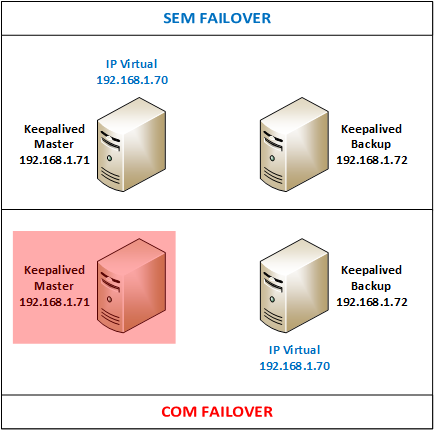
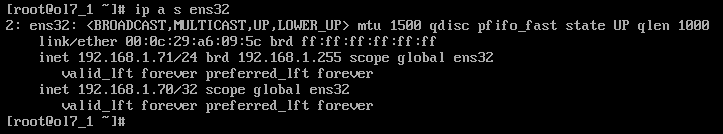
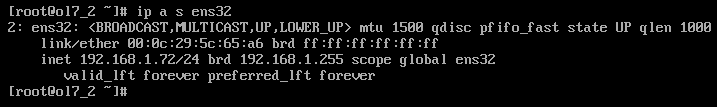
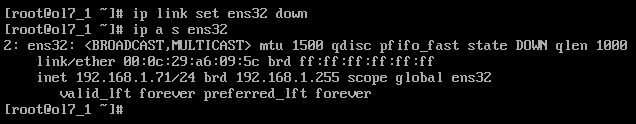
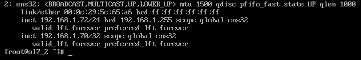

[](http://rodrigolira.eti.br/wp-content/uploads/2017/06/oraclelinux1.png)

Salve Salve Pessoal!

Hoje vou falar um pouco sobre o Keepalived, um software de roteamento, onde o objetivo principal deste projeto é fornecer instalações simples e robustas para balanceamento de carga e alta disponibilidade para infraestruturas baseadas em sistemas Linux.  A alta disponibilidade é alcançada pelo protocolo VRRP que o keepalived usa.

Para esse post fiz um cenário bem simples, onde tenho dois servidores, um servidor **Master** e um **Backup**, o servidor **Master** tem o IP **192.168.1.71** e o servidor **Backup** tem o IP **192.168.1.72**.

A figura abaixo ilustra um pouco o nosso cenário.

[](http://rodrigolira.eti.br/wp-content/uploads/2017/06/Desenho1.png)

O keepalived faz o seguinte, você configura um IP Virtual nos dois servidors (master e backup), no nosso caso o IP Virtua é o 192.168.1.70, o IP Virtual vai ficar ativo no servidor Master, caso o servidor Master fique indisponível, o IP virtual é inserido no servidor de Backup.

As figuras abaixo mostra a interface de rede dos dois servidores quando ativos.

**Master**

[](http://rodrigolira.eti.br/wp-content/uploads/2017/06/01.png)

 

**Backup**

[](http://rodrigolira.eti.br/wp-content/uploads/2017/06/02.png)

 

Como podemos verificar, a interface **ens32** de cada servidor está **UP**.

Agora vamos ver como fica as configurações caso o servidor Master fique indisponível.

**Master**

[](http://rodrigolira.eti.br/wp-content/uploads/2017/06/03.png)

**Backup**

[](http://rodrigolira.eti.br/wp-content/uploads/2017/06/04.png)

Como podemos ver, quando derrubamos a conexão do **Master** o IP Virtual é inserido no servidor de **Backup**.

Quando o servidor Master ficar disponível novamente, o IP Virtual será inserido no Master e removido do Backup.

Mas vamos ao que interessa, como configurar isso :D

Para instalar o keepalived no Oracle Linux 7 execute o seguinte comando abaixo:

```
# yum install keepalived
```

**Obs:** Precisamos instalar nos dois servidores (Master e Backup).

O arquivo de configuração padrão do keepalived é o keepalived.conf que fica dentro do diretório /etc/keepalived.

Para esse cenário, utilizei a seguinte configuração:

**Servidor Master (192.168.1.71)**

```
global_defs {
 notification_email {
 root@lab.local
 }
 notification_email_from eurodrigolira@gmail.com
 smtp_server localhost
 smtp_connect_timeout 30
}

vrrp_instance VRRP1 {
 state MASTER
 interface ens32
 virtual_router_id 41
 priority 200
 advert_int 1
 authentication {
 auth_type PASS
 auth_pass Mudar123
 }
 virtual_ipaddress {
 192.168.1.70
 }
}
```

**Servidor Backup (192.168.1.72)**

```
global_defs {
 notification_email {
 root@lab.local
 }
 notification_email_from eurodrigolira@gmail.com
 smtp_server localhost
 smtp_connect_timeout 30
}

vrrp_instance VRRP1 {
 state BACKUP
 interface ens32
 virtual_router_id 41
 priority 100
 advert_int 1
 authentication {
 auth_type PASS
 auth_pass Mudar@123
 }
 virtual_ipaddress {
 192.168.1.70
 }
}
```

Após realizar as configurações dos arquivos libere o protocolo VRRP e o IP 224.0.0.18 no firewall, o VRRP usa multicast.

```
# firewall-cmd --direct --permanent --add-rule ipv4 filter INPUT 0 --in-interface ens32 --destination 224.0.0.18 --protocol vrrp -j ACCEPT
# firewall-cmd --direct --permanent --add-rule ipv4 filter OUTPUT 0 --out-interface ens32 --destination 224.0.0.18 --protocol vrrp -j ACCEPT
# firewall-cmd --reload
```

Agora habilite o keepalived para iniciar automaticamente com o sistema operacional.

```
# systemctl enable keepalived
```

Agora inicie o keepalived.

```
# systemctl start keepalived
```

Com o keepalived iniciado nos dois servidores, execute um ping para o IP Virtual e depois derrube a interface do servidor Master para verificar se o IP Virtual vai ser inserido corretamente no servidor de Backup.

Quando realizar mudanças nos arquivos de configuração execute um reload nas configuração.

```
# systemctl reload keepalived
```

O Keepalived tem bem mais possibilidades de configurações, acesse a documentação oficial para maiores detalhes.

[http://www.keepalived.org/](http://www.keepalived.org/)

As mesmas configurações realizadas aqui, também são aplicáveis ao CentOS 7 e ao Red Hat 7.

Espero que tenham gostado, até a próxima ;D
