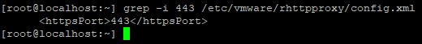
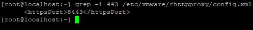
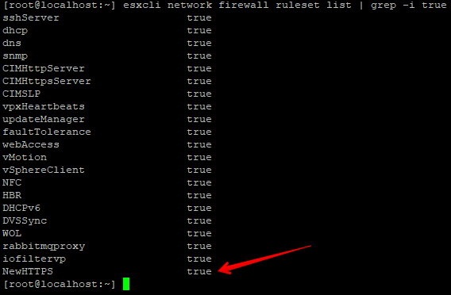
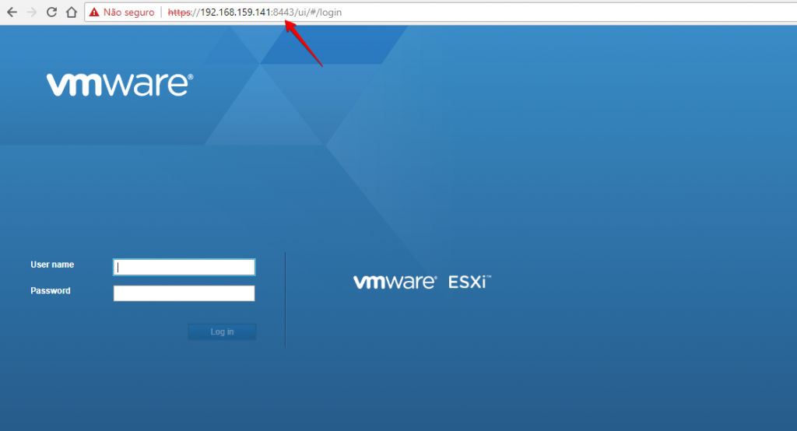
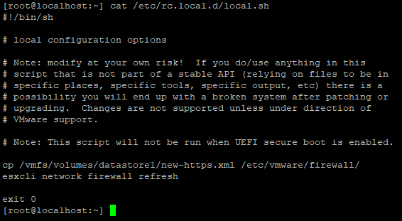

Salve Salve Pessoal!

Alguns leitores do blog sempre me perguntaram como alterar a porta do **HTTPS** do **ESXi**, nunca tive a necessidade de fazer essa alteração, mas devido a pedidos, resolvi fazer esse post.

Temos que entender uma coisa inicialmente, durante o processo de boot do **ESXi**, ele apaga toda e qualquer alteração que fizermos em determinados arquivos de configuração padrão dele, então nesse post vou mostrar uma forma de contornar esse problema, é a melhor forma? Não, mas resolverá sua necessidade momentaneamente.

Outro ponto que devemos observar é que a **VMware** não recomenda essas mudanças de portas, então nunca faça isso caso você use o **vCenter**. ;)

Em um outro post que desejo fazer, vou falar sobre o processo de boot do **ESXi** e como ele sobrescreve essas alterações realizadas por nós.

Então vamos ao que interessa :D

**!!!! ISTO NÃO É SUPORTADO PELA VMWARE - FAÇA POR SUA PRÓPRIA CONTA E RISCO !!!!**

Acesse seu host **ESXi** via **SSH** e vamos editar o seguinte arquivo **/etc/vmware/rhttpproxy/config.xml**.

Esse arquivo define a porta **HTTPS** do ESXi.

```
# grep -i 443 /etc/vmware/rhttpproxy/config.xml
```

[](images/192.168.159.141-PuTTY-2018-07-18-10.57.15.png)

Vamos alterar e colocar a porta **443** para **8443** por exemplo.

```
# sed -i "s/443/8443/" /etc/vmware/rhttpproxy/config.xml
```

Vamos verificar se a porta foi alterada.

```
# grep -i 443 /etc/vmware/rhttpproxy/config.xml
```

[](images/192.168.159.141-PuTTY-2018-07-18-11.02.45.png)

Como podemos observar, a porta 443 foi alterada para 8443.

Agora precisamos reiniciar o serviço **rhttpproxy**.

```
# /etc/init.d/rhttpproxy restart
```

Pronto, a interface web do ESXi já está rodando na porta 8443, mas ainda não está acessível, precisamos liberar no firewall essa porta também.

Crie um arquivo chamado **new-https.xml** no diretório **/etc/vmware/firewall/**.

```
#  touch /etc/vmware/firewall/new-https.xml
```

Edite o arquivo e coloque as seguintes linhas:

```
<ConfigRoot>
  <service>
    <id>NewHTTPS</id>
    <rule id="8443">
      <direction>inbound</direction>
      <protocol>tcp</protocol>
      <porttype>dst</porttype>
      <port>8443</port>
    </rule>
    <enabled>true</enabled>
    <required>false</required>
  </service>
</ConfigRoot>
```

Salve o arquivo e execute um **refresh** no **firewall** para nova regra ser aplicada.

```
# esxcli network firewall refresh
```

Para verificar se a nova regra foi aplicada, execute o seguinte comando:

```
# esxcli network firewall ruleset list | grep -i true
```

[](images/192.168.159.141-PuTTY-2018-07-18-11.21.02.png)

Pronto, agora podemos acessar o ESXi na porta 8443.

[](images/Log-in-VMware-ESXi-Google-Chrome-2018-07-18-11.24.01.png)

Como falei anteriormente, quando reiniciarmos o ESXi, algumas configurações serão perdidas, em nosso caso o arquivo **new-https.xml**, para não precisarmos fazer todo o processo manualmente novamente, vamos fazer o seguinte.

1 - Copie o arquivo **new-https.xml** para o seu **datastore**, assim ele não será removido quando o ESXi for reiniciado, exemplo **datastore1**.

```
# cp /etc/vmware/firewall/new-https.xml /vmfs/volumes/datastore1
```

2 - Coloque as seguintes entradas no arquivo **/etc/rc.local.d/local.sh**.

```
cp /vmfs/volumes/datastore1/new-https.xml /etc/vmware/firewall/
esxcli network firewall refresh
```

Exemplo:

[](images/192.168.159.141-PuTTY-2018-07-18-13.14.52.png)

Pronto, agora toda vez que o host ESXi for reiniciado ele ira sobrescrever as configurações que são padrão dele pela configurações que acabamos de configurar.

Espero que tenham gostado :D

Até a próxima!
