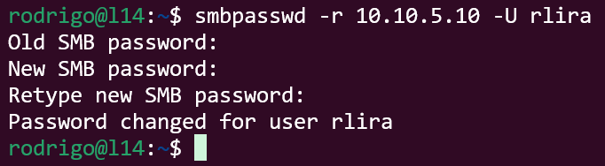

Salve, salve, pessoal!

Muita gente não sabe, mas é possível alterar a senha do seu usuário no Active Directory diretamente pelo terminal do Linux, mesmo que a senha esteja expirada.

Para isso, só precisamos do pacote **smbclient**. Dependendo do seu sistema operacional, o nome do pacote pode variar.

Com o pacote instalado, basta executar o seguinte comando:

```
# smbpasswd -r IP_ACTIVE_DIRECTORY -U USUÁRIO
```

Veja o exemplo abaixo.

[](images/Captura-de-tela-2025-03-12-112354.png)Pronto, senha atualizada com sucesso!

Até o próximo post!

:D
