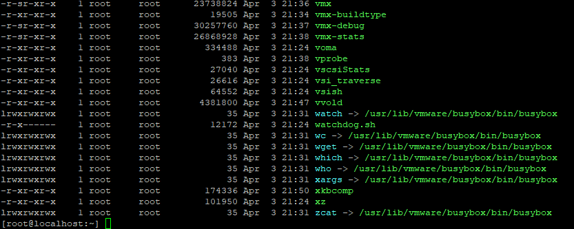
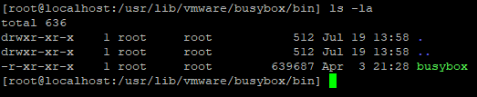
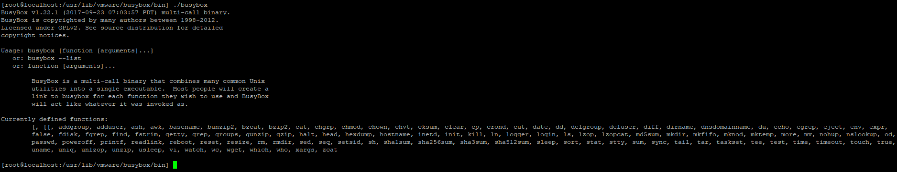
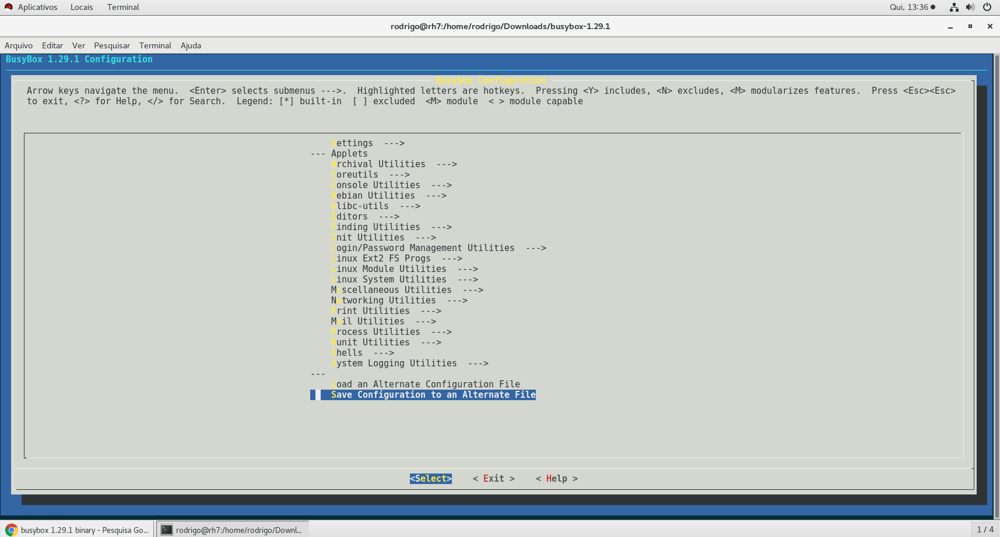
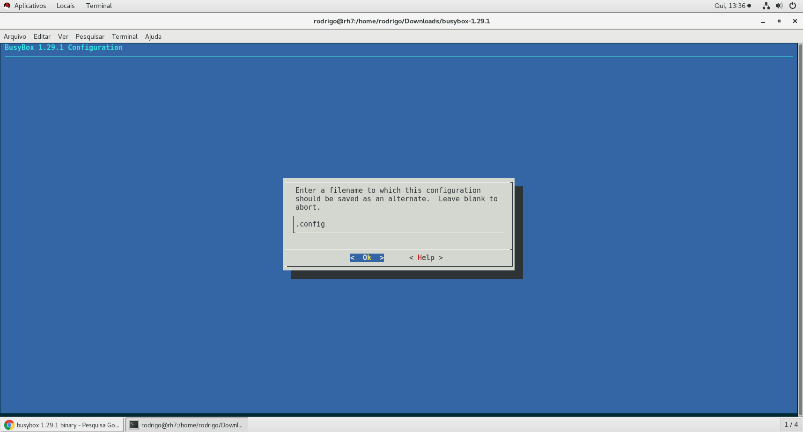
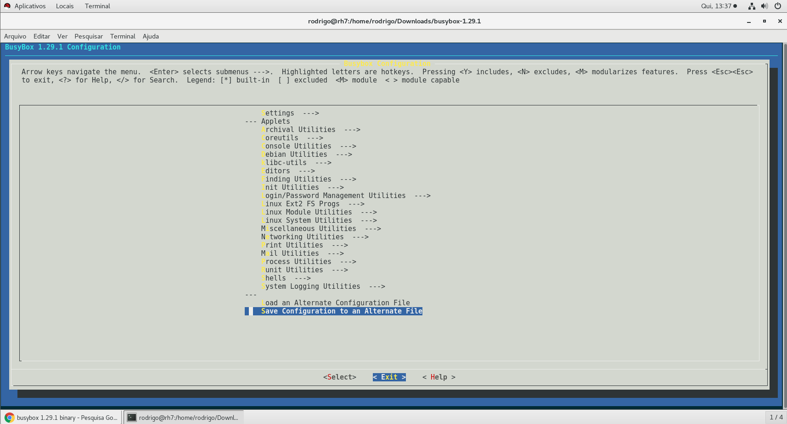
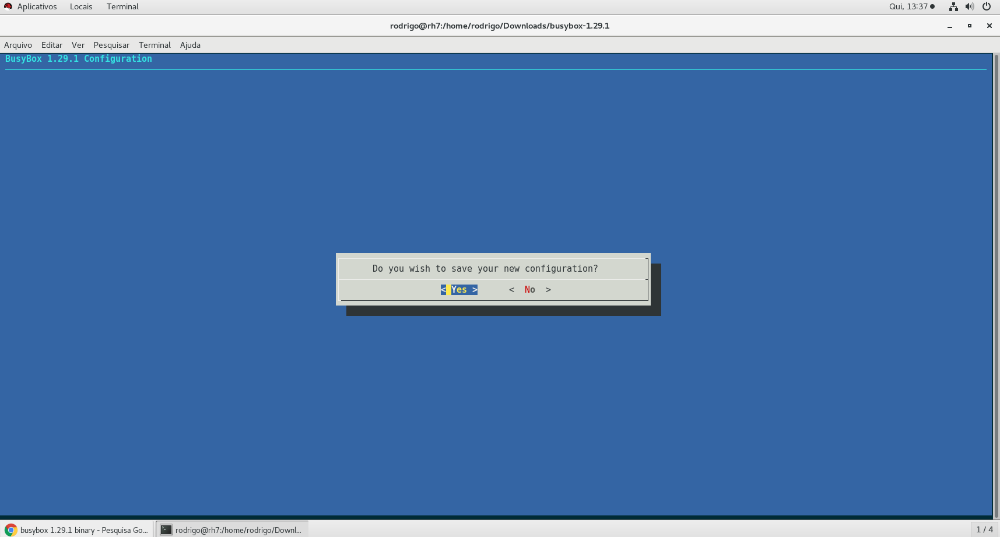
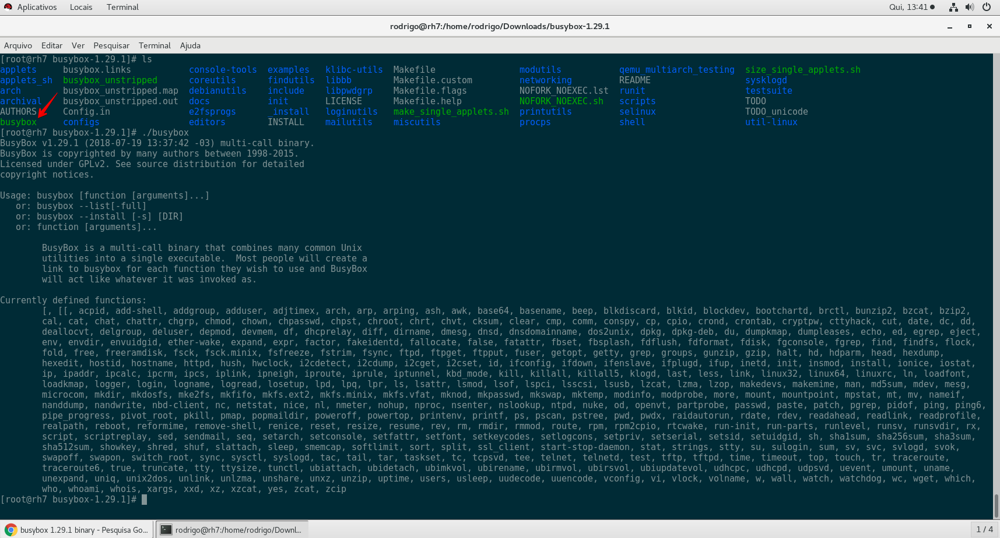
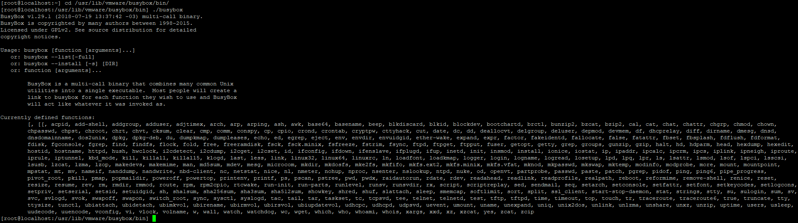

[](images/BusyBox-Google-Chrome-2018-07-19-11.27.24.png)

Salve Salve Pessoal!

Quando acessamos um ESXi via console, vemos que o shell dele tem uma familiaridade muito grade de comandos com um Linux, porém também vemos que não existem diversos comandos que encontramos no Linux.

O que acontece é o seguinte, o ESXi utiliza o BusyBox para execução de alguns desses comandos que você também encontra em um Linux.

Para quem não conhece o busybox, ele é um canivete suíço para dispositivos embarcados usando Linux.

O BusyBox combina pequenas versões de muitos utilitários comuns do \*Unix em um único pequeno executável. Ele fornece substituições para a maioria dos utilitários que normalmente encontramos em um \*Unix.

Os utilitários no BusyBox geralmente têm menos opções, no entanto, as opções incluídas fornecem a funcionalidade esperada.

Para maiores informações sobre o BusyBox acesse o link abaixo:

[https://busybox.net/](https://busybox.net/)

**Mas para quê eu desejaria fazer isso?**

**Respondo essa pergunta no final do post! :P**

Vamos ao que interessa :D

**!!!! ISTO NÃO É SUPORTADO PELA VMWARE - FAÇA POR SUA PRÓPRIA CONTA E RISCO !!!!**

Para descobrirmos quais comandos são executado pelo BusyBox no ESXi, basta executarmos o comando **ls -l** no diretório **/sbin** ou **/bin**.

```
# ls -l /sbin
```

ou

```
# ls -l /bin
```

Como podemos ver na imagem abaixo, vários comandos são link simbólicos para o mesmo executável.

[](images/192.168.159.141-PuTTY-2018-07-19-11.49.53.png)

Agora já sabemos quais comandos são na verdade executados pelo Busybox.

Vamos entrar na pasta onde se encontra o BusyBox e ver algumas informações sobre a versão do mesmo.

```
# cd /usr/lib/vmware/busybox/bin/
```

Se executarmos um **ls -la** veremos que existe apenas o **BusyBox** no diretório.

```
# ls -la
```

[](images/192.168.159.141-PuTTY-2018-07-19-11.56.06.png)

Se executarmos ele sem passar nenhum parâmetro, veremos algumas informações sobre ele, como a versão e os comandos disponíveis.

```
# ./busybox
```

[](images/192.168.159.141-PuTTY-2018-07-19-11.58.18.png)

Como podemos ver a versão atual do **BusyBox** é a **1.22.1** e também é exibido os comandos disponíveis nessa versão.

Como o projeto é aberto e podemos compilar nossa própria versão, com nosso próprios comandos personalizados.

Vamos compilar a nossa própria versão :D

A versão atual do **BusyBox** é a **1.29.1**, você precisará de um sistema operacional Linux para fazer o processo.

Como uso o **Red Hat 7.5**, precisei instalar pacote **ncurses-devel**(dependência) para realizar o procedimento.

Baixe o source do BusyBox 1.29.1.

```
# wget https://busybox.net/downloads/busybox-1.29.1.tar.bz2
```

Extraia os arquivos.

```
# tar -xvf busybox-1.29.1.tar.bz2
```

Entre na pasta do BusyBox.

```
# cd busybox-1.29.1
```

1 - Execute o comando abaixo para selecionar os pacotes desejados no BusyBox.

```
# make menuconfig
```

[](images/Red-Hat-7-VMware-Workstation-2018-07-19-13.36.15.png)

No meu caso deixei o padrão, mas você pode navegar entre as opções e selecionar apenas os pacotes que lhe interessam, depois selecione **Save Configuration to an Alternate File**.

2 - Deixe com o nome padrão e selecione **OK**.

[](images/Red-Hat-7-VMware-Workstation-2018-07-19-13.36.44.png)

3 - Selecione **Exit**.

[](images/Red-Hat-7-VMware-Workstation-2018-07-19-13.37.13.png)

4 - E salve a nova configuração.

[](images/Red-Hat-7-VMware-Workstation-2018-07-19-13.37.39.png)

Agora execute o **make** e depois o **make install**.

```
#make

#make install
```

Pronto, seu **BusyBox** foi criado, como podemos ver na imagem abaixo:

[](images/Red-Hat-7-VMware-Workstation-2018-07-19-13.41.11.png)

**OBS:** Observe a versão e a quantidade de comandos disponíveis nessa nossa versão ;)

Agora só enviar para o ESXi.

Agora só substituir o **BusyBox** do **ESXi** pelo o que foi criado.

```
#  mv busybox /usr/lib/vmware/busybox/bin/
```

Agora só entrar na pasta **/usr/lib/vmware/busybox/bin/** e verificar a versão que estará lá.

\# ./busybox

[](images/192.168.159.141-PuTTY-2018-07-19-14.04.31.png)

Como podemos observar já estamos usando a **versão atualizada** :D

Respondendo a pergunta feita no inicio do post **"Mas para quê eu desejaria fazer isso?"**

Como vimos podemos criar nosso próprio BusyBox, dentro dele podemos colocar o comando/serviço que desejarmos, como por exemplo o telnet, que já veio nessa versão padrão do 1.29.1.

**OBS:** Existem comandos que não terão compatibilidade com o ESXi, como por exemplo: ip, free, etc. Então o ideal é você saber sua real necessidade e compilar apenas aquilo que deseja usar.

Existe uma má notícia,  é que quando o sistema for reiniciado o **BusyBox** que acabamos de criar e enviar será substituído pela versão **original** do **ESXi**.

Podemos contornar isso, mas como falei no post anterior, isso será tema de um post dedicado.

Espero que tenham gostado e até a próxima! :D
