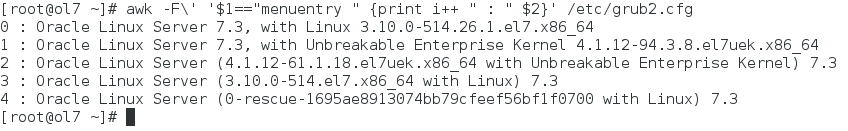

[](http://rodrigolira.eti.br/wp-content/uploads/2017/06/oraclelinux1.png)

Salve Salve Pessoal.

Hoje vou dar uma dica de como podemos alterar a versão do kernel no Oracle Linux 7 sem fazer muito esforço.

Não sei se vocês sabem, mas o Oracle Linux usa por padrão o Unbreakable Enterprise Kernel (UEK), desenvolvido e mantido pela Oracle.

Mais detalhes [AQUI](http://www.oracle.com/technetwork/server-storage/linux/technologies/uek-overview-2043074.html).

Mas nós podemos usar o Oracle Linux sem o kernel padrão, ou seja, sem o UEK.

Execute o comando abaixo para listar o seu kernel atual.

```
# grub2-editenv list
```

[](http://rodrigolira.eti.br/wp-content/uploads/2017/07/Oracle-Linux-7-2017-07-12-20-42-13.png)

Agora que já sabemos qual kernel estamos usando, vamos listar todos os kernels disponíveis do nosso sistema, execute o comando abaixo.

```
# awk -F\' '$1=="menuentry " {print i++ " : " $2}' /etc/grub2.cfg
```

[](http://rodrigolira.eti.br/wp-content/uploads/2017/07/Oracle-Linux-7-2017-07-12-20-42-49.png)

Agora que já sabemos todas as nossas possibilidades, basta digitar o comando abaixo passando como parâmetro o número do kernel que desejamos utilizar. No meu caso já estou utilizando o kernel "1", vou mudar para o kernel "0".

```
# grub2-set-default 0
```

Agora basta reiniciar o sistema operacional :D

Os comandos também se aplicam ao CentOS, Red Hat e derivados.

Até a próxima! ;)
