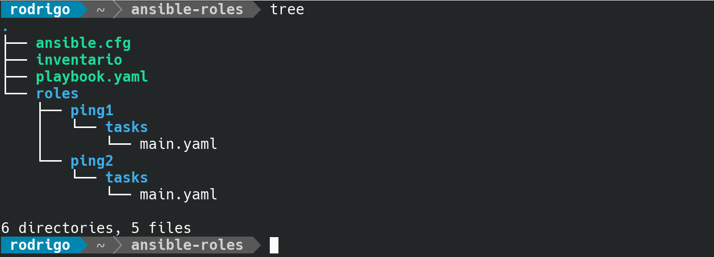
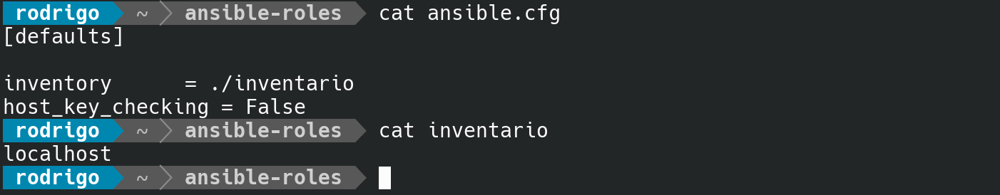
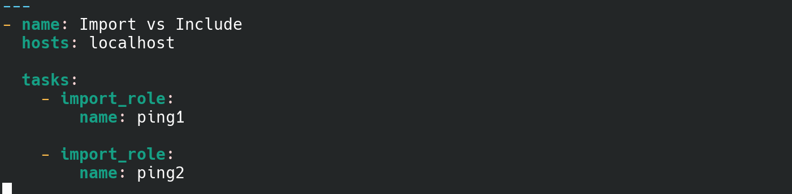
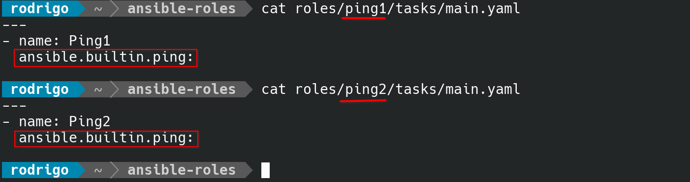
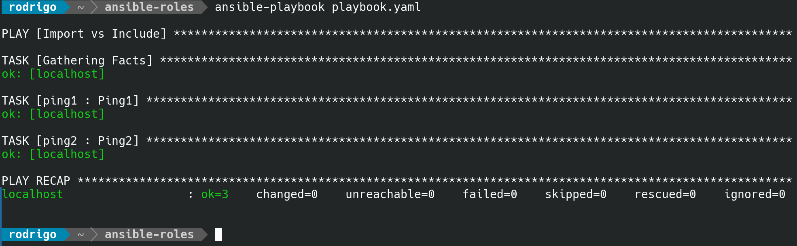
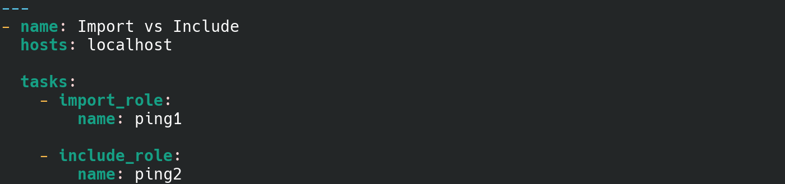
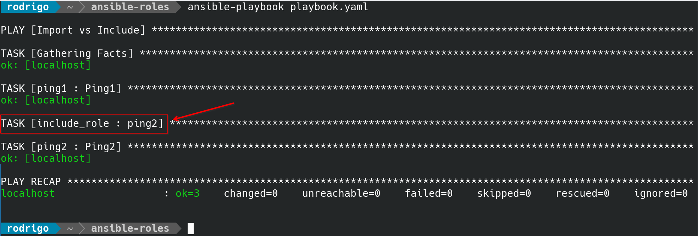
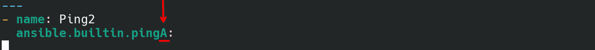
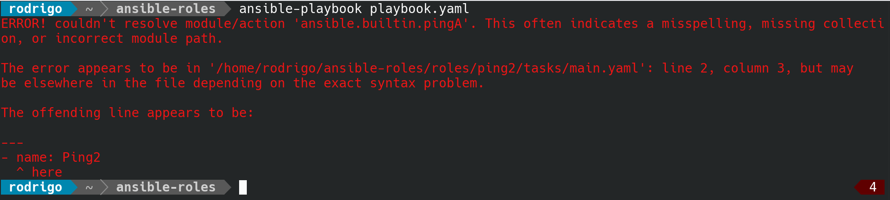
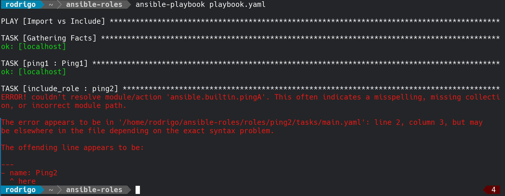

Salve Salve Pessoal!

Acho que é a primeira vez que escrevo algo sobre **Ansible** aqui no blog. Então para começar vou escrever sobre uma dúvida comum do pessoal.

Quando usar o **include** ou **import**?

No ansible nós podemos usar essas opções com **roles**, **playbooks** e **tasks**.

Mas quando usar, e qual a melhor solução?

A resposta é que tudo vai depender do seu cenário e das suas necessidades, cada um tem suas vantagens e desvantagens, então cabe a você decidir quando usar um ou outro.

Mas vamos tentar esclarecer um pouco cada um deles.

Quando usamos o **import**, as instruções são pré-processadas no momento em que os playbooks são analisados, ou seja, o código é analisado antes da execução das tasks configuradas.

Quando usamos o **include,** as instruções são processadas conforme são encontradas durante a execução do playbook, ou seja, o código de uma determinada task só será analisado quando ela for ser utilizada.

Vamos ver dois cenários diferentes, o primeiro não temos erros nas tasks, o segundo nos vamos inserir um erro.

Tenho a seguinte estrutura de arquivos e diretórios:

Os arquivos **ansible.cfg** e **inventario** são bem simples, apenas para o ambiente de teste que é executado em localhost.

### **CENÁRIO 01 (SEM ERRO)**

Agora observem o arquivo **playbook.yaml**, ele faz dois **import** em duas roles, **ping1** e **ping2**.

Vejam que cada **role** executa o mesmo código com o **módulo de ping**.

Vamos executar a playbook.

Observe que usando o **import** o ansible executou **três** tarefas, a primeira \[Gathering Facts\] que é um padrão e depois **Ping1** e **Ping2**.

Agora vamos mudar o arquivo **playbook.yaml** e vamos trocar **import** por **include** na role **ping2**.

Vamos executar a playbook novamente.

Observe que agora tivemos **quatro** tarefas, uma tarefa a mais, de **inclusão** da role **ping2** antes da execução da própria role **ping2**.

### **CENÁRIO 02 (COM ERRO)**

Vamos voltar nosso arquivo **playbook.yaml** para usar apenas o **import**.

Agora vamos alterar a role **ping2**, deixando o nome do módulo incorreto, observe que coloquei um **A** no final do **ping**.

Vamos executar novamente a playbook.

Nós já recebemos a mensagem de erro antes de qualquer coisa, porque o import analisa o código antes de processar as tarefas que vão ser executadas.

Agora vamos mudar o arquivo **playbook.yaml** para **include** novamente.

Vamos executar a playbook.

Ele executa as tarefas iniciais e apenas mostra a mensagem de erro na hora de **incluir a task ping2**, que é quando ele vai analisar o código dessa tarefa.

É isso, como falei anteriormente tudo depende da sua necessidade, espero que você tenha entendido, abaixo vou deixar vários links da documentação do include e import.

[https://docs.ansible.com/ansible/2.8/modules/import\_playbook\_module.html](https://docs.ansible.com/ansible/2.8/modules/import_playbook_module.html)

[https://docs.ansible.com/ansible/2.8/modules/import\_role\_module.html](https://docs.ansible.com/ansible/2.8/modules/import_role_module.html)

[https://docs.ansible.com/ansible/2.8/modules/import\_tasks\_module.html](https://docs.ansible.com/ansible/2.8/modules/import_tasks_module.html)

[https://docs.ansible.com/ansible/2.8/modules/include\_role\_module.html](https://docs.ansible.com/ansible/2.8/modules/include_role_module.html)

[https://docs.ansible.com/ansible/2.8/modules/include\_tasks\_module.html](https://docs.ansible.com/ansible/2.8/modules/include_tasks_module.html)

[https://docs.ansible.com/ansible/2.8/modules/include\_module.html](https://docs.ansible.com/ansible/2.8/modules/include_module.html)

Todos esses módulos fazem parte do ansible-core e vão estar disponíveis em qualquer instalação do ansible.

[https://docs.ansible.com/ansible/2.8/modules/core\_maintained.html](https://docs.ansible.com/ansible/2.8/modules/core_maintained.html)

Até o próximo post!

:D
