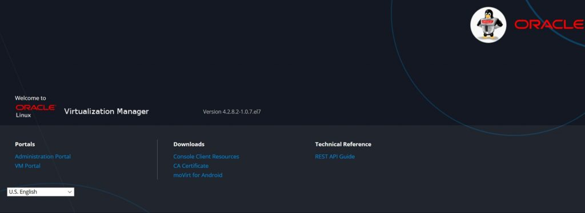

Salve Salve Pessoa!

Hoje a Oracle anunciou o Oracle Linux Virtualization Manager.

O Oracle Linux Virtualization Manager é baseado no oVirt 4.2.8.

O Oracle Linux Virtualization Manager versão 4.2.8 é a primeira versão desta nova plataforma de virtualização da Oracle.

O Oracle Linux KVM é o mesmo hipervisor usado no Oracle Cloud Infrastructure, sua plataforma de nuvem, facilitando a migração de um ambiente local para sua nuvem e até mesmo de um ambiente já baseado em oVirt/KVM.

Com essa nova plataforma ganhamos diversas features que já fazem parte do oVirt, snapshot, regras de acesso, entre outras.

Vou ficando por aqui, nos próximos posts já devo começar a escrever sobre o Oracle Linux Virtualization Manager.

Para maiores detalhes acessem o link abaixo:

[https://blogs.oracle.com/virtualization/announcing-oracle-linux-virtualization-manager](https://blogs.oracle.com/virtualization/announcing-oracle-linux-virtualization-manager)

Até o próximo post!

:D
