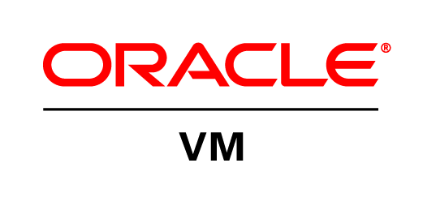

Salve Salve Pessoal!

Hoje foi anunciado o Oracle VM 3.4.5.

A nova versão está disponível tanto para o Oracle VM Server, Manager e Agent Sparc.

Como esperado, houve a correção de vários bugs e falhas de segurança, houve a descontinuação e/ou remoção de algumas features, não houve nenhuma grande alteração no software:

Alguns links sobre:

Blog Oracle - [https://blogs.oracle.com/virtualization/oracle-vm-release-345-is-now-available](https://blogs.oracle.com/virtualization/oracle-vm-release-345-is-now-available)

Novidades - [https://docs.oracle.com/cd/E64076\_01/E94829/html/vmrns-new-3.4.5.html](https://docs.oracle.com/cd/E64076_01/E94829/html/vmrns-new-3.4.5.html)

Bugs - [https://docs.oracle.com/cd/E64076\_01/E94829/html/vmrns-fixed-3.4.5.html](https://docs.oracle.com/cd/E64076_01/E94829/html/vmrns-fixed-3.4.5.html)

Features removidas/descontinuada - [https://docs.oracle.com/cd/E64076\_01/E94829/html/vmrns-deprectaed.html](https://docs.oracle.com/cd/E64076_01/E94829/html/vmrns-deprectaed.html)

Até a próxima :D
