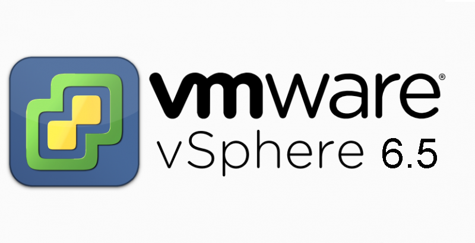

Salve Salve Pessoal!

Hoje foi anunciado o VMware vSphere 6.5, não irei entrar em detalhes porque o Pedro Calixto [@BlogPCalixto](https://twitter.com/BlogPCalixto), fez um ótimo post sobre as novidades dessa nova versão, acessem o link abaixo e confiram:

http://pedrocalixto.com/blog/2016/10/18/vsphere-6-5-e-anunciado-na-vmworld-barcelona/

Para maiores detalhes você pode acessar o blog da VMware e conferir tudo lá, segue os links abaixo:

Introducing vSphere 6.5

https://blogs.vmware.com/vsphere/2016/10/introducing-vsphere-6-5.html

What’s new in vSphere 6.5: Security

https://blogs.vmware.com/vsphere/2016/10/whats-new-in-vsphere-6-5-security.html

What’s New in vSphere 6.5: Host & Resource Management and Operations

https://blogs.vmware.com/vsphere/2016/10/whats-new-in-vsphere-6-5-host-resource-management-and-operations.html

What’s New in vSphere 6.5: vCenter Server

https://blogs.vmware.com/vsphere/2016/10/whats-new-in-vsphere-6-5-vcenter-server.html

Até a próxima :D
