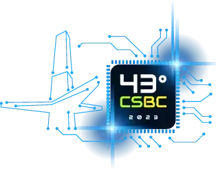
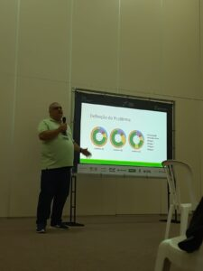

Salve Salve Pessoal!

Essa semana está acontecendo o [Congresso da Sociedade Brasileira de Computação](https://csbc.sbc.org.br/2023/) (CSBC) que é o maior evento científico em Ciência da Computação da América Latina. Por sorte minha, esse ano ele está acontecendo aqui em João Pessoa/PB.

Dentro do CSBC também acontece o SEMISH (Seminário Integrado de Software e Hardware), que é o evento de computação mais antigo do Brasil.

https://csbc.sbc.org.br/2023/semish/

Eu tive a honra de submeter um artigo para o SEMISH e ele ser aceito, o título é "**Gerência e Alocação de Aulas Virtualizadas em Laboratórios de Informática: Uma Arquitetura Híbrida**".

Ontem fiz a apresentação do mesmo no evento, caso você tenha vontade de ler você pode encontra ele na url abaixo:

[https://sol.sbc.org.br/index.php/semish/article/view/25079](https://sol.sbc.org.br/index.php/semish/article/view/25079)

Até o próximo post!

:D
