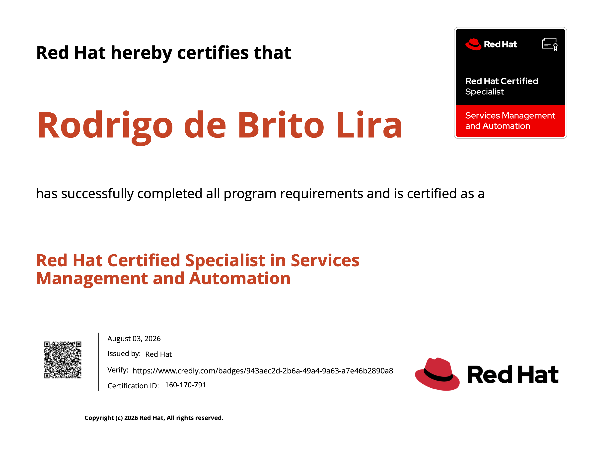

Salve Salve Pessoal!

No início deste mês dei mais um passo importante na minha caminhada rumo ao **RHCA**, fui aprovado no exame **Red Hat Certified Specialist in Services Management and Automation (EX358)**! 

O exame é baseado no **Red Hat 9.4** e utiliza **Ansible 2.4**, cobrando conhecimentos relacionados à administração de serviços e automação de tarefas utilizando Ansible.

Para quem fez o antigo **RHCE 7 ou anterior**, quando a certificação ainda era bastante focada na administração do sistema operacional e não tinha o Ansible como elemento central, e para quem fez o **RHCE 8 ou posterior**, que passou a ser fortemente baseado em automação com Ansible, eu diria que o EX358 acaba trazendo um pouco dos dois mundos.

Durante o exame existem tarefas que precisam ser realizadas diretamente no sistema, envolvendo a configuração e gerenciamento de serviços, e outras em que o Ansible é utilizado para automatizar as atividades.

Ou seja, não basta saber apenas criar um playbook. É necessário conhecer bem o funcionamento do **RHEL**, saber configurar os serviços manualmente e, ao mesmo tempo, conseguir transformar essas configurações em uma automação utilizando Ansible.

E talvez esse seja um dos pontos mais interessantes do exame: ele exige que você realmente entenda o que está fazendo, e não apenas que saiba decorar comandos ou copiar playbooks.

Os tópicos abordados no exame são:

- Gerenciar Serviços de Rede (IPv4 e IPv6)
- Gerenciar Serviços de Firewall (Firewalld)
- Gerenciar Processos do Sistema (Systemd)
- Gerenciar Agregação de Links (Bond)
- Gerenciar DNS (Bind e Unbound)
- Gerenciar DHCP (IPv4 IPv6, Radvd)
- Gerenciar Impressoras (CUPS)
- Gerenciar Serviços de E-mail (Postfix)
- Gerenciar Banco de Dados (MariaDB)
- Gerenciar Serviço Web (HTTPD e Nginx)
- Gerenciar iSCSI
- Gerenciar NFS
- Gerenciar SMB
- Gerenciar SELinux
- Utilize o Ansible para Configurar Serviços

Para quem está estudando para o EX358, minha principal recomendação é: pratique bastante em laboratório. Monte máquinas virtuais, configure os serviços manualmente, depois tente automatizar tudo com Ansible. Quanto mais você praticar, mais natural fica a resolução das questões.

O exame tem 4h de duração, o padrão para esses exames de especialista da Red Hat, mas não se engane, apesar de parecer muito tempo, é muita coisa para configurar e testar.

Boa sorte e até o próximo post!

🖖