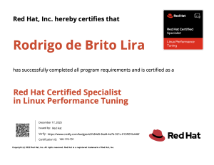
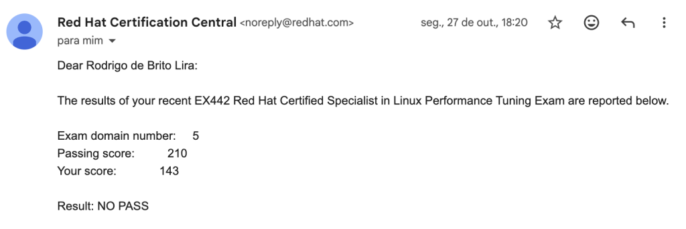
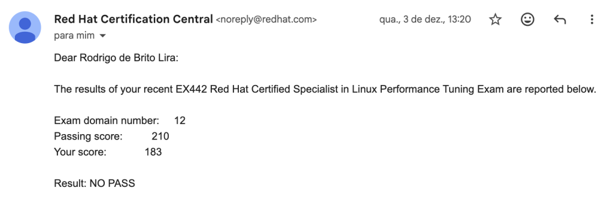
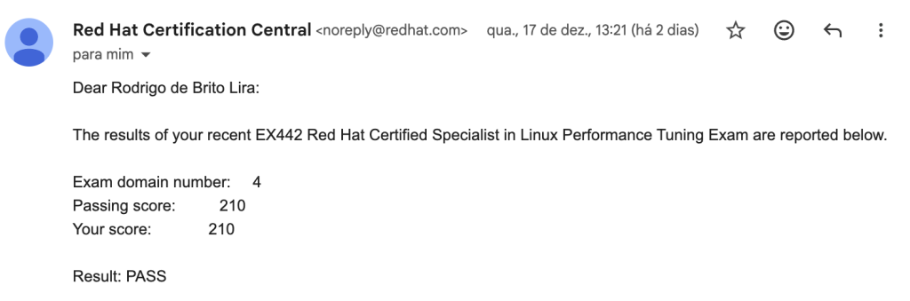

Salve Salve Pessoal!

É com muita alegria que venho compartilhar uma grande conquista: finalmente fui aprovado no exame **EX442 – Red Hat Certified Specialist in Linux Performance Tuning**!

Foram **três tentativas** até alcançar o tão esperado êxito.

Minha primeira tentativa foi no dia **27 de outubro**, mas infelizmente não obtive a pontuação necessária.

Como não passei, tive direito a um _retake_ sem custo e realizei a segunda tentativa no dia **3 de dezembro**. Apesar de ter melhorado significativamente minha pontuação, ainda não foi suficiente para a aprovação.

Então foi necessário pagar mais uma vez para poder fazer novamente o exame, foram em média 10 meses estudando para este exame, não poderia deixar de lado e seguir, precisava passar nele.

E foi então que veio a aprovação. A sensação de receber o e-mail e ver o **“PASS”** foi indescritível. Foram muitos meses de dedicação, estudo e persistência para conquistar esse resultado.

Muitas pessoas consideram o **EX442** o exame mais difícel da Red Hat, o que torna essa conquista ainda mais especial. Estou extremamente satisfeito por encerrar **2025** com o resultado que tanto sonhava.

Para **2026**, minha meta é realizar **mais três exames da Red Hat** e conquistar o título de **RHCA (Red Hat Certified Architect)**. Ainda não defini quais exames farei, mas esse já é um objetivo muito claro para o próximo ano.

Por fim, uma notícia não tão boa, atualmente, os exames da Red Hat custam **R$ 1.600,00**, e fiquei sabendo que em **2026 esse valor irá aumentar**. Ainda não sei o novo preço, mas infelizmente não é uma boa notícia.

Pretendo fazer alguns posts sobre as ferramentas que estudei para fazer o exame, então deve vim coisas legais em breve.

Até o próximo post!

:D
