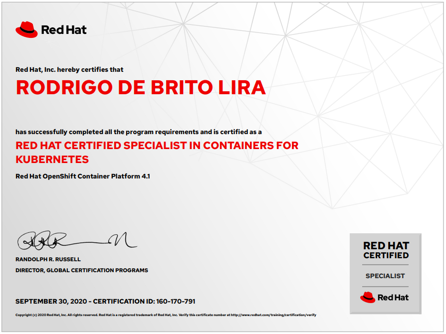

Salve Salve Pessoal!

Recentemente passei no **Exame Red Hat Certified Specialist in Container for Kubernetes (DO180)**, esse é o primeiro exame recomendado pela Red hat na trilha de estudos para o **OpenShift**.

Foi um exame bem simples comparado ao **RHCSA** ou **RHCE**.

Existe um curso oficial para o exame, porém usei apenas as informações do site da Red Hat para estudar para o exame, segue o link abaixo sobre o curso.

[https://www.redhat.com/pt-br/services/training/do180-introduction-containers-kubernetes-red-hat-openshift](https://www.redhat.com/pt-br/services/training/do180-introduction-containers-kubernetes-red-hat-openshift)

Quando fiz o exame ele ainda estava em formato preliminar, acabei pegando uma promoção e pagando bem menos por ele. :D

Para me auxilixar nos estudos usei basicamente a documentação do **Podman**.

[https://podman.io/](https://podman.io/)

E para os primeiros passos com **OpenShift** usei o **Katacoda**.

https://www.katacoda.com/openshift

Se você já tem conhecimento em **Docker** o exame será bem mais tranquilo de se fazer, porém estude as diferenças entre alguns conceitos do **Podman** e **Docker**, como o **pod** por exemplo.

Assim como os outros exames da Red Hat tudo é prático e em ambientes reais, meu exame teve apenas 01 hora, porém o exame novo são 02 horas.

Como quero estudar e me aprofundar em **OpenShift** eu comprei os cursos oficiais:

**Red Hat OpenShift Administration: Operating a Production Kubernetes Cluster (DO280)**

[https://www.redhat.com/en/services/training/do280-red-hat-openshift-administration-II-operating-production-kubernetes-cluster](https://www.redhat.com/en/services/training/do280-red-hat-openshift-administration-II-operating-production-kubernetes-cluster)

**Red Hat OpenShift Development: Containerizing Applications (DO288)**

[https://www.redhat.com/pt-br/services/training/do288-red-hat-openshift-development-i-containerizing-applications](https://www.redhat.com/pt-br/services/training/do288-red-hat-openshift-development-i-containerizing-applications)

Em breve devo estar fazendo os exames e passo por aqui no blog para falar um pouco sobre eles.

Para saber mais sobre a trilha de cursos e exames para o OpenShift você pode acessar o link abaixo:

[https://www.redhat.com/cms/managed-files/tr-red-hat-openshift-learning-path-infographic-f20967-201911-ptb.pdf](https://www.redhat.com/cms/managed-files/tr-red-hat-openshift-learning-path-infographic-f20967-201911-ptb.pdf)

Até o próximo post!

:D
