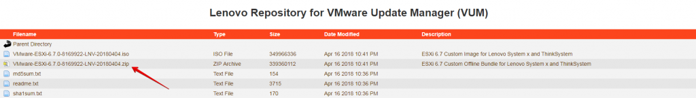
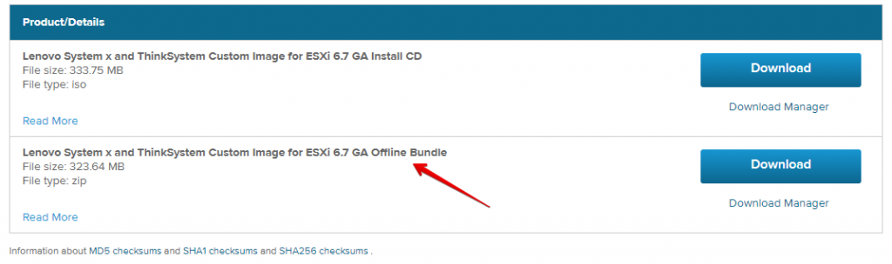
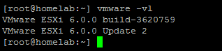
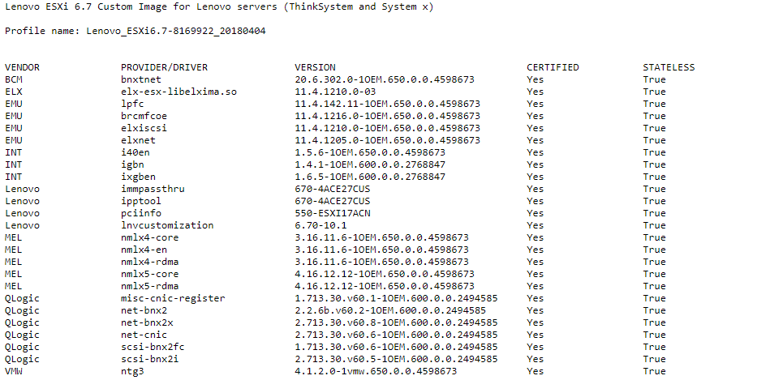
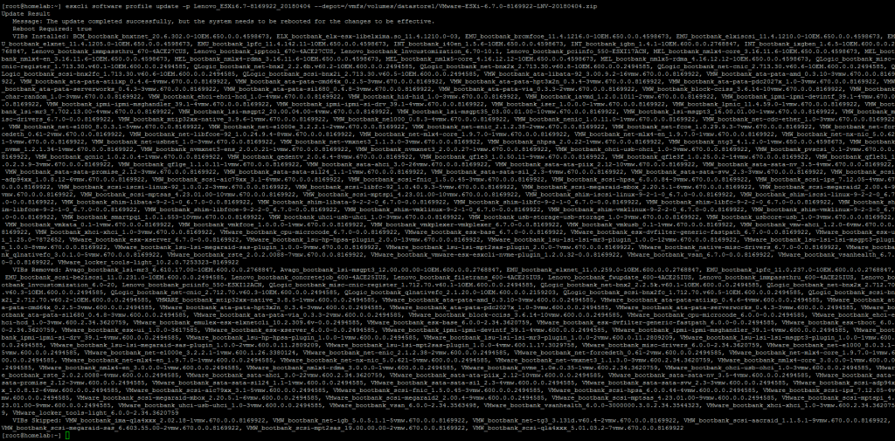
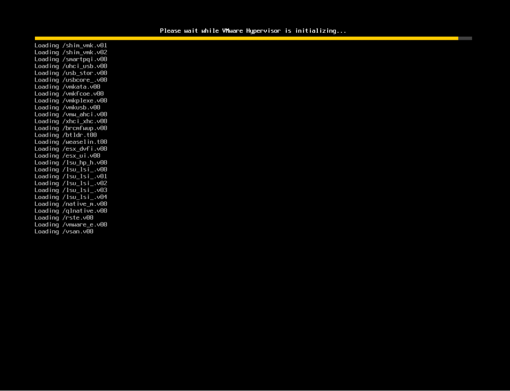
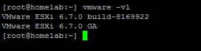

Salve Salve Pessoal!

Nesse post vou mostrar como podemos fazer a atualização do ESXi via CLI.

Eu possuo vários clientes de pequeno e médio porte que rodam o esxi free em seus ambientes, ou seja, a versão que não utiliza o vCenter Server e etc, então o processo de atualização do sistema é manual, diferentemente de quando usamos o vCenter com Update Manager.

Uma das possibilidades de atualização é através da CLI, normalmente executo esse procedimento durante a madrugada remotamente, assim não preciso ir até o cliente para atualizar os sistemas.

Antes de iniciarmos o procedimento de instalação, precisamos baixar o pacote offline de atualização(**Offline Bundle**), que são pacotes com a extensão **.zip**.

Normalmente, sempre que vamos baixar uma iso de instalação, esse pacote está no mesmo diretório, observem o exemplo no site da Lenovo.

[](images/05.png)

De da própria VMware.

[](images/06.png)

Precisamos prestar atenção também se a imagem que está instalada atualmente é personalizada por algum fabricante, se sim, baixe a versão atualizada do fabricante, para que a imagem contenha os drivers personalizados.

Envie o pacote offline para dentro do servidor, isso pode ser feito via scp ou através da própria interface do esxi, habilite o ssh no servidor e acesse o mesmo.

Antes de atualizar, verifique se todas as VMs estão desligadas.

Se desejar, pode colocar o servidor em modo de manutenção também.

Verifique a versão do seu esxi com o seguinte comando.

```
# vmware -vl
```

[](images/01.png)

Execute o seguinte comando para atualizar o esxi.

```
# esxcli software profile update -p Lenovo_ESXi6.7-8169922_20180404 -d /vmfs/volumes/datastore1/VMware-ESXi-6.5.0-4564106-depot.zip
```

Devemos observar o parâmetro **\-p Lenovo\_ESXi6.7-8169922\_20180404**, que faz referência ao profile de imagem que estamos usando para atualização, no meu caso, a Lenovo informou isso em um readme.txt dentro do mesmo diretório onde baixei os arquivos.

[](images/07.png)

E ao **\-d /vmfs/volumes/datastore1/VMware-ESXi-6.5.0-4564106-depot.zip**, que é o caminho onde coloquei o arquivo offline.

Depois de executar o comando o sistema é atualizado, é necessário reiniciar o esxi.

[](images/03.png)

Ele vai iniciar e aplicar todas as atualizações, depois vai reiniciar novamente.

[](images/04.png)

Pronto, o esxi foi atualizado, para verificar, execute mais uma vez o comando.

```
# vmware -vl
```

[](images/08.png)

ESXi atualizado com sucesso!

Até a próxima :D
