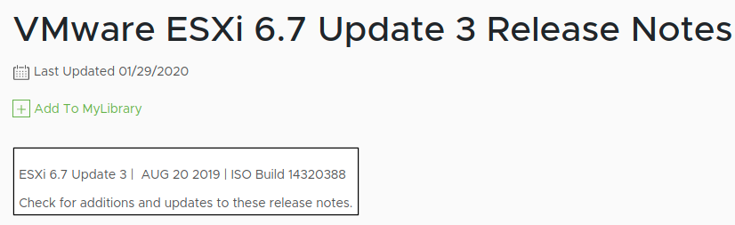

Salve Salve Pessoal!

Essa semana fiz a atualização para o **ESXI 6.7** **Update 3** das minhas **ISOs** **Customizadas** com os drivers de rede de placas realtek, drivers de rede para placas USB e da interface web.

Demorei um bucado para poder atualizar, sorry! :(

Junto com o **Update 3** está as mais recentes versões dos drivers de rede USB e da interface web.

USB Network Native Driver for ESXi - **Versão 1.5** ESXi Embedded Host Client - **Versão 1.33.1**

**OBS**: Os drivers para placas de rede realtek não tiveram alterações.

Nessas novas ISOs não fiz a divisão que havia feito com as outras versões, todas elas vem com os **drivers de rede de placas realtek**, **drivers de rede para placas USB** e **interface web**.

Também criei ISOs personalizadas para hardware da **Cisco** e **DellEMC** desta vez.

Para fazer o download das ISOs acesse o link abaixo:

https://rodrigolira.eti.br/isos-esxi-customizadas/

Para maiores informações sobre as atualizações acessem os links abaixo:

[https://docs.vmware.com/en/VMware-vSphere/6.7/rn/vsphere-esxi-67u3-release-notes.html](https://docs.vmware.com/en/VMware-vSphere/6.7/rn/vsphere-esxi-67u3-release-notes.html)

[https://flings.vmware.com/esxi-embedded-host-client](https://flings.vmware.com/esxi-embedded-host-client)

[https://flings.vmware.com/usb-network-native-driver-for-esxi](https://flings.vmware.com/usb-network-native-driver-for-esxi)

Até a próxima!

:D
