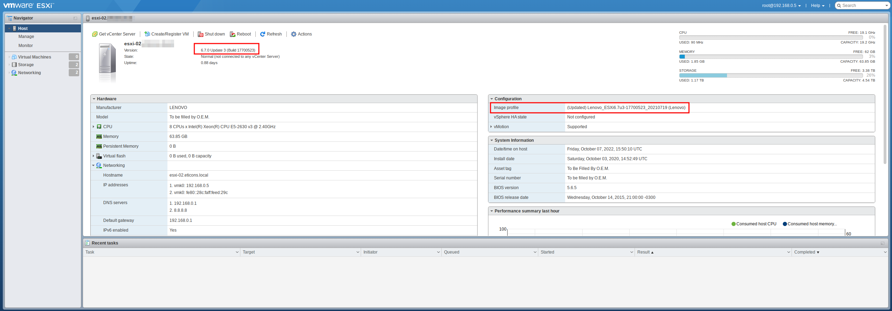
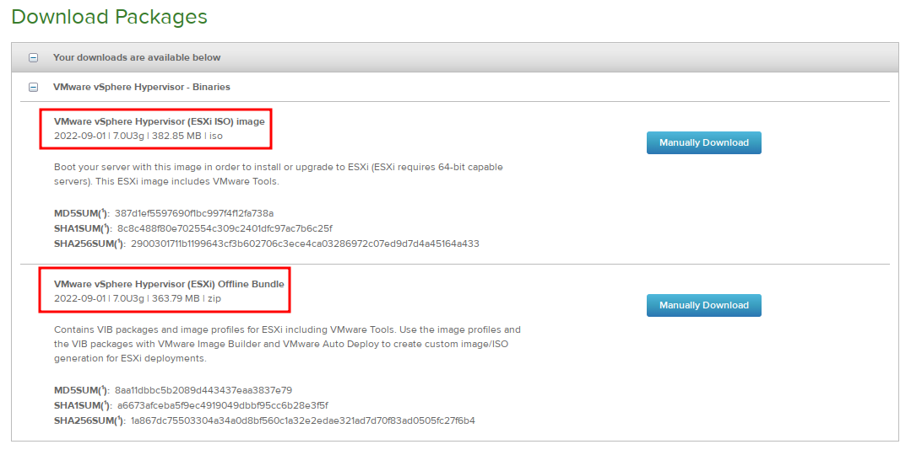
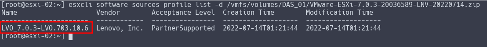
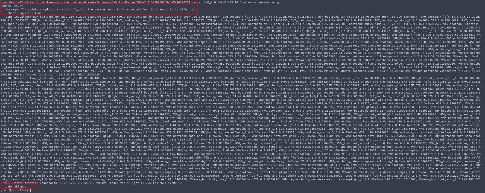
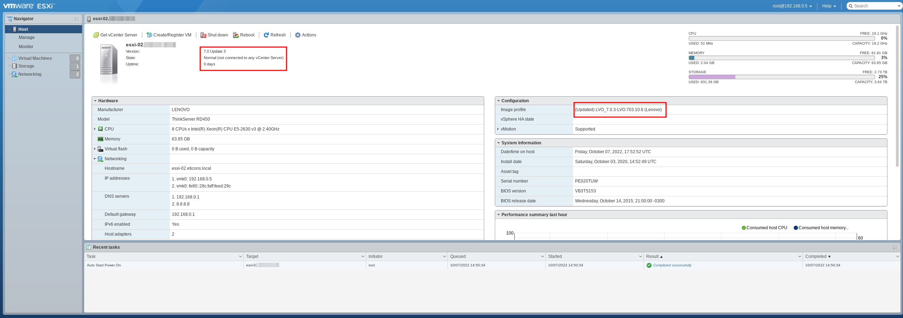
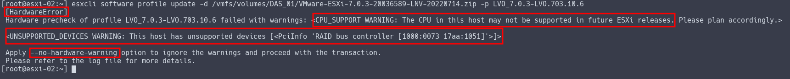

Salve Salve Pessoal!

Nesse post vou mostrar como podemos fazer a atualização do ESXi via linha de comando, normalmente através de uma conexão via SSH, mas o mesmo caso se aplica se você estiver na frente do servidor usando a DCUI/SHELL do ESXi.

Existem outras formas de atualizar de atualizar o ESXi, porém hoje vamos nos concentrar apenas nessa.

No exemplo que vou mostrar, faremos a atualização de um servidor **Lenovo** que está executando o **ESXi 6.7** e vamos atualizar para o **ESXi 7.0 Update3**.

[](images/2022-10-07_12-51.png)

Antes de mais nada precisamos baixar o arquivo para atualização. Normalmente quando vamos fazer o download da **ISO** do **ESXi**, nos também temos a possibilidade de baixar um arquivo **BUNDLE (.zip)**, como podemos ver na imagem abaixo.

[](images/2022-10-07_14-20.png)É exatamente esse arquivo **bundle**(.zip) que precisamos para fazer a atualização do nosso ESXi.

Baixe e envie o arquivo para dentro de um datastore dentro do seu ESXi.

Com ele já localizado no seu servidor ESXi, execute o comando a seguir para descobrir qual o nome do profile da versão que você fez o download.

```
# esxcli software sources profile list -d /vmfs/volumes/DAS_01/VMware-ESXi-7.0.3-20036589-LNV-20220714.zip
```

[](images/2022-10-07_14-33.png)

Observe que o "/vmfs/volumes/DAS\_01/VMware-ESXi-7.0.3-20036589-LNV-20220714.zip" é o caminho para o seu arquivo.

Agora que já sabemos qual é o nome do profile "LVO\_7.0.3-LVO.703.10.6**"**, basta executarmos o comando a seguir.

```
# esxcli software profile update -d /vmfs/volumes/DAS_01/VMware-ESXi-7.0.3-20036589-LNV-20220714.zip -p LVO_7.0.3-LVO.703.10.6
```

[](images/2022-10-07_14-45.png)

Após a conclusão do comando provavelmente será necessário a reinicialização do servidor, como ele mostra na saída de log na imagem acima, podemos ver que ele também não ignorou nenhum pacote.

Depois disso basta reiniciar o servidor com o comando reboot.

```
# reboot
```

Quando o servidor reiniciar, já iniciará com a nova versão do **ESXi**.

[](images/2022-10-07_14-53.png)

**OBSERVAÇÕES:**

Se você prestou atenção no comando que eu digitei para atualização, no final dele eu coloquei um \--no-hardware-warning, isso faz com que o comando ignore os alertas de compatibilidade de hardware e execute o comando.

Veja abaixo a saída do comando sem o \--no-hardware-warning**.**

[](images/2022-10-07_14-42.png)

Nós recebemos dois alertas.

O primeiro CPU\_SUPPORT informa que esse tipo de processador não será suportado em uma versão futura do ESXi.

O segundo UNSUPPORTED\_DEVICES informa que esse tipo de hardware não é suportado na versão atual do ESXi, no meu caso a controladora RAID.

O primeiro não tem problema algum, pois existe o suporte ao processador nesta versão do ESXi, o segundo é que é preocupante, dependendo do tipo de hardware ele pode ser essencial para o funcionando do seu ambiente, então cuidado e preste bastante atenção na sua atualização.

Se você executou e não recebeu nenhum alerta, é porque todos os hardwares do seu servidor são compatíveis com a versão do ESXi.

Por enquanto é isso pessoal, até o próximo post!

:D
