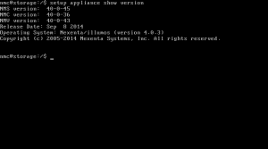
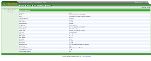
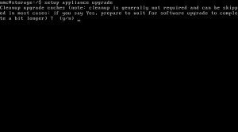
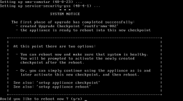
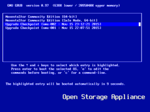
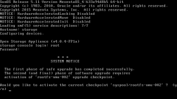
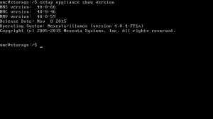

Salve Salve Pessoal!

Nesse post vou mostra como atualizar o NexentaStor da versão 4.0.3 para 4.0.4.

Para quem vinha acompanhando os meus posts sobre o meu laboratório de vmware, pode observar que a versão utilizada no mesmo é o 4.0.3, dessa forma vamos fazer um upgrade em nosso servidor de storage :D

Nesse post vou mostrar como atualizar o nexenta via linha de comando, o processo é bem simples.

Antes de mais nada vamos verificar qual a versão do nosso nexenta.

Execute o seguinte comando:

```
$setup appliance show version
```

[](http://rodrigolira.eti.br/wp-content/uploads/2015/11/Storage-2015-11-15-23-05-47.png)

Nós também podemos verificar a versão via web. Para isso basta logar e clicar em about na parte superior esquerda, como mostra a imagem abaixo:

[](http://rodrigolira.eti.br/wp-content/uploads/2015/11/imagem-1.png)

Para atualizar basta digitar no terminal o seguinte comando:

```
$setup appliance upgrade
```

[](http://rodrigolira.eti.br/wp-content/uploads/2015/11/Storage-2015-11-15-23-06-27.png)

Confirme todas as etapas, após confirmar ele vai começar a fazer o download das atualização e instalar, após a atualização é necessário reiniciar o sistema, confirme para o sistema reiniciar, como mostra a figura abaixo:

[](http://rodrigolira.eti.br/wp-content/uploads/2015/11/Storage-2015-11-15-23-18-40.png)

Na tela do grub deixe que o sistema inicie normalmente, não escolha nenhuma outra opção, dessa forma ele vai iniciar na nova versão, como mostra a imagem abaixo:

[](http://rodrigolira.eti.br/wp-content/uploads/2015/11/Storage-2015-11-15-23-18-58.png)

Após iniciar e você fazer o login no sistema, será solicitado que ative essa atualização como padrão de inicialização, basta responder que sim:

[](http://rodrigolira.eti.br/wp-content/uploads/2015/11/Storage-2015-11-15-23-20-12.png)

Depois disso basta executar novamente o comando para verificar a versão do sistema:

```
$setup appliance show version

```

[](http://rodrigolira.eti.br/wp-content/uploads/2015/11/Storage-2015-11-15-23-20-36.png)

Pronto, NexentaStor atualizado!

Para maiores detalhes acesse a documentação da versão 4.0.4 no link abaixo:

[https://nexenta.com/sites/default/files/docs/ReleaseNotes/NS404Relnote\_72115.pdf?2](https://nexenta.com/sites/default/files/docs/ReleaseNotes/NS404Relnote_72115.pdf?2)

Até a próxima ;)
