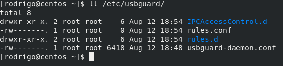
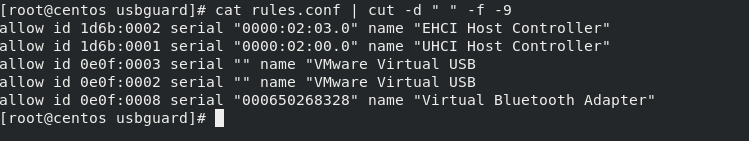
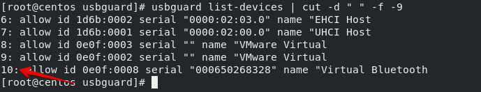
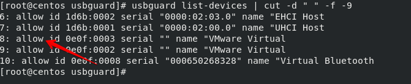
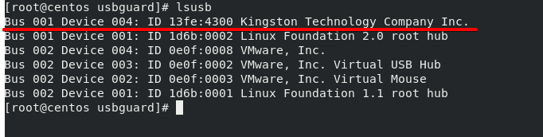
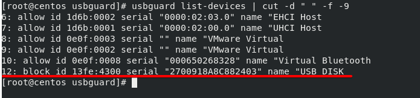
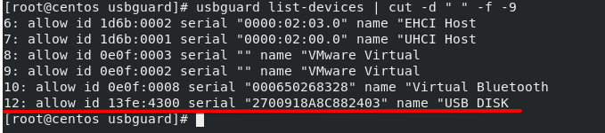

[](images/usbguard.png)

Salve Salve Pessoal!

Neste post vou mostrar como podemos bloquear ou liberar dispositivos do tipo **USB** no Linux com **USBGuard**.

O **USBGuard** fornece uma camada de proteção contra dispositivos físicos do tipo USB, nós podemos definir uma lista de dispositivos permitidos e bloqueados, o USBGuard usa o recurso de autorização de dispositivo USB do Kernel Linux.

Sua estrutura básica fornece os seguintes componentes:

- O daemon que interage na comunicação entre processos para interação dinâmica e aplicação de regras.
- Uma interface de linha de comando para interagir com o daemon do USBGuard em execução.
- Uma linguagem para escrever regras de autorização dos dispositivos USB.
- E uma API C ++ para interagir com o daemon.

Acesse o link abaixo para acessar o site do projeto.

[https://usbguard.github.io/](https://usbguard.github.io/)

Bem vamos ao que interessa e ver o que podemos fazer com o USBGuard. :D

Para esse post estou usando um **CentOS 8** e vou usar um **pendrive** como dispositivo de teste, a instalação do USBGuard na família **RPM** é bem simples, basta executar o comando abaixo.

```
# yum install -y usbguard (CentOS 7 / Oracle Linux 7 / Red Hat 7)
```

```
# dnf install -y usbguard (CentOS 8 / Oracle Linux 8 / Red Hat 8)
```

O diretório padrão dos arquivos de configuração é o **/etc/usbguard**.

[](images/usbguard01.png)

Por padrão o USBGuard não cria uma regra padrão, ele apenas cria um arquivo **rules.conf** vazio onde podemos inserir nossas regras.

[](images/usbguard02.png)

Para criar uma regra inicial podemos executar o comando abaixo.

```
# usbguard generate-policy > /etc/usbguard/rules.conf
```

Com isso uma regra padrão é criada no arquivo **rules.conf**, se verificarmos o arquivo novamente veremos várias informações agora.

[](images/usbguard10.png)

Observe que a regra é criada com todos os dispositivos USB conectados no momento da execução do comando, para confirma isso podemos executar o comando **lsusb** e comparar o **ID** dos dispositivos.

**OBS:** O resto do comando ( **| cut -d " " -f -9**) é apenas para formatar a saída e melhorar a visualização.

```
# lsusb
```

[](images/usbguard04.png)

Agora que já temos a nossa regra podemos iniciar a daemon.

```
# systemctl enable --now usbguard.service
```

Com isso a partir desse momento só será permitidos os dispositivos USB configurados no arquivos **rules.conf**.

Podemos listar os dispositivos e seu status com o comando abaixo.

```
# usbguard list-devices
```

[](images/usbguard13.png)

Observe que a saída é bem parecida com o conteúdo do arquivo **rules.conf** porém ele enumera os dispositivos, com isso podemos usar esse número para liberar ou bloquear dispositivos.

Agora observe a segunda coluna da saída do comando, faz referência ao **target**, informando se o dispositivo está autorizado ou não para uso.

[](images/usbguard14.png)

As regras do USBGuard trabalham com três tipos de target.

- **allow** - autorizar o dispositivo
- **block** - desautorizar o dispositivo
- **reject** - remove o dispositivo do sistema

Todos os dispositivos estão como **allow**, ou seja, **autorizados** porque no momento da instalação e configuração inicial do USBGuard eles já estava conectados.

Vamos inserir um novo dispositivo e verificar o comportamento, no caso estou inserindo um pendrive.

Depois de inserir podemos executar um **lsusb** para listar os dispositivos e veremos que o pendrive é exibido.

```
# lsusb
```

[](images/usbguard20.png)

Porém ele não pode ser utilizado porque no USBGuard o dispositivo está como **block**.

```
# usbguard list-devices | cut -d " " -f -9
```

[](images/usbguard21.png)

Para ter a certeza que ele não está em uso podemos usar o comando **fdisk** e verificar se ele consegui listar esse **pendrive**.

```
# fdisk -l | grep ^/dev/
```

[](images/usbguard22.png)

Como podemos ver na imagem acima o **fdisk** não foi capaz de listar o dispositivo.

Agora vamos autorizar o dispositivo para uso do sistema, nós temos três comandos para mudar o target dos dispositivos.

```
# usbguard allow-device ID
```

```
# usbguard block-device ID
```

```
# usbguard reject-device ID
```

Execute o comando.

```
# usbguard allow-device 12
```

**12** é o **ID** referente ao pendrive que foi adicionado, o ID provavelmente será diferente para você.

Agora executamos novamente o comando **fdisk** e verificamos que ele consegui listar o **pendrive**.

```
# fdisk -l | grep ^/dev/
```

[](images/usbguard23.png)

Se executarmos um **usbguard list-devices** podemos ver que o dispositivo agora está como **allow**.

```
# usbguard list-devices | cut -d " " -f -9
```

[](images/usbguard24.png)

Pronto, pendrive liberado e já pode ser utilizado. :D

Agora já sabemos como liberar os novos dispositivos USB conectados em nosso sistema, porém da forma como estamos fazendo se reiniciarmos o sistema o dispositivo iniciará como **block** precisando ser **autorizado** novamente, para resolver esse problema devemos colocar o dispositivo no arquivo **rules.conf**.

Para isso basta executar o comando **usbguard list-devices**, copiar a linha referente ao dispositivo **sem o ID** e inserir no arquivo **rules.conf**.

Reinicie a **daemon** e pronto, seu dispositivo será sempre autorizado.

```
# systemctl restart usbguard.service
```

Também podemos autorizar o dispositivo e depois executar novamente o comando **usbguard generate-policy > /etc/usbguard/rules.conf** para ele criar um novo arquivo rules.conf com o nosso novo dispositivo.

```
# usbguard generate-policy > /etc/usbguard/rules.conf
```

Também podemos fazer a mesma coisa para **bloquear(block)** e até mesmo **remover(reject)** os dispositivos do sistema.

Quando usamos o **reject** o disposito não é nem listado no sistema, se executarmos um **lsusb** ele não será exibido.

Existem diversas outras possibilidade de utilização do USBGuard, trabalhar com usuários e grupos, tipos de dispositivos, condicionais e etc.

Acessem a documentação, ela é muito rica e cheia de exemplos.

Espero que você tenha gostado do post e compartilhe.

Até o próximo post!

:D
