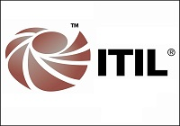

Salve Salve Pessoal!

Mês passado realizei a minha prova de ITIL, e como não tive tempo de postar nada aqui no blog desde que fiz a mesma estou postando hoje.

O que posso dizer dessa certificação?

Muito show! Gostosa de se estudar, lhe abre os olhos em muitas coisas nessa parte de gestão no qual você nem faz ideia de que os processos sejam dessa forma, ela faz você trabalhar de uma forma diferente, com mais atenção, seguindo os processos.

Parte ruim da historia, caso você trabalhe em uma empresa onde a mesma não tenha ITIL ou qualquer outro framework implantado tem hora que você se chateia, hehehe :P

O Nível?

O nível da prova para mim foi muito bom, em uma escala de 0 a 100 diria que o nível de dificuldade é de 60.

As perguntas são bem objetivas e claras, não existe nenhuma pegadinha , tudo muito transparente.

Exame presencial ou online?

Realizei o meu exame online pela PeopleCert, no qual fica um fiscal online com você, lhe visualizando para você não burlar nenhuma das condições para esse tipo de exame.

Quanto tempo de preparação?

Com um mês de estudos sem muitos esforços você consegui se preparar bem para a prova.

Fez curso?

 Sim, comprei o curso online na PMG Education, que por sinal é muito bom (Curso Online, Podcasts, Ebook, Simulados).

Valor?

Não me recordo quanto paguei corretamente, comprei o voucher na PMG também e paguei via pagseguro.

Bem é isso ai pessoal espero ter passado um pouco do que achei da prova para vocês, segue abaixo alguns links citados aqui, fui :)

PMG Education - [http://www.pmgeducation.com.br/](http://www.pmgeducation.com.br/)

PeopleCert - [http://www.peoplecert.org](http://www.peoplecert.org/)

Matéria sobre certificações - [http://www.portalitsm.com.br/o-top-10-das-certificacoes-em-ti/](http://www.portalitsm.com.br/o-top-10-das-certificacoes-em-ti/)
