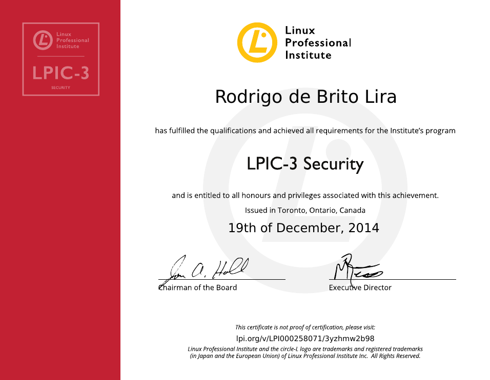
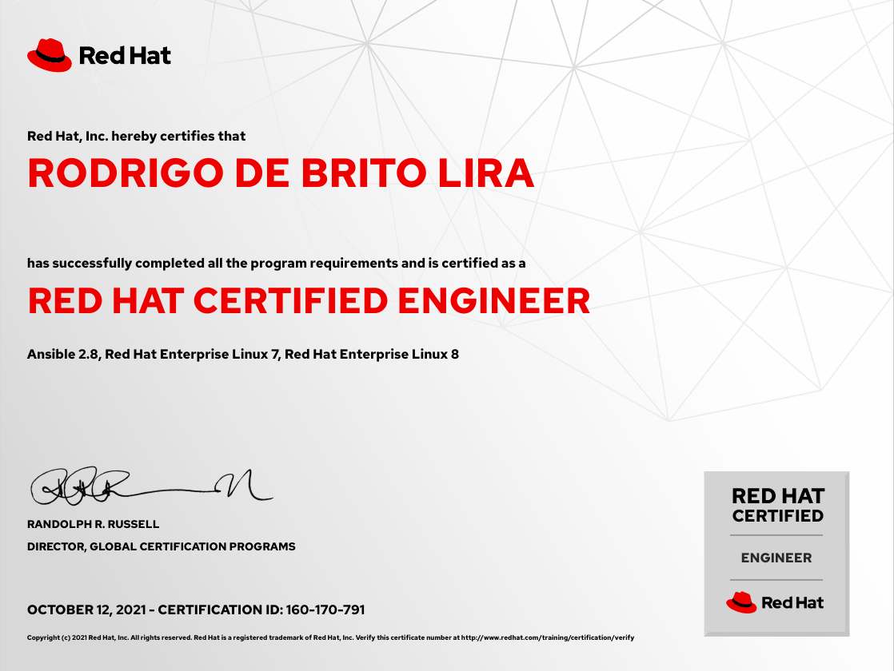
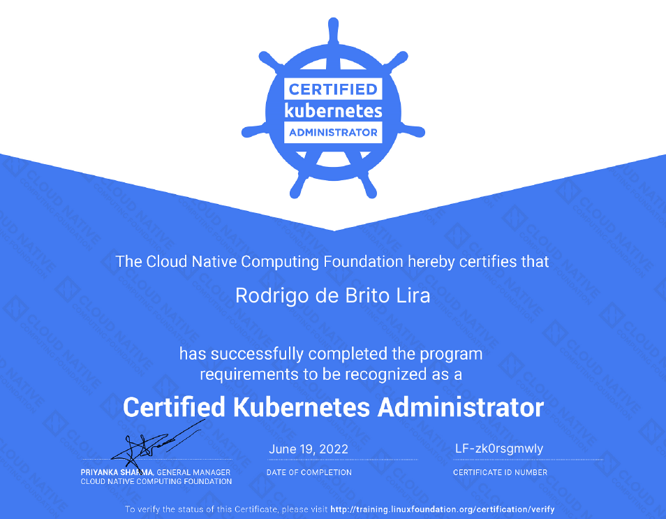

Salve Salve Pessoal!

Hoje vamos falar um pouco sobre as certificações que pretendo tirar ou renovar nesse ano de 2024.

Eu já fiz diversas provas para certificações durante a minha carreira profissional, abaixo uma lista com todas.

- CKA: Certified Kubernetes Administrador
- RHCSA: Red Hat Certified System Administrator
- RHCE: Red Hat Certified Engineer 7
- RHCE: Red Hat Certified Engineer 8, Ansible 2.8
- RHCS: Red Hat Certified Specialist in Containers for Kubernetes
- LPIC-1: Linux Administrador
- LPIC-2: Linux Engenier
- LPIC-3: Linux Enterprise Professional Security (303)
- SUSE Certified Linux Professional 11
- SUSE Certified Linux Professional 12
- VMware Certified Associate - Data Center Virtualization
- VMware Certified Professional 5 - Data Center Virtualization
- VMware Certified Professional 6 - Data Center Virtualization
- VMware Certified Professional 6 - Network Virtualization
- Oracle VM 3.0 for x86 Certified Implementation Specialist
- Oracle Cloud Infrastructure Foundations Certified Associate 2021
- Oracle Cloud Infrastructure - Certified Architect Associate 2021
- Microsoft Specialist: Server Virtualization with Windows Server Hyper-V and System Center
- ITIL Foundation Certificate in IT Service Management v3
- Information Security Foundation ISO/IEC 27002
- GitLab Certified Associate

Algumas dessas certificações ainda estão válidas, algumas já fiz mais de uma vez, outras já venceram, outras nem são aplicadas mais.

Hoje procuro manter apenas as certificações que acho interessante para a minha carreira profissional e para o momento atual.

**LPIC-3**

**RHCE**

**CKA**

Para o ano de 2024 quero tirar ou renovar as seguintes:

Tirar:

**Certified Kubernetes Security Specialist (CKS)** **Red Hat Enterprise Linux Diagnostics and Troubleshooting (EX342)** **Red Hat Certified Specialist in Security (EX415)**

Renovar:

**Linux Professional Institute (LPIC-3 Security)**

Vou atualizando vocês caso seja aprovado ou reprovado em cada exame e como foi a experiência com cada uma das provas.

Até o próximo post!

:D
