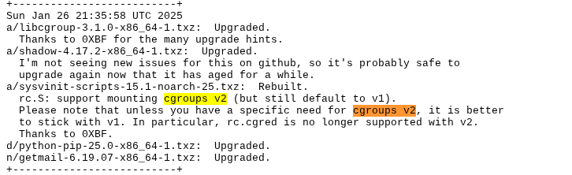
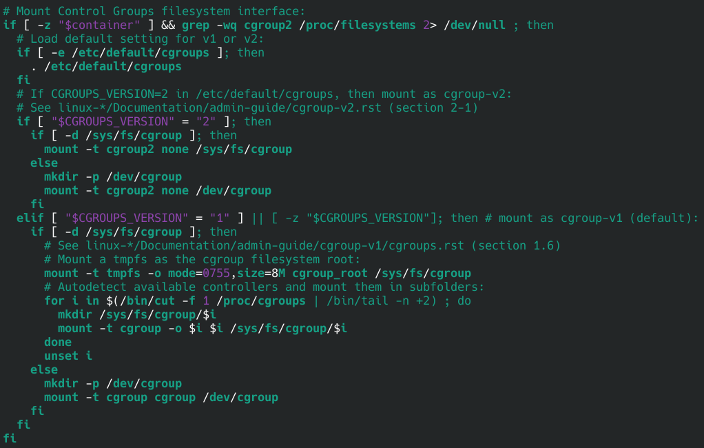
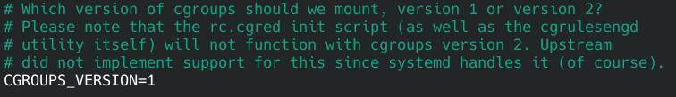
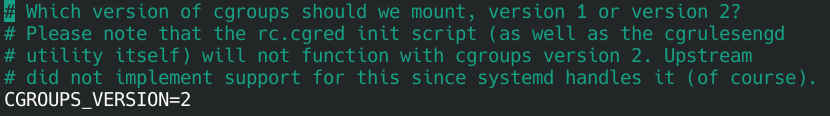

Salve, salve, pessoal!

O **Cgroups versão 2** foi implementado no **Slackware** apenas em **janeiro de 2025**, mais precisamente no **dia 26**. Porém, por padrão, ainda é recomendado utilizar a **versão 1**, a menos que você tenha uma necessidades específicas, como é o meu caso, pois estou tentando subir meu cluster Kubernetes de teste no Slackware. Mas isso é assunto para outro post.



Podemos validar qual versão estamos utilizando com o seguinte comando:

```
# stat -fc %T /sys/fs/cgroup/
tmpfs
```

A saída **tmpfs** indica que estamos utilizando a **versão 1**.

Dando uma olhada no arquivo **/etc/rc.d/rc.S**, conforme informado no **changelog**, vemos que ele lê o arquivo **/etc/default/cgroups** para determinar qual versão do cgroups deve ser utilizada, veja o trecho do **/etc/rc.d/rc.S**.



Ao verificar o **/etc/default/cgroups**, vemos que a **versão 1** está definida como padrão.



Basta alterar o valor de **1** para **2** e reiniciar o sistema.



Pronto! Agora o Slackware está utilizando o cgroups versão 2.

Para confirmar, podemos executar novamente o comando utilizado anteriormente:

```
# stat -fc %T /sys/fs/cgroup/
cgroup2fs
```

Observe que agora o retorno é **cgroup2fs**, confirmando que a versão 2 está ativa.

Até o próximos post!

🖖🖖🖖