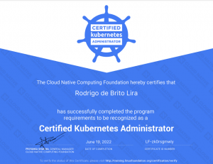

Salve Salve Pessoal!

Este final de semana fiz minha primeira prova de Kubernetes: **CKA - Certified Kubernetes Administrador**

Como vocês podem ver fui bem e passei.

A prova é muito boa de fazer e até bem tranquila comparada as provas da Red Hat.

Eu já venho trabalhando com kubernetes faz algum tempo, então algumas coisas foram bem simples de resolver.

Mas por onde estudei para o exame?

Eu estudei e particularmente indico o seguinte caminho:

**1 -** [https://www.pluralsight.com/paths/certified-kubernetes-administrator](https://www.pluralsight.com/paths/certified-kubernetes-administrator) 

Esse curso do Pluralsight é muito bom e tem o foco bem maior que apenas o CKA.

**2 -** [https://www.udemy.com/course/certified-kubernetes-administrator-with-practice-tests](https://www.udemy.com/course/certified-kubernetes-administrator-with-practice-tests)

Esse curso da Udemy é quase uma obrigação para quem está querendo fazer a prova.

**3 -** [https://killer.sh/cka](https://killer.sh/cka)

Quando você comprar o exame você vai ter direito a duas seções no simulador, aproveite bem, se você resolver as questões dele com certeza você irá passar na prova.

Por enquanto é isso, boa sorte!

Até o próximo post.

:D
