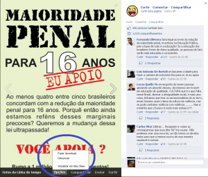
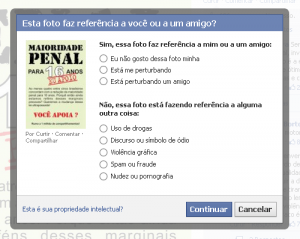

Salve Salve Galera!

Estou fazendo esse post porque fiquei indignado com um vídeo que foi postado no facebook essa semana, o vídeo mostrava cenas de sexo explicito entre dois jovens com idades aparentemente entre 15 e 16 anos, o que mais me revoltou foi a quantidade de curtidas e compartilhamento do mesmo e ninguém teve a coragem de fazer a denuncia ao facebook porque não sabiam ou não queriam, não sou contra esse tipo de vídeo na internet, mas existem sites especializados nesses assuntos, alem do mais não são apenas maiores de idade que tem facebook, ao contrario uma grande parte são crianças e jovens.

Vamos ao tutorial para que nós possamos combater esse tipo de coisa.

Quando você da um click em cima de um vídeo ou uma foto por exemplo, o mesmo fica maior e vem a frente na tela do seu computador como mostra a figura abaixo:

Observe que quando você coloca o ponteiro do mouse em cima da figura aparece algumas opções, como mostra a figura abaixo:

Observe que ao lado do nome **Compartilhar** aparece o nome **Opções**, click em cima de **Opções** e se abrira mais três opções, **Fazer download**, **Denunciar** e **Visualizar em tela cheia**, click em denunciar, vai abrir uma nova tela como mostra abaixo:

Selecione a opção que mais se encaixa a você, no meu caso foi **Nudez ou Pornografia**, click em continuar e vai aparecer uma nova tela como abaixo:

Exitem duas opções, no meu caso escolhi denunciar diretamente ao facebook para que o mesmo resolvesse o problema, click em continuar. Pronto feito isso basta esperar que o próprio facebook resolva o problema.

Em 11 minutos recebi um e-mail informando que o vídeo tinha sido retirado.

Pois bem pessoal fica ai a dica para quem não sabia o que fazer para denunciar essa raça nojenta que publica esse tipo de conteúdo em uma rede social, abraço a todos!
