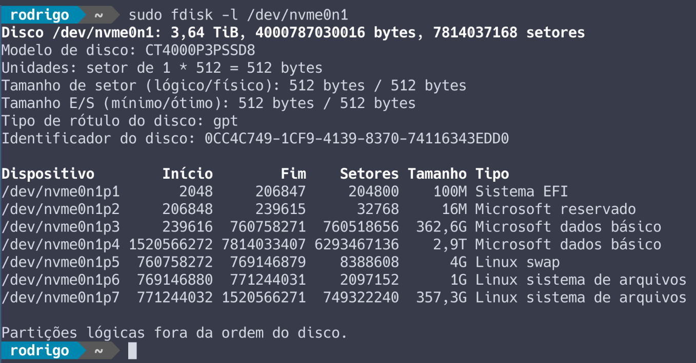
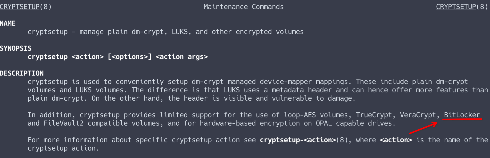
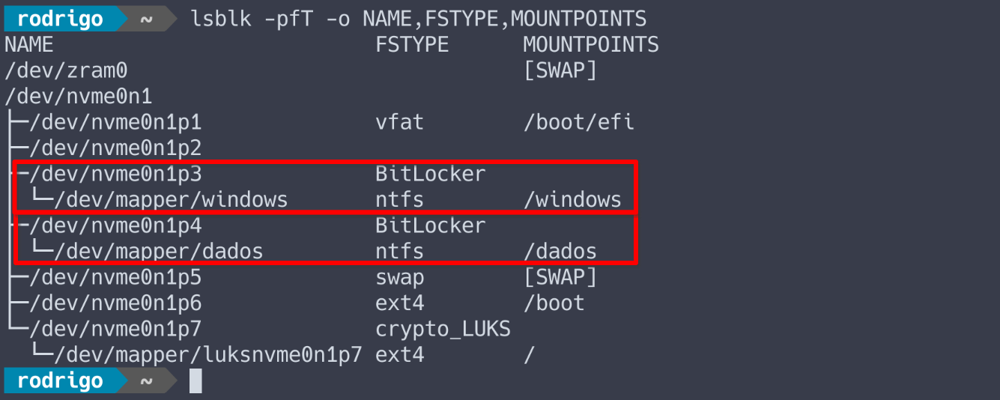
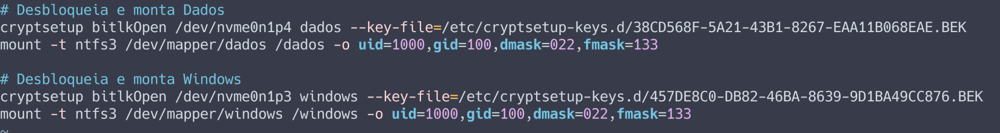

Salve Salve Pessoal!

Neste post, vou mostrar como montar partições **NTFS** com **BitLocker** ativado no **Linux**, utilizando apenas o **cryptsetup**.

Para dar um pouco de contexto, atualmente, meu notebook pessoal está equipado com um disco **NVMe** de **4TB**, que eu dividi da seguinte forma: aproximadamente **3TB** para uma partição de dados, **360GB** para o **Windows** e **360GB** para o **Slackware**.

A partição de 3TB, que chamei de "**Dados**", contém todos os meus arquivos essenciais. Para garantir que ela seja acessível de qualquer sistema operacional, optei por formatá-la em **NTFS**. Isso ocorre porque, embora o Windows não consiga ler uma partição EXT4 nativamente, o formato NTFS permite que tanto o Windows quanto o Slackware acessem a partição com facilidade.

[](images/fdisk.png)

Para garantir a proteção dos meus dados, ativei o **BitLocker** nas duas partições **NTFS**: a partição do sistema operacional Windows e a partição de Dados.

Com isso, é essencial que, ao iniciar o Slackware, essas partições estejam desbloqueadas, permitindo o acesso sem problemas.

Uma das opções para realizar essa tarefa é utilizando um software chamado **Dislocker**, disponível no seguinte link:

[https://github.com/Aorimn/dislocker](https://github.com/Aorimn/dislocker)

No entanto, o que muitos não sabem é que também é possível fazer isso diretamente no Linux, utilizando o **cryptsetup**.

[](images/cryptsetup.png)

O procedimento para desbloquear a partição é bastante simples. Basta executar o seguinte comando, e o sistema solicitará a senha/chave de recuperação.

```
# cryptsetup bitlkOpen /dev/nvme0n1p4 dados
```

**/dev/nvme0n1p4** (é a partição ntfs com bitlocker)

**dados**(é o novo dispositivo que será criado e poderá ser montado)

Agora, com a partição debloqueada, basta montar o novo dispositivo criado, que no nosso caso é o **/dev/mapper/dados**.

```
# mount -t ntfs3 /dev/mapper/dados /dados
```

[](images/lsblk.png)

Nós também podemos desbloquear as partições utilizando chaves geradas pelo Windows, o que permite automatizar o processo de desbloqueio e montagem das partições.

Para gerar o arquivo `.bek` da partição criptografada no Windows, execute o seguinte comando:

```
PS C:\Windows\System32> manage-bde -protectors -add D: -recoverykey G:\chaves\
```

No exemplo acima, estamos gerando a chave para a partição **D** e salvando-a no diretório **G:\\chaves\\**, que corresponde a um pendrive. O comando retornará a seguinte saída:

```
Criptografia de Unidade de Disco BitLocker:
Ferramenta de Configuração versão 10.0.26100
Copyright (C) 2013 Microsoft Corporation. Todos os direitos reservados.

  Protetores de Chave Adicionados:

    Salvo no diretório G:\chaves\

    Chave Externa:
      ID: {457DE8C0-DB82-46BA-8639-9D1BA49CC876}
      Nome do Arquivo de Chave Externo:
        457DE8C0-DB82-46BA-8639-9D1BA49CC876.BEK
```

Observe que, por padrão, as chaves ficam ocultas no Windows. Para visualizá-las, é necessário habilitar a opção de exibir arquivos ocultos.

Com a chave em mãos, podemos voltar ao Linux. Primeiro, crie um diretório para armazenar as chaves:

```
# mkdir /etc/cryptsetup-keys.d
```

Em seguida, copie as chaves para esse diretório:

```
# cp /PENDRIVE/CAMINHO_DAS_CHAVES /etc/cryptsetup-keys.d/
```

Agora, altere a propriedade e o grupo dos arquivos para garantir que apenas o usuário root tenha acesso:

```
# chown root:root /etc/cryptsetup-keys.d/*.BEK
```

Ajuste as permissões para restringir o acesso:

```
# chmod 400 /etc/cryptsetup-keys.d/*.BEK
```

Crie um diretório onde a partição será montada:

```
# mkdir /dados
```

Agora, para desbloquear a partição, utilize o parâmetro **\--key-file** e forneça o caminho da chave:

```
# cryptsetup bitlkOpen /dev/nvme0n1p4 dados --key-file=/etc/cryptsetup-keys.d/457DE8C0-DB82-46BA-8639-9D1BA49CC876.BEK
```

Com a partição desbloqueada, basta montá-la no diretório criado:

```
# mount -t ntfs3 /dev/mapper/dados /dados -o uid=1000,gid=100,dmask=022,fmask=133
```

Para automatizar esse processo a cada inicialização do sistema, você pode adicionar os comandos ao arquivo **rc.local**. Isso garantirá que, sempre que o Slackware for iniciado, as partições sejam desbloqueadas e montadas automaticamente.

[](images/rc-local.png)

Até o próximo post!

:D
