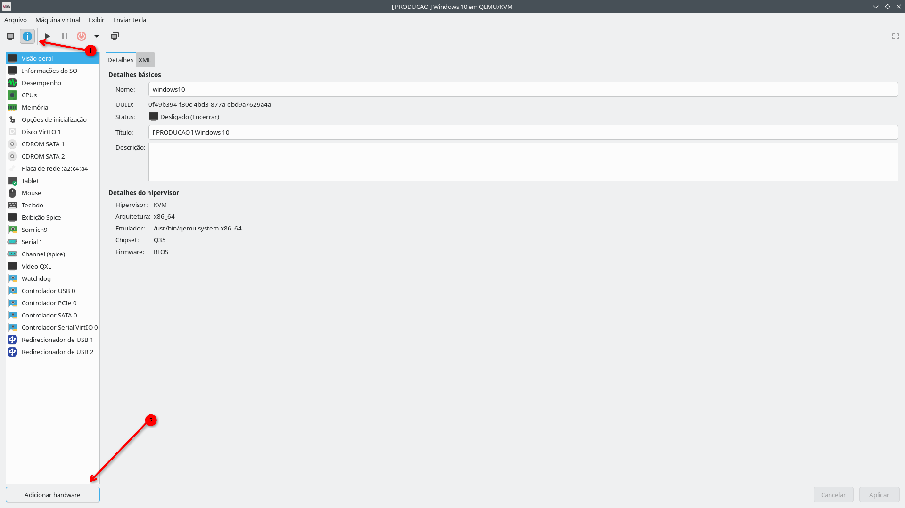
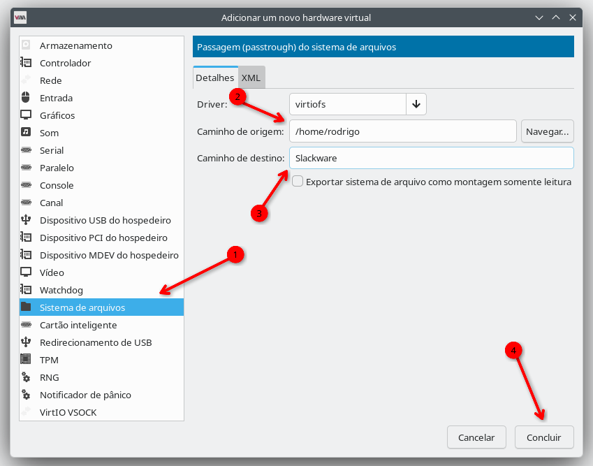
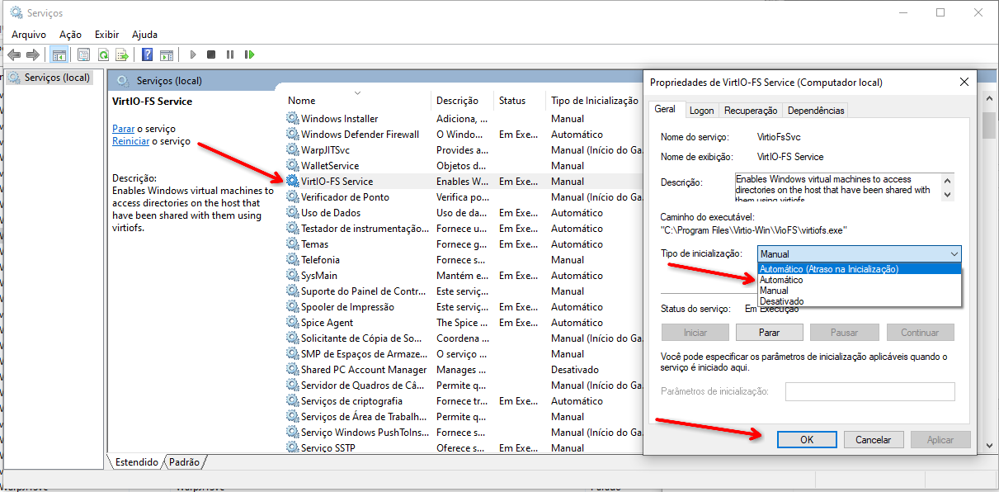
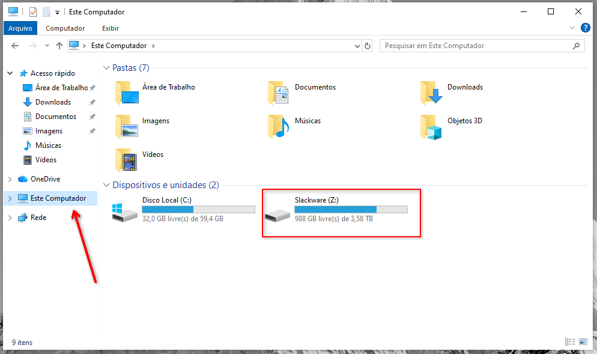

Salve Salve Pessoal!

Aqui no blog já escrevi alguns posts sobre o **VMware Workstation**. Quem utiliza a ferramenta sabe como é simples realizar o compartilhamento de diretórios entre o **sistema operacional hospedeiro** e o **sistema operacional convidado**. Inclusive, já mostrei como fazer esse procedimento no post abaixo:

https://rodrigolira.eti.br/vmware-workstation-compartilhamento-de-pastas-com-vms-linux

O que muita gente não sabe é que também é possível fazer esse tipo de compartilhamento utilizando **QEMU/KVM** com o **Virt-Manager**.

No meu caso, costumo utilizar um **Windows** virtualizado quando preciso executar alguma aplicação que está disponível apenas para esse sistema operacional.

Para realizar o compartilhamento de diretórios entre a máquina virtual Windows e o meu Slackware, precisamos instalar no Windows dois componentes: **VirtIO Drivers** e **WinFsp**.

Você pode baixar ambos nos links abaixo:

**VirtIO Drivers** - https://fedorapeople.org/groups/virt/virtio-win/direct-downloads/archive-virtio/

**WinFsp** - https://github.com/winfsp/winfsp/releases/

A instalação segue o mesmo padrão de qualquer outro software no Windows, então basta avançar nas etapas do instalador.

## Configurando o compartilhamento no Virt-Manager

No **Virt-Manager**, abra as configurações da máquina virtual e clique em **Adicionar hardware**.

Na janela que será aberta, selecione **Sistema de arquivos**. Em seguida, configure:

- **Caminho de origem**: diretório que será compartilhado no host (no meu caso, utilizo o diretório home do meu usuário).

- **Caminho de destino**: nome que será utilizado para acessar o compartilhamento dentro do Windows.

Depois disso, clique em **Concluir**.

## Configurando o serviço no Windows

Após iniciar a máquina virtual Windows, será necessário configurar o serviço **VirtIO-FS** para iniciar automaticamente.

Por padrão, esse serviço vem configurado para iniciar de forma **Manual**, então abra o gerenciador de serviços do Windows e altere o tipo de inicialização para **Automático**.

## Acessando o compartilhamento

Com tudo configurado, o diretório compartilhado já estará disponível no Windows e poderá ser acessado normalmente.

Pronto! Agora você já consegue compartilhar diretórios entre o host **Linux** e uma máquina virtual **Windows** utilizando **QEMU/KVM** e **Virt-Manager** de forma simples e eficiente.

Até o próximo post!

🖖🖖🖖
