[](images/powerdns.png-800x95-100-_001.png)

Salve Salve Pessoal!

Dando continuidade a serie de posts sobre o PowerDNS, hoje vamos ver como podemos configurar o PowerDNS para trabalhar como Master e Slave fazendo a replicação dos dados automaticamente.

Para quem não acompanhou meu outros posts sobre o PowerDNS segue os links abaixo:

**1** - [Instalando o PowerDNS 4.3 Authoritative no CentOS 8 / Oracle Linux 8 / RHEL 8](https://rodrigolira.eti.br/instalando-o-powerdns-4-3-authoritative-no-centos-8-oracle-linux-8-rhel-8/)

**2** - [Gerenciando o PowerDNS com o PowerDNS-Admin](https://rodrigolira.eti.br/gerenciando-o-powerdns-com-o-powerdns-admin/)

Temos diversas possibilidades de replicação dos dados, normalmente o próprio banco de dados nos dá essa possíbilidade, mas podemos configurar para que o próprio PowerDNS gerencie e faça esse serviço.

Vamos usar o mesmo servidor que configuramos nos outros dois posts como **Master** (10.20.30.220) e precisaremos criar mais um servidor para usarmos como **Slave** (10.20.30.217).

Para configurar o servidor **Slave** crie uma nova máquina, faça a instalação do sistema operacional e basta seguir os mesmo passos descritos no post de instalação do **PowerDNS**([Instalando o PowerDNS 4.3 Authoritative no CentOS 8 / Oracle Linux 8 / RHEL 8](https://rodrigolira.eti.br/instalando-o-powerdns-4-3-authoritative-no-centos-8-oracle-linux-8-rhel-8/)), porém só até o passo **15**.

Vamos as configurações. :D

Olhando a configuração atual do nosso servidor que vai ser o **Master**, podemos verificar que ele esta trabalhando com o tipo **Native**, em modo único.

[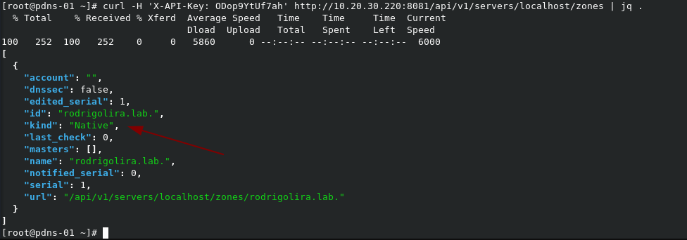](images/2020-04-22_19-34.png)

A primeira coisa que precisamos fazer é mudar as configurações desse servidor para Master, podemos fazer isso via console do banco de dados ou através do PowerDNS-Admin.

Vamos fazer essas configurações usando o PowerDNS-Admin, assim começamos a conhecer um pouco a ferramenta também.

1 - Acesse o PowerDNS-Admin e veja o domínio que deseja configurar, observer que ele já informa o tipo de funcionamento do servidor na coluna **Type**, clique em **Admin** para mudarmos.

[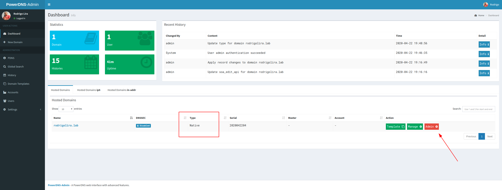](images/2020-04-22_19-47-1.png)

2 - Em **Change Type**, selecione **Master** em **New Domain Type Setting** e depois clique em **Change type for SEU DONÍNIO**.

[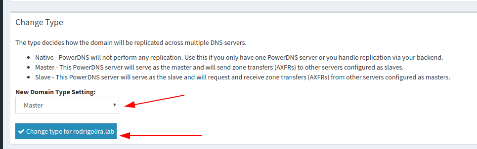](images/2020-04-22_19-57.png)

3 - Em **Change SOA-EDIT-API**, selecione **INCRASE** em **New SOA-EDIT-API Setting** para incrementar o serial a cada mudança no domínio e clique em **Change SOA-EDIT-API setting for SEU DOMÍNIO**.

[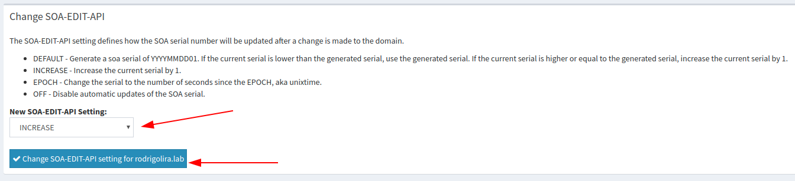](images/2020-04-22_20-03.png)

Quando você voltar ao dashboard verá que a coluna **Type** estará como **Master** agora.

4 - Agora acesse seu servidor Master via SSH e vamos inserir as seguintes linhas no arquivo de configuração **/etc/pdns/pdns.conf**.

```
master=yes 
allow-axfr-ips=10.20.30.217 
also-notify=10.20.30.217
```

[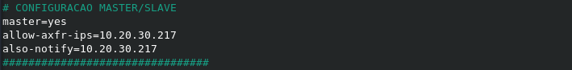](images/2020-04-22_20-09.png)

**OBS:** Substitua os endereços IP pelos endereços IP do seu servidor **Slave**.

5 - Reinicie o PowerDNS.

```
# systemctl restart pdns
```

Pronto, terminamos as configurações em nosso servidor Master, agora vamos configurar o nosso servidor Slave.

Se você fez todos os passos do outro post como mencionei no inicio do post, está na hora de configurarmos o banco de dados no servidor **Slave**.

6 - Acesse o banco de dados.

```
# mysql -u pdnsuser -p powerdns
```

7 - Vamos criar o mesmo domínio que já tem no master.

```
# INSERT INTO domains (name, master, type) VALUES ('rodrigolira.lab', '10.20.30.220', 'SLAVE');
```

Observer que estamos criando o domínio com o mesmo nome do domínio no master **rodrigolira.lab**, estamos passando o endereço IP do nosso servidor Master (**10.20.30.220**) e o tipo como **SLAVE**.

**OBS:** A replicação é feita por domínio, ou seja, se você desejar que todos os domínios que o PowerDNS gerência sejam replicados você precisa fazer esse passo para todos.

8 - Agora vamos editar o arquivo de configuração **/etc/pdns/pdns.conf**, insira as linhas abaixo.

```
slave=yes 
slave-cycle-interval=60
```

[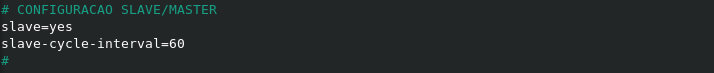](images/2020-04-22_20-29.png)

9 - Reinicie o PowerDNS.

```
# systemctl restart pdns
```

Pronto, **Master** e **Slave** configurados, agora vamos verificar se estão sincronizando as informações corretamente.

10 - No servidor **Slave** execute o seguinte comando.

```
# pdns_control list-zones
```

O retorno do comando deve ser os seus domínios cadastrados, como a imagem abaixo.

[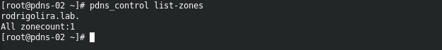](images/2020-04-22_20-36.png)

11 - Vamos criar um novo registro no servidor Master através do **PowerDNS-Admin** e vamos acompanhar os logs no Master e Slave.

Acesse via SSH o **Master** e o  **Slave** e execute o comando abaixo para acompanhar os **logs**.

```
# tail -f -n 0 /var/log/messages | grep pdns_server
```

Agora acesse o **PowerDNS-Admin** e clique em **Manager** no seu domínio.

[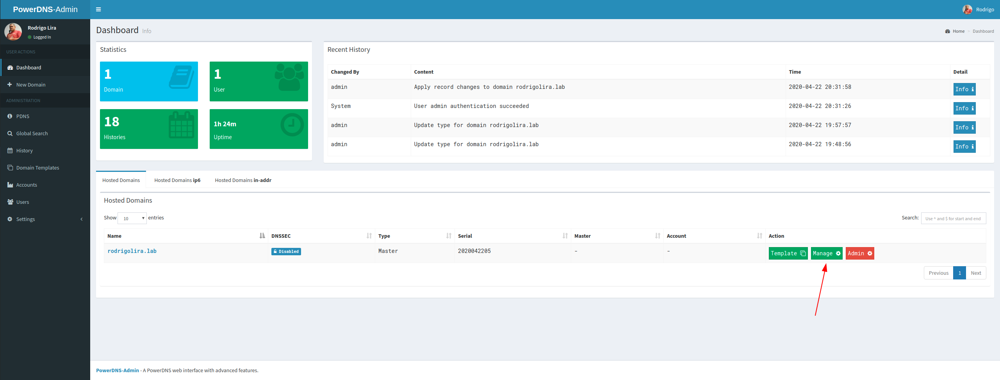](images/2020-04-22_20-41.png)

Clique em **Add Record**, **insira os dados** e clique em **Save**.

[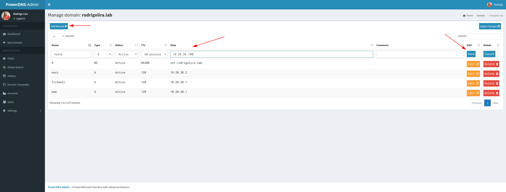](images/2020-04-22_20-43.png)

Clique em **Apply Changes** e depois **Apply** para confirmar.

[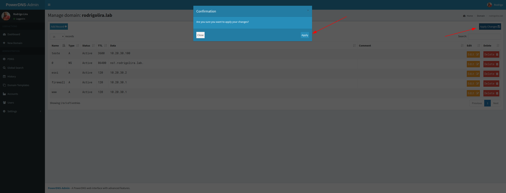](images/2020-04-22_20-46.png)

Pronto, o novo registro é adicionado.

Agora veja os logs, observer que o **Slave** inicia uma nova transferência depois que ele identifica que houve mudança no **serial**.

**Master**

[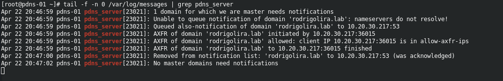](images/2020-04-22_20-50.png)

**Slave**

[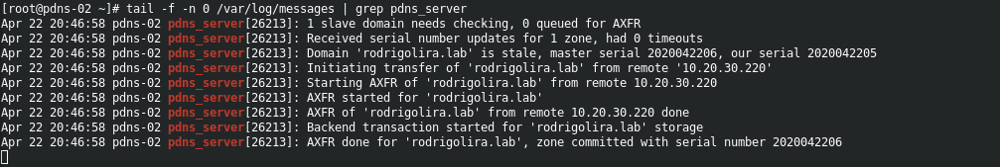](images/2020-04-22_20-51.png)

Para finalizar use o **DIG** de seu desktop e verifique se os servidores estão respondendo corretamente.

[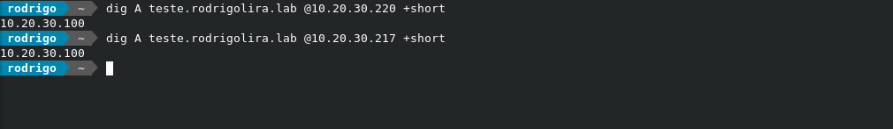](images/2020-04-22_20-52.png)

Pronto, é isso ai, espero que tenham gostado.

Até a próxima!

:D
