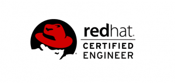

Salve Salve Pessoal!

Este é o primeiro de uma serie de posts que vou fazer sobre o exame de certificação Red Hat Certified Engineer (EX300).

Todos os links para os posts dessa serie vão estar disponíveis no link abaixo, a cada post que for criando vou atualizando a página, então salva ai nos favoritos. ;)

https://rodrigolira.eti.br/rhce/

Nesse post vamos conhecer um pouco mais sobre o exame, onde fazer, quanto custa, o conteúdo cobrado e etc.

Para começar vamos ver o que o site da Red Hat pode nos dizer sobre o exame:

**Um RHCE é capaz de realizar tarefas de um RHCSA, e outras como:**

- Configuração de rotas estáticas, filtragem de pacotes e conversão de endereços de rede
- Configuração de parâmetros de tempo de execução de kernel
- Configuração de um iniciador Internet Small Computer System Interface (iSCSI)
- Produção e entrega de relatórios sobre a utilização do sistema
- Utilização de scripts shell para automatizar tarefas de manutenção do sistema
- Configuração de logs do sistema, incluindo logs remotos
- Configuração de um sistema para fornecer serviços de rede, incluindo HTTP/HTTPS, Protocolo de Transferência de Arquivos (FTP), Sistema de Arquivos de Rede (NFS), Bloco de Mensagens do Servidor (SMB), Protocolo de Transferência de Correio Simples (SMTP), Secure Shell (SSH) e Protocolo de Tempo de Rede (NTP)

Os treinamentos indicados são:

Administradores de sistema do Windows com experiência mínima em Linux:

- Red Hat System Administration I (RH124)
- Red Hat System Administration II (RH134)
- Red Hat System Administration III (RH254)

Administradores Linux ou UNIX com 1 a 3 anos de experiência:

- RHCSA Rapid Track Course (RH199)
- Red Hat System Administration III (RH254)

RHCEs que desejam renovar a certificação:

- RHCE Certification Lab

Essas informações estão no link abaixo:

[https://www.redhat.com/pt-br/services/certification/rhce](https://www.redhat.com/pt-br/services/certification/rhce)

Agora que já sabemos um pouco sobre o conteúdo cobrado e os treinamentos indicados, vamos ver alguns detalhes sobre o exame.

**1** - É necessário passar no exame **RHCSA** para obter o título de **RHCE**.

**OBS:** Vou fazer uma serie de posts sobre o RHCSA em breve, porém como estou estudando nesse momento para o RHCE, só vou estar disponibilizando o conteúdo dele por enquanto.

**2** - A prova custa atualmente **R$ 1.600,00**.

**3** - Existem três possibilidades de realizar o exame, são:

- **Em Sala de Aula** (quando você faz o treinamento e depois a prova em algum parceiro da Red Hat)
- **Exame Local** (normalmente quando é realizado um treinamento inloco na empresa)
- **Quiosque** (você pode realizar o exame o dia e hora desejada, desde agendado previamente)

**4** - No Brasil só existe um local onde você pode fazer a prova no Quiosque, fica no Estado de São Paulo.

**5** - A prova tem uma duração de **3 horas e meia**.

**6** - A prova poder ser realizada em **português**, você escolhe o idioma na hora que deseja na hora que começa a fazer a prova, porém a pessoa que aplica a prova falará com você em inglês em um chat, porém é bem tranquilo.

**7** - A pessoa(fiscal) que aplica a prova estará vendo você online através de câmeras.

**8** - A prova é totalmente prática, você não terá acesso a internet, porém tem acesso a documentação local da Red Hat.

**OBS:** Esqueça a documentação, vá sabendo o que vai fazer. :P

Por enquanto é isso, até o próximo post!

:D
