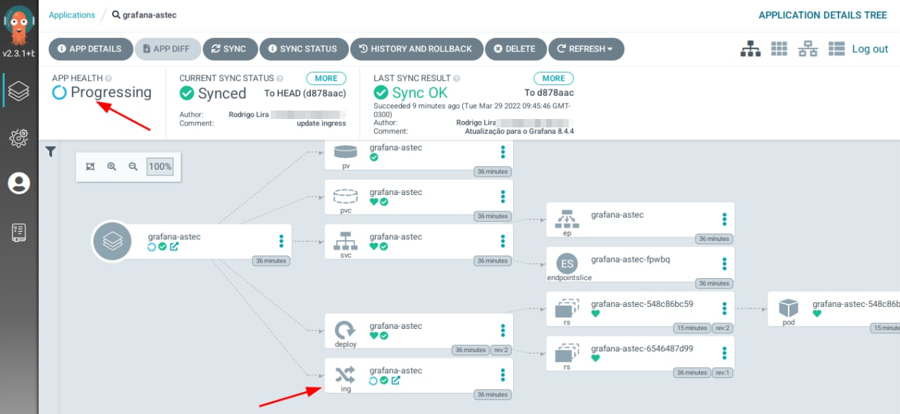
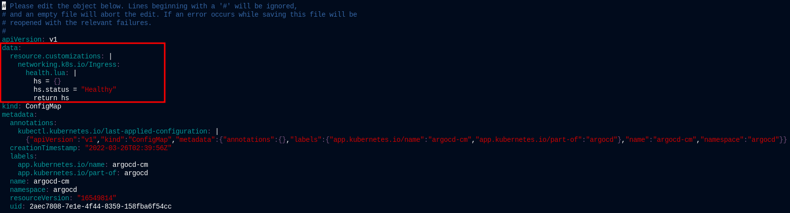
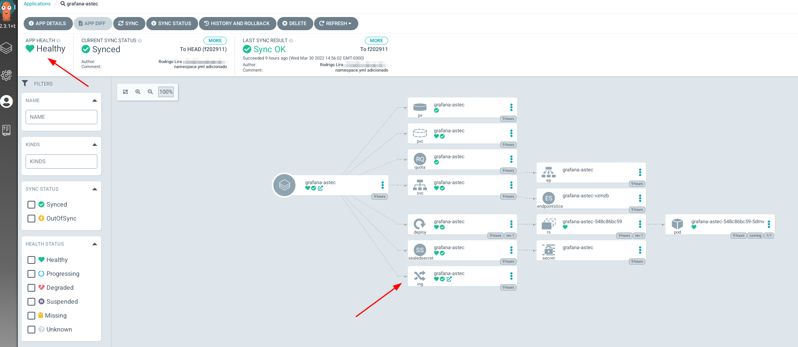

[](images/argoprojio-ar21.png)

Salve Salve Pessoal!

Nesses últimos dias venho tentando migrar todas as aplicações que administro no meu trabalho para dentro de um cluster kubernetes.

Estou utilizando o **ArgoCD** como ferramenta para o **continuous delivery** do ambiente. Não tive problema algum com os deploys feitos no ambiente, porém o **health check** do **ingress** de todos sempre estavam com o status de **Progressing**, como podemos ver na imagem abaixo.<!--more-->

[](images/2022-03-30_23-11.png)

Esse problema é conhecido e acontece porque o  **Contour** não atualiza o **status.loadBalancer.ingress** com um valor de **IP** ou **hostname**.

Como solução alternativa podemos configurar o **ArgoCD** e mudar o seu comportamento padrão, para isso é necessário editar o **ConfigMaps argocd-cm**.

Execute o comando abaixo para editar o argocd-cm.

```
# kubectl -n argocd edit configmap argocd-cm
```

Adicione as seguintes linhas.

```
data:
  resource.customizations: |
    networking.k8s.io/Ingress:
      health.lua: |
        hs = {}
        hs.status = "Healthy"
        return hs
```

[](images/2022-03-30_23-56.png)

Pronto, depois disso seus deploys devem ficar com o status de **Healthy** como na imagem abaixo.

[](images/2022-03-30_23-46.png)

Por hoje é isso, até o próximo post!

:D

**Referências:**

[https://argo-cd.readthedocs.io/en/stable/faq/#why-is-my-application-stuck-in-progressing-state](https://argo-cd.readthedocs.io/en/stable/faq/#why-is-my-application-stuck-in-progressing-state)

[https://argo-cd.readthedocs.io/en/stable/operator-manual/health/](https://argo-cd.readthedocs.io/en/stable/operator-manual/health/)

[https://github.com/argoproj/argo-cd/issues/1704](https://github.com/argoproj/argo-cd/issues/1704)
