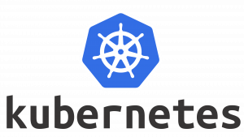

[](images/Kubernetes-Logo.png)

Salve Salve Pessoal!

No post de hoje vou mostrar como podemos criar um usuário para gerenciar um **Cluster kubernetes**.

Antes de mais nada quero deixar bem claro que existem diversas maneiras de criar um usuário para gerenciar o kubernetes, aqui vou escrever da maneira que eu gosto de fazer e que eu acho mais simples, não que seja a maneira mais simples, mas como já é o meu padrão, para mim é simples. :D

Primeiro vamos entender um pouco sobre usuários no kubernetes.

No Kubernetes existem duas categorias de usuários: contas de serviço gerenciadas pelo Kubernetes e usuários normais, não existe um tipo de objeto que represente um usuário normal no Kubernetes, dessa forma não conseguimos adicionar um usuário normal via uma chamada de API como os outros objetos, porém podemos usar um certificado assinado pela CA do Kubernetes para nos autenticar, que é o nosso caso nesse post.

Vamos ao que interessa e ver como podemos criar e assinar esses certificados, vamos usar o nome **devops** para referênciar o usuário do certificado.

**1** - Vamos criar as chaves, execute os seguintes comando.

```
# openssl genrsa -out devops.key 2048

# openssl req -new -key devops.key -out devops.csr -subj "/CN=devops"
```

**2** - Vamos criar um objeto no cluster do tipo **CertificateSigningRequest** contendo o conteúdo do **devops.csr**, porém esse dado precisa ser convertido em **base64**, execute o comando.

```
# cat devops.csr | base64 | tr -d "\n"
```

**3** - Agora pegue a saída do comando acima e cole no comando abaixo.

```
# cat <<EOF | kubectl apply -f -
apiVersion: certificates.k8s.io/v1
kind: CertificateSigningRequest
metadata:
  name: devops
spec:
  request: COLE_AQUI
  signerName: kubernetes.io/kube-apiserver-client
  usages:
  - client auth
EOF
```

**4** - Vamos aprovar o certificado no cluster.

```
# kubectl certificate approve devops
```

**5** - Agora vamos exportar o certificado emitido pelo **CertificateSigningRequest**, observe que usamos o **base64 -d**, o motivo é que ele está codificado em **base64**.

```
# kubectl get csr devops -o jsonpath='{.status.certificate}'| base64 -d > devops.crt
```

**6** - Adicionamos o **usuário** ao **kubeconfig**.

```
# kubectl config set-credentials devops --client-key=devops.key --client-certificate=devops.crt --embed-certs=true
```

**7** - Adicionamos o **contexto** ao **kubeconfig**.

```
# kubectl config set-context devops --cluster=kubernetes --user=devops
```

Agora para testar o usuário que acabamos de criar, vamos criar alguns objetos no cluster e definir permissões para nosso usuário devops.

**8** - Crie um namespace, no nosso caso estou chamando ele de **sre**.

```
# kubectl create namespace sre
```

**9** - Vamos criar um pod simples usando a imagem do **nginx** no namespace sre.

```
# kubectl run --image=nginx nginx -n sre
```

**10** - Verifique se o **pod** está rodando.

```
# k get pods -n sre
```

**11** - Agora vamos criar uma **role** com permissão apenas nos **pods** do namespace **sre**, vamos chamar essa role de **role-sre**.

```
# kubectl create role role-sre --verb=create --verb=get --verb=list --verb=update --verb=delete --resource=pods -n sre
```

**12** - Também precisamos criar uma **role binding** para vicular a role **role-sre** ao usuário **devops**, vamos chamar essa role binding de **role-binding-sre**, lembre que tem que ser criado no namespace **sre**.

```
# kubectl create rolebinding role-binding-sre --role=role-sre --user=devops -n sre
```

**13** - Pronto, agora podemos mudar o contexto e testar o usuário devops.

```
# kubectl config use-context devops
```

**14** - Agora verifique se o usuário devops tem permissão no namespace **default** e depois se ele tem permissão no namespace sre.

```
# kubectl get pods
```

Você deve ter recebido o seguinte erro na tela:

```
Error from server (Forbidden): pods is forbidden: User "devops" cannot list resource "pods" in API group "" in the namespace "default": RBAC: role.rbac.authorization.k8s.io "role-sre" not found
```

```
# kubectl get pods -n sre
```

```
NAME    READY   STATUS    RESTARTS   AGE 
nginx   1/1     Running   0          41m
```

Permissão para listar os pods no namespace sre. :D

Agora que já testamos as permissões do usuário devops, precisamos enviar os dados de acesso ao cluster para ele, como nós inserimos as credenciais e o contexto do usuário devops no **kubeconfig**, basta enviarmos esse arquivo para ele, porém esse arquivo também contem as informações do usuário **admin**.

Então precisamos remover o contexto e o usuário **admin** do arquivo antes de enviar uma cópia dele para o usuário.

**15** - Crie um backup do kubeconfig.

```
# cp ~/.kube/config ~/.kube/config-bkp
```

**16** - Delete o contexto do usuádio admin.

```
# kubectl config delete-context kubernetes-admin@kubernetes
```

**17** - Remova o usuário.

```
# kubectl config unset users.kubernetes-admin
```

Pronto, agora você pode enviar o arquivo para o usuário devops sem problema.

Se lembre de voltar o backup para poder mudar o contexto para **admin** novamente.

Espero que vocês tenham gostado do post, até a próxima!

:D

Referências:

[https://kubernetes.io/docs/reference/access-authn-authz/authentication](https://kubernetes.io/docs/reference/access-authn-authz/authentication)

[https://kubernetes.io/docs/reference/access-authn-authz/certificate-signing-requests/#normal-user](https://kubernetes.io/docs/reference/access-authn-authz/certificate-signing-requests/#normal-user)
