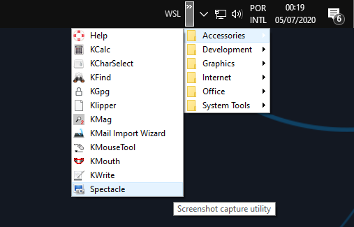
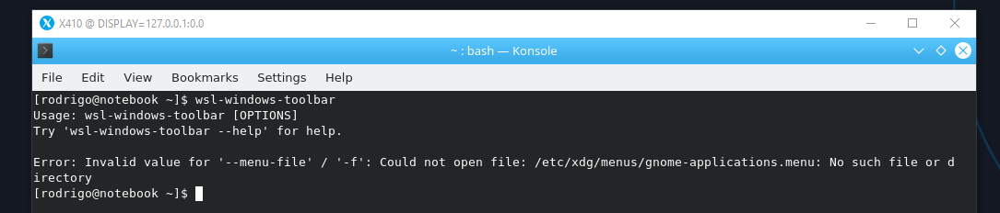
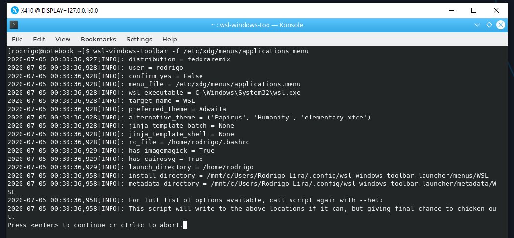
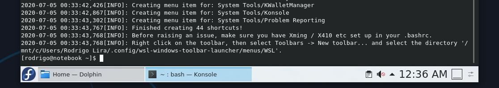
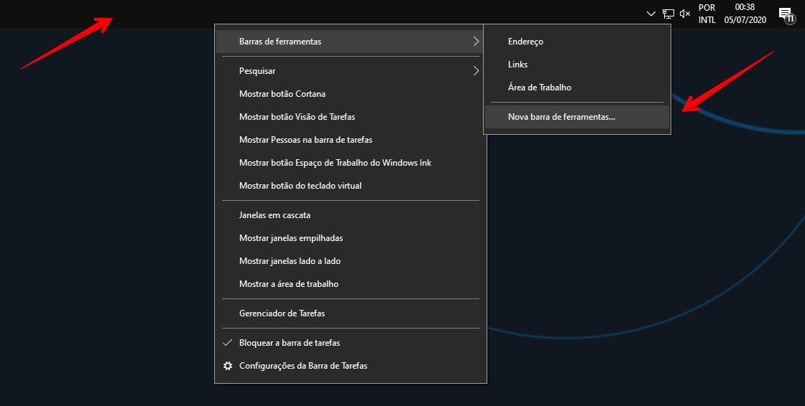
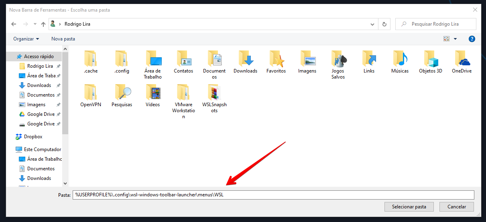
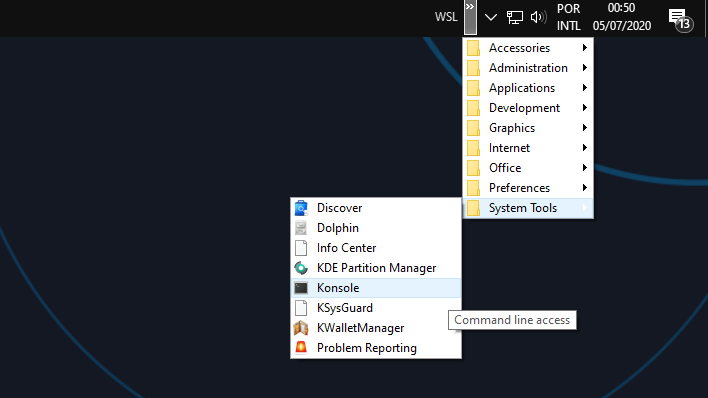
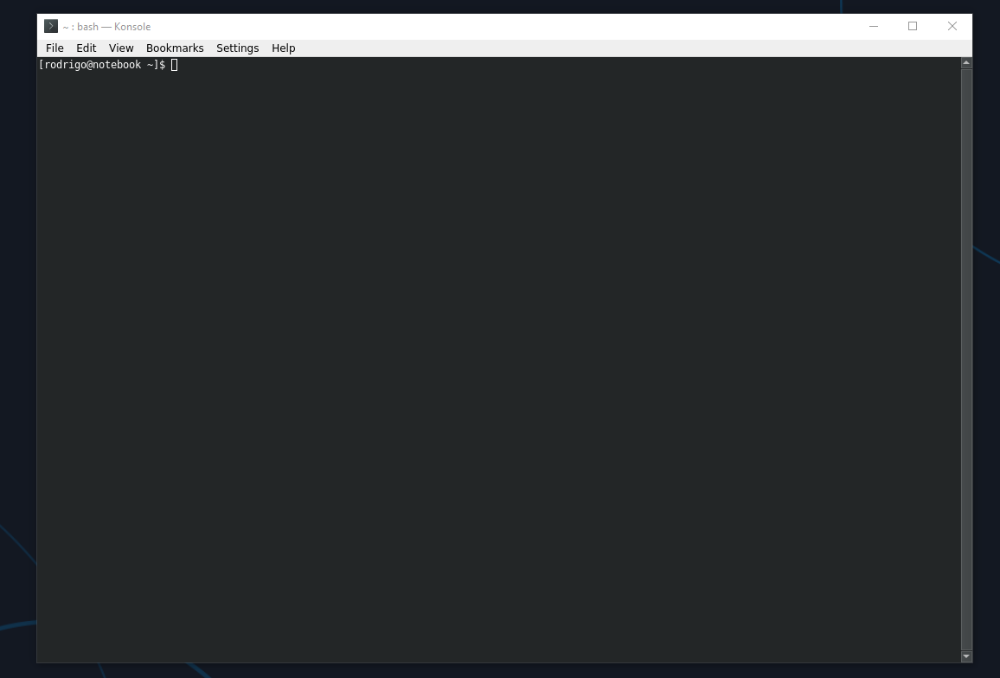

Salve Salve Pessoal!

Nesse post vou mostrar como podemos criar o menu do **KDE** do nosso **Fedora Remix** na barra de tarefas do Windows.

Se você não leu o meu post sobre **Windows 10 + WSL2 + Fedora Remix + KDE + X410** eu sugiro que leia, pois esse post é basicamente uma continuação dele.

Segue o link abaixo:

https://rodrigolira.eti.br/windows-10-wsl2-fedora-remix-kde-x410/

Nesse post do link acima mostrei como podemos fazer a instalação do ambiente gráfico do **KDE** no **Fedora Remix**, porém para abrir uma aplicação com ambiente gráfico é necessário abrir todo o ambiente gráfico do KDE.

Para resolver esse problema existe um projeto chamado **WSL Windows Toolbar Launcher**.

Esse script cria um menu na **Barra de Tarefas do Windows** baseado no **Menu do KDE**, como na imagem abaixo:

[](images/001.png)

Vamos logo ao que interessa! :D

Inicie seu **Fedora Remix** com o **KDE** instalado e digite o seguinte comando:

```
# pip install wsl-windows-toolbar CairoSVG
```

Agora precisamos executar o script:

```
# wsl-windows-toolbar
```

Por padrão ele procura o menu do gnome e acaba apresentando um erro, como na imagem abaixo:

[](images/002.png)

Então precisamos informar o caminho completo para nosso menu KDE, é basicamente o mesmo:

```
# wsl-windows-toolbar -f /etc/xdg/menus/applications.menu
```

Apos executar o comando pressione **ENTER** para continuar.

[](images/003.png)

Ao final do processo ele informa o procedimento para criação do menu no windows, como mostra a imagem abaixo.

[](images/004.png)

No Windows clique com o botão direito na **barra de tarefas**, depois navegue até **Barra de ferramentas** > **Nova barra de ferramentas**.

[](images/005.png)

Na janela que se abre só digitar o seguinte caminho.

```
%USERPROFILE%\.config\wsl-windows-toolbar-launcher\menus\WSL
```

E depois clicar em **Selecionar pasta**.

[](images/006.png)

Pronto, o menu é criado automaticamente na barra de tarefas do Windows, agora só se divertir com essa facilidade.

[](images/007.png)

Abrindo o **Konsole** por exemplo ele só abrirá a janela dele sem precisar abrir todo o KDE, vejam a imagem abaixo:

[](images/008.png)

**OBSERVAÇÕES:**

Lembre-se que seu **servidor X** tem que estar em execução, no meu caso o **X410**.

Para esse modo de usabilidade deixo o **X410** com a opção **Windowed Apps** definida por padrão.

Pronto, espero que tenham gostado!

Até o próximo post.

:D

Referência:

[https://pypi.org/project/wsl-windows-toolbar/](https://pypi.org/project/wsl-windows-toolbar/)
