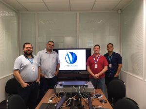

Salve Salve Pessoal!

Esse semana ministrei mais um curso de Oracle VM Server x86, dessa vez para o pessoal da empresa ENGIE BRASIL.

Oracle VM vem crescendo bastante no Brasil ;)

Quero agradecer a todos os alunos da turma.

Muito obrigado a todos :D

