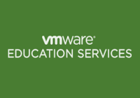

Salve Salve Pessoal!

Depois de um bom tempo sem postar nada, venho postar aqui alguns cursos da VMware que são gratuitos, esses cursos dão uma boa base das suas tecnologias e ajudam a decidir qual caminho seguir, segue a lista abaixo:

VSAN - Virtual SAN Fundamentals

[https://mylearn.vmware.com/mgrreg/courses.cfm?ui=www\_edu&a=one&id\_subject=55806](https://mylearn.vmware.com/mgrreg/courses.cfm?ui=www_edu&a=one&id_subject=55806)

NSX - VMware Network Virtualization Fundamentals

[http://mylearn.vmware.com/mgrReg/courses.cfm?ui=www\_edu&a=det&id\_course=240782](http://mylearn.vmware.com/mgrReg/courses.cfm?ui=www_edu&a=det&id_course=240782)

Data Center Virtualization Fundamentals - vSphere 6<!--more-->

[https://mylearn.vmware.com/mgrreg/courses.cfm?ui=www\_edu&a=one&id\_subject=64758](https://mylearn.vmware.com/mgrreg/courses.cfm?ui=www_edu&a=one&id_subject=64758)

Software-Defined Storage Essentials - vSphere 6 - VSAN 6

[http://mylearn.vmware.com/mgrreg/courses.cfm?ui=www\_edu&a=one&id\_subject=64761](http://mylearn.vmware.com/mgrreg/courses.cfm?ui=www_edu&a=one&id_subject=64761)

Para a lista completa dos cursos gratuitos da VMware acesse o link abaixo:

[http://mylearn.vmware.com/portals/www/mL.cfm?menu=topfreecourses](http://mylearn.vmware.com/portals/www/mL.cfm?menu=topfreecourses)

Espero que gostem!

Até a próxima :D
