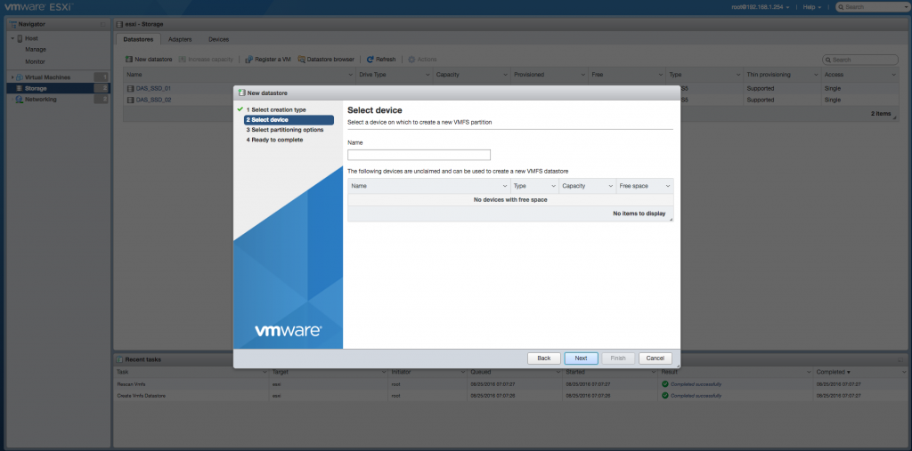
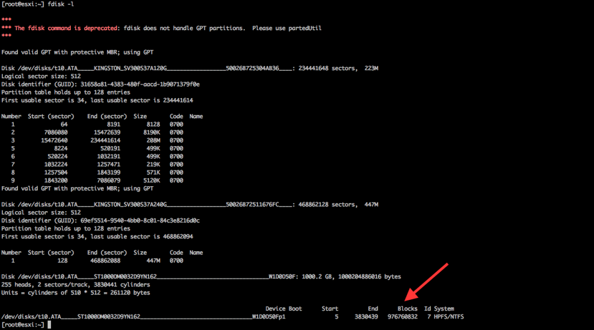
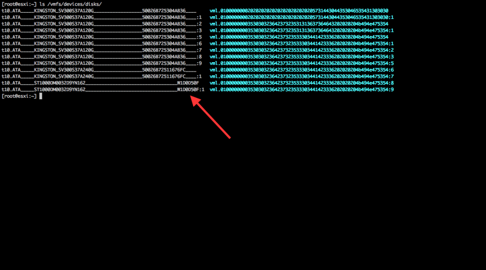
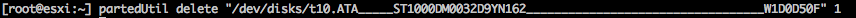
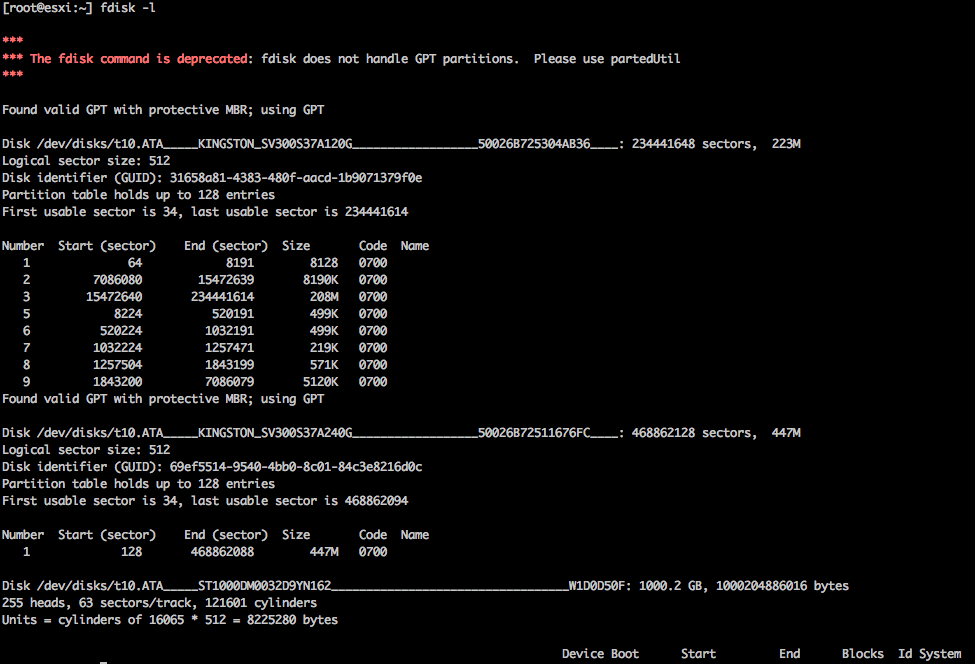
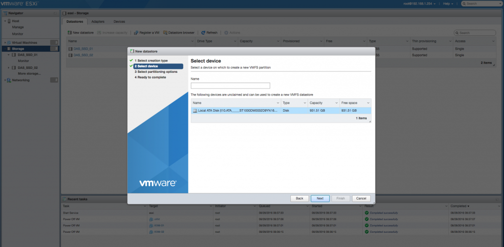
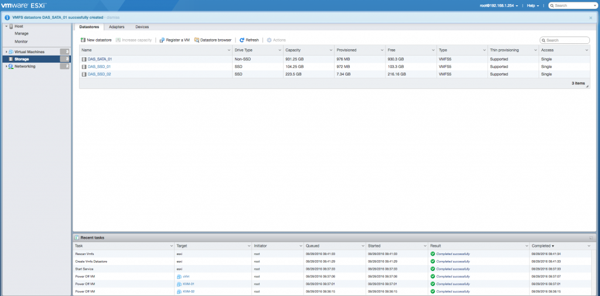

Salve Salve Pessoal!

De vez em quando, vem um conhecido ou outro me dizendo que colocou um novo disco no ambiente deles e o disco não foi reconhecido pelo vSphere, quando pergunto a eles se esse disco já tinha sido utilizado, na maioria das vezes sim e estão formatados com o sistemas de arquivos NTFS. Então dessa forma decide fazer esse post para mostrar como deletar esse sistema de arquivos para que o disco apareça no seu vSphere e que você possa formata-lo normalmente via interface web.

Então vamos lá :D

Como vocês podem ver na imagem abaixo, no meu ambiente estou apenas com 2 discos SSD.

Adicionei um novo disco Sata de 1TB ao meu ambiente, o mesmo já formatado com NTFS.

Quanto tendo adiciona-lo pelo ambiente web do vSphere o mesmo não aparece para mim, como mostra a imagem abaixo:

Quando listo os discos via CLI o mesmo está lá, porém o sistema de arquivos do mesmo está como NTFS, dessa forma o vSphere não o adiciona ao ambiente.

Para listar os discos você pode usar o **fdisk -l**, como na imagem abaixo:

Podemos listar também dando um **ls -l** no **/vmfs/devices/disks**:

Pronto, já vimos que o disco realmente foi reconhecido pelo vSphere, basta deletar-mos a partição NTFS para que ele possa aparecer na interface web do vSphere.

Para fazermos isso vamos usar o partedUtil, que é o utilitário de discos do vSphere.

Como já sabemos o nome basta deletar-mos a partição que contém o NTFS com o partedUtil:

Apenas para esclarecer um pouco mais o comando, o nome do disco fica entre aspas duplas e o numero da partição vem depois, dessa forma excluimos a partição 1 (NTFS) que faia parte do nosso disco.

Se executarmos novamente o **fdisk -l**, podemos verificar que a partição 1 (NTFS) sumiu:

Agora podemos ir na interface web que o disco já estará aparecendo para nós:

Pronto, depois disso só formata-lo e colocar no seu ambiente.

Espero que ajudem você, pelo menos quando alguém vim me perguntar como fazer, vou mandar pesquisar aqui no blog ;)

Para maiores detalhes sobre o uso do partedUtil acesse o link abaixo:

[https://kb.vmware.com/kb/1036609](https://kb.vmware.com/kb/1036609)

Até a próxima :D
