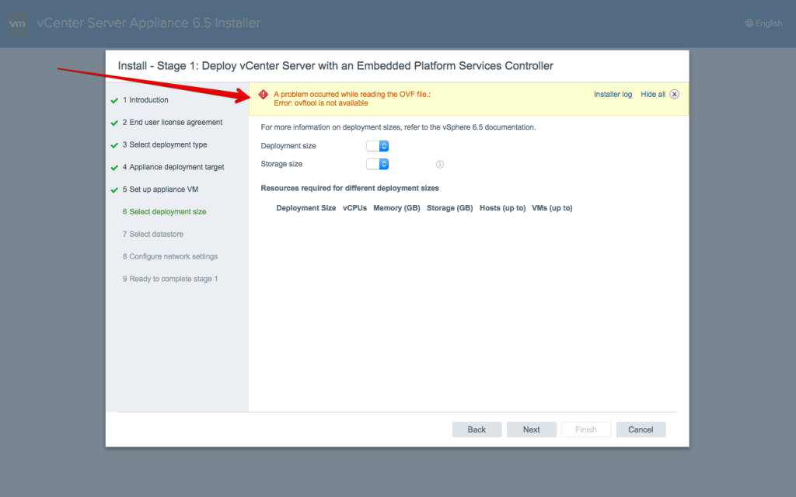
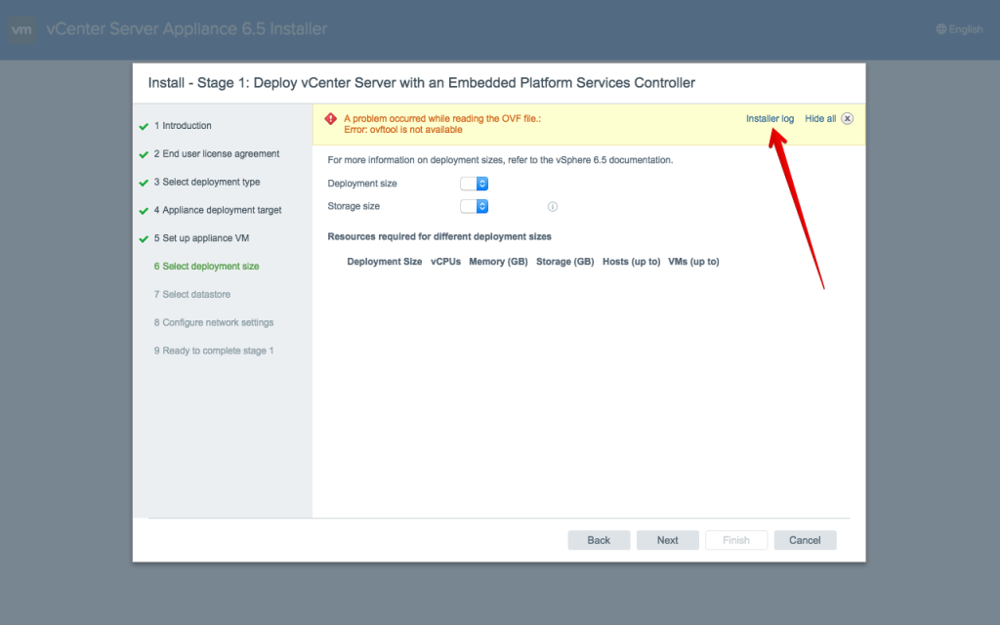
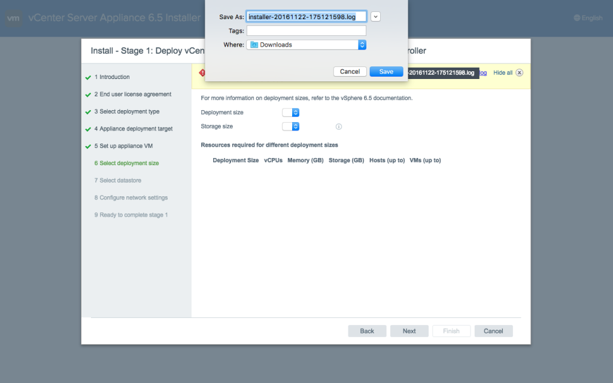
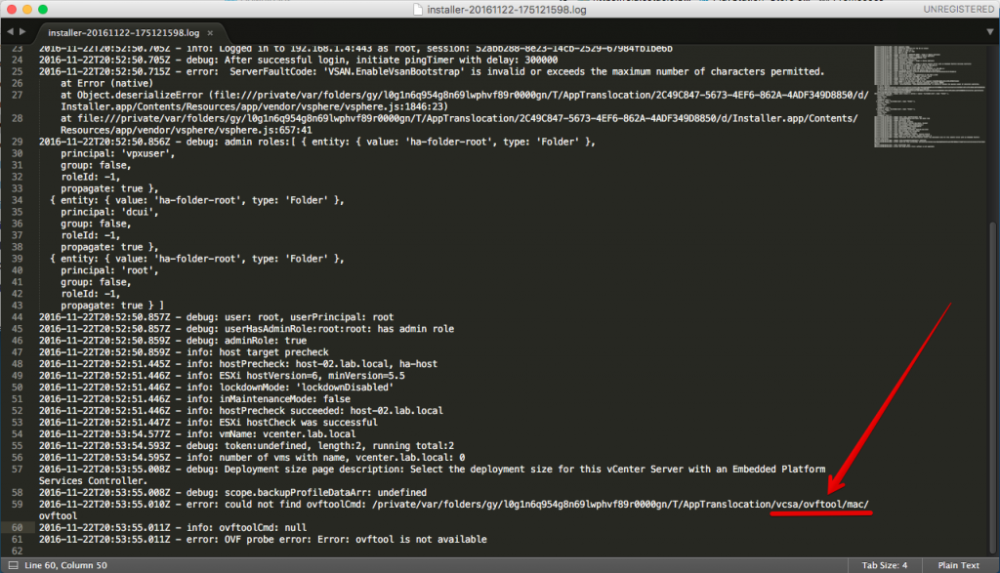
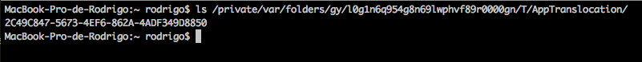
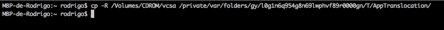
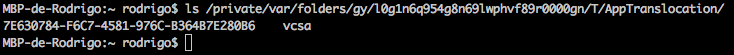

Salve Salve pessoal!

Quando estava fazendo o deploy do vCenter Server 6.5 no meu lab através do meu MacBook, tive alguns problemas durante o processo, acontece que o processo de instalação informava que o **ovftool** não estava disponível, sendo que o mesmo está dentro da ISO do VCSA 6.5.

Obs: Não tive problemas com Windows e não tentei pelo Linux.

Veja o erro abaixo:

O problema é que o programa de deploy procura o **ovftool** em um local diferente de onde o mesmo se encontra.

Para solucionar o problema siga os passos a seguir.

Precisamos analisar o arquivo de **log** e verificar o erro, clique no **Instaler log** como mostra a imagem abaixo:

Salve o arquivo de log no local desejado:

Abra o arquivo de log com um programa que desejar e veja o caminho que o processo de instalação está buscando o ovftool:

Abrindo um terminal e executando um **ls** para listar os arquivos no caminho informado, veremos que não existe o diretório **/vcsa/ovftool/mac**:

Porém o mesmo existe dentro da ISO montada, como mostra a imagem abaixo:

Bem, o processo para resolver o problema é simples, basta copiarmos o diretório **vcsa** para o caminho onde o programa de instalação está buscando, cancelar o processo de instalação e iniciar novamente.

**Porque copiar o diretório vcsa completo e não apenas o ovftool?**

Acontece que o processo de instalação também vai procurar o arquivo **.ova** dentro desse diretório, caso o mesmo não encontre o arquivo **.ova**, continuará acontecendo o mesmo erro. ;)

Copie o diretório para o caminho solicitado:

Execute um **ls** para verificar se o diretório foi copiado para o caminho correto:

Pronto, agora basta cancelar e iniciar novamente o processo de instalação.

Espero que tenha ajudado e até a próxima ;)
