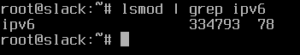
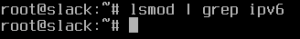

Salve Salve Pessoal!

Depois de um bom tempo sem usar o bom e velho Slackware, estou voltando para ele. (Um bom filho a casa torna :D )

Uma das coisas que sempre desabilito por padrão é o IPv6.

Para verificarmos se o modulo do IPv6 está habilitado no seu sistema, execute o seguinte comando:

```
# lsmod | grep ipv6
```

[](http://rodrigolira.eti.br/wp-content/uploads/2017/01/imagem1.png)

Como podemos verificar o modulo está habilitado.

Para desabilitar o modulo do IPv6, basta colocarmos esse modulo na blacklist, para isso execute o seguinte comando:

```
# echo "blacklist ipv6" > /etc/modprobe.d/blacklist.conf (caso o arquivo não exista)

# echo "blacklist ipv6" >> /etc/modprobe.d/blacklist.conf (caso o arquivo exista)
```

Pronto, depois disso basta reiniciar o sistema e verificar se o modulo está habilitado ou não.

```
# lsmod | grep ipv6
```

[](http://rodrigolira.eti.br/wp-content/uploads/2017/01/imagem2.png)

Como podemos ver o modulo não está habilitado, como esperado ;)

Pronto, é isso ai, espero que tenham gostado e até o próximo post :D
