Salve Salve Pessoal!

Bem, como falei no post anterior (acesse [AQUI](https://rodrigolira.eti.br/desmistificando-o-slackware-linux-parte-01/)), vamos começar a desmistificar o Slackware, nesse post vou mostrar a parte de instalação do Slackware.

Apesar de não ter uma interface gráfica "bonitinha" como algumas distribuições que encontramos hoje em dia, o processo de instalação do Slackware é tão simples quanto a instalação de uma dessas distros.

A instalação pode ser realizada de diversas formas, USB, CD/DVD, PXE e etc, em nosso caso vamos utilizar uma imagem de DVD.

Caso não possua a ISO do Slackware, você pode baixar a mesma no link abaixo:

[https://mirrors.slackware.com/slackware/slackware-iso/slackware64-14.2-iso/](https://mirrors.slackware.com/slackware/slackware-iso/slackware64-14.2-iso/)

Então vamos começar :D

**01** - Quando damos boot com o DVD, aparece algumas informações, para nós, nesse momento basta apertar o botão ENTER.

[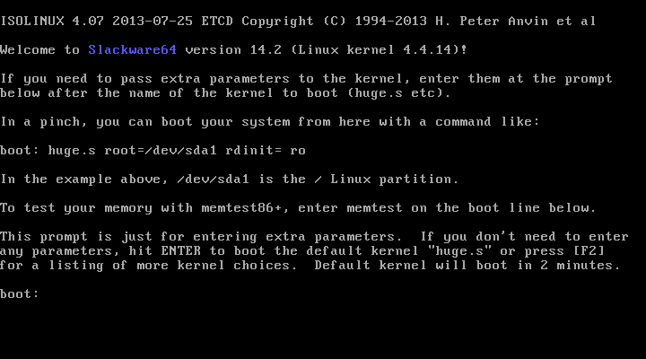](images/VirtualBox_Slackware-14-01.png)

**02** - Após dar boot, o sistema irá solicitar que você selecione o teclado desejado, se você usa um teclado que não seja com o padrão US, basta digitar "**1**" e teclar ENTER que será mostrado um menu com diversos modelos de teclado.

[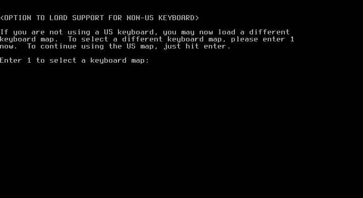](images/VirtualBox_Slackware-14-02.png)

**03** \- Selecione **br-abnt2** caso esteja usando o padrão brasileiro, e clique em **OK**.

[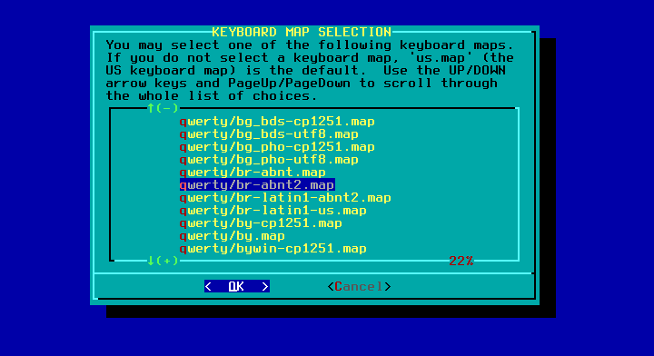](images/VirtualBox_Slackware-14-03.png)

**04** - Nesse momento é possível testar seu teclado, verificar se está no padrão correto, para isso basta sair teclando teclas aleatórios e verificar se as teclas aparecem corretamente. Depois disso basta digitar **1** e teclar **ENTER**, se tiver certeza que é o teclado desejado, caso queira corrigir, basta digitar **2** e teclar **ENTER** que você voltará para a tela anterior.

[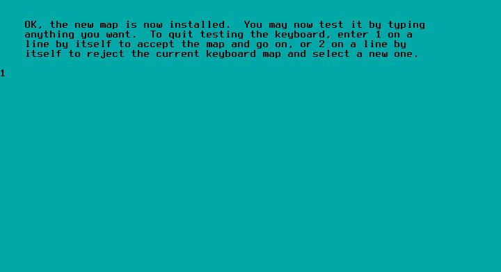](images/VirtualBox_Slackware-14-04.png)

**05** - Depois que escolher o teclado, basta digitar **root** e teclar **ENTER**.

[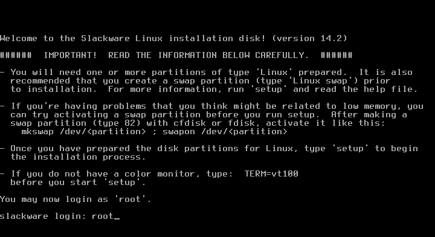](images/VirtualBox_Slackware-14-05.png)

**06** - Nesse ponto, precisamos configurar a tabela de partições, para isso nós temos vários utilitários, **cfdisk**, **fdisk** e **gdisk**, se você não está muito familiarizado com o **fdisk**, sugiro que use o **cfdisk**.

[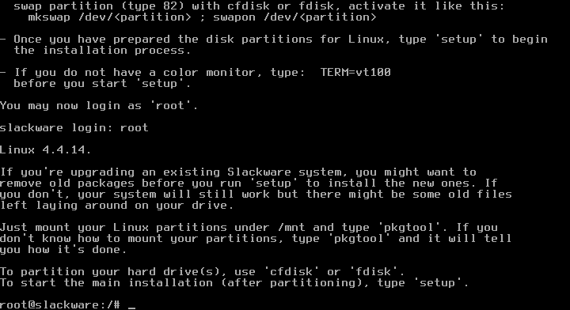](images/VirtualBox_Slackware-14-06.png)

**07** - Não vou mostrar como criar as partições, até mesmo porque é muito fácil e intuitivo com o cfdisk, mas vejam que meu disco para essa instalação é de 20G, eu deixei 512M para swap, 10G para o sistema (**/**) e 9.5G que será meu **/home**.

[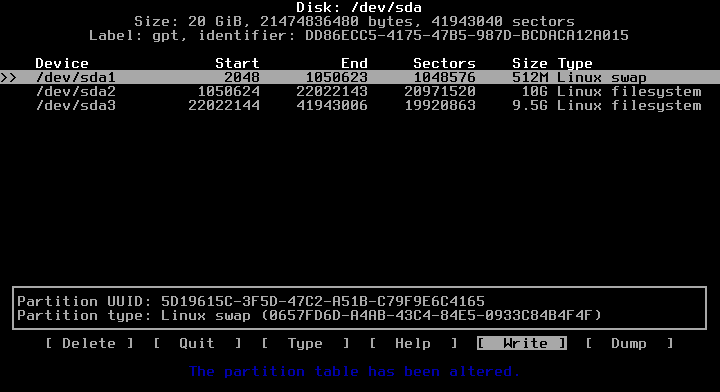](images/VirtualBox_Slackware-14-07-1.png)

**08** - Agora basta digitar o comando **setup** e teclar **ENTER**.

[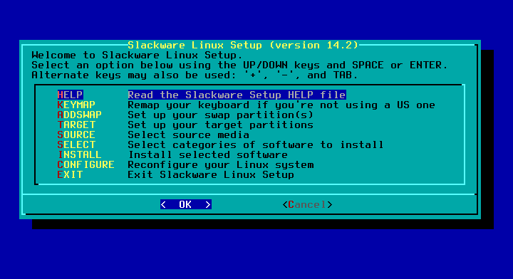](images/VirtualBox_Slackware-14-08.png)

**09** - A primeira opção é um **help** da instalação, a segunda nós já configuramos, o **teclado**, agora basta selecionar **ADDSWAP**, se você criou a partição swap corretamente, ela sera detectada automaticamente, basta dar OK.

[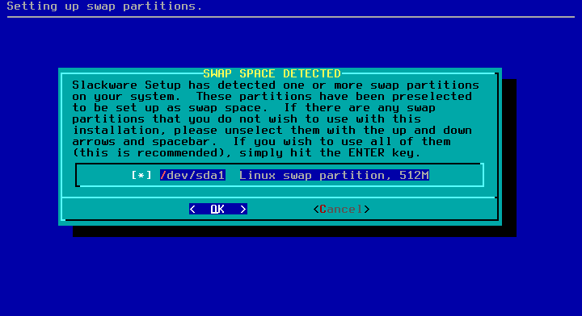](images/VirtualBox_Slackware-14-09.png)

**10** - Responda não para checagem de **bad blocks** na partição swap.

[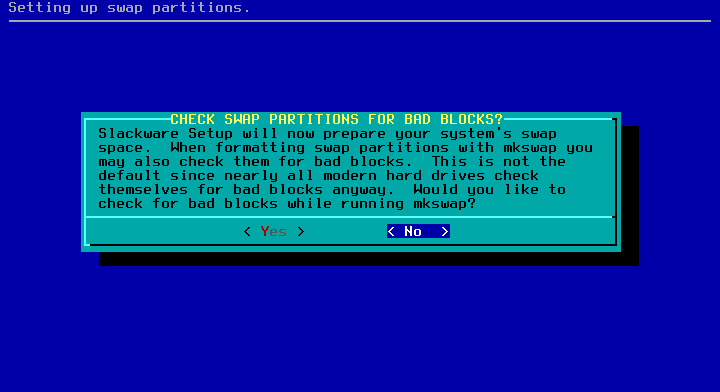](images/VirtualBox_Slackware-14-10.png)

**11** - Como será a entrada no **/etc/fstab** da partição swap.

[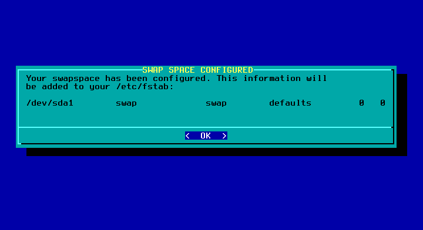](images/VirtualBox_Slackware-14-11.png)

**12** - Agora selecione a partição que o sistema será instalado, a partição **raiz (/)**, em nosso caso o **/dev/sda2**.

[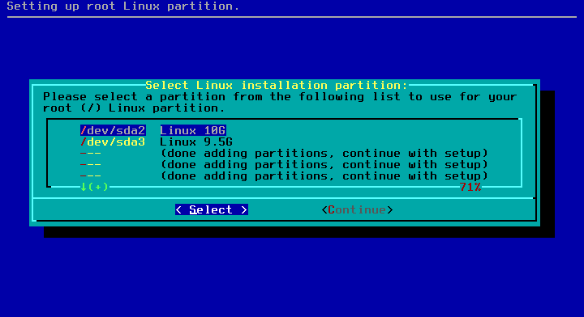](images/VirtualBox_Slackware-14-12.png)

**13** - Formate a partição.

[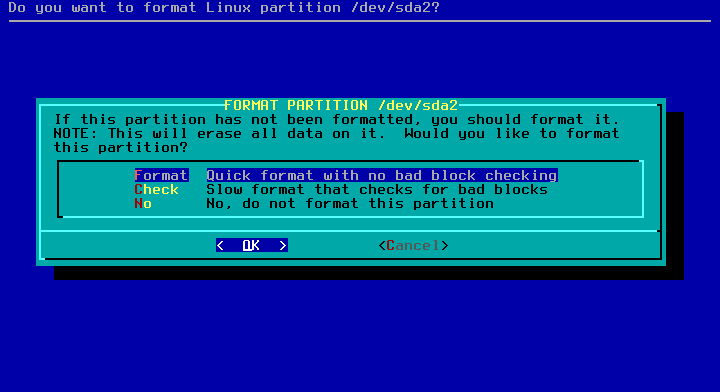](images/VirtualBox_Slackware-14-13.png)

**14** - Selecione o sistema de arquivos, nosso caso **ext4**.

**15** - Agora selecione a outra partição, que será nosso **/home**.

[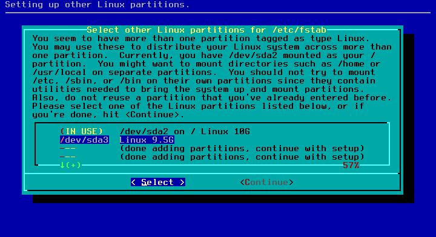](images/VirtualBox_Slackware-14-15.png)

**16** - Formate a partição.

**17** - Selecione o sistema de arquivos.

[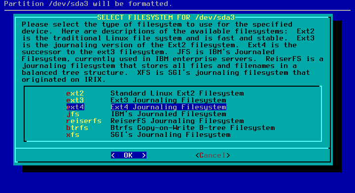](images/VirtualBox_Slackware-14-17.png)

**18** - Agora defina o ponto de montagem no sistema, em nosso caso o **/home**, como falado anteriormente.

[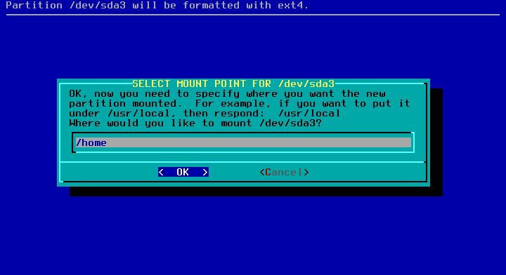](images/VirtualBox_Slackware-14-18.png)

**19** - Entrada no **/etc/fstab** das partições.

[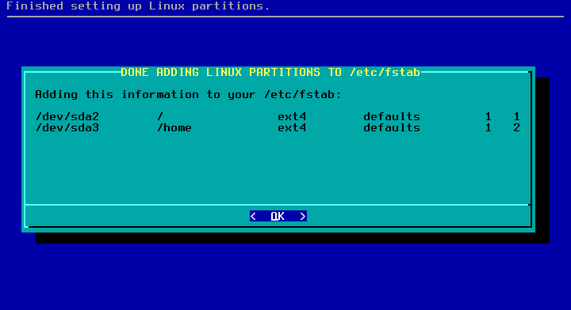](images/VirtualBox_Slackware-14-19.png)

**20** - Agora selecione a fonte de instalação, em nosso caso é **DVD**, se estivesse usando um pendrive seria **USB**.

[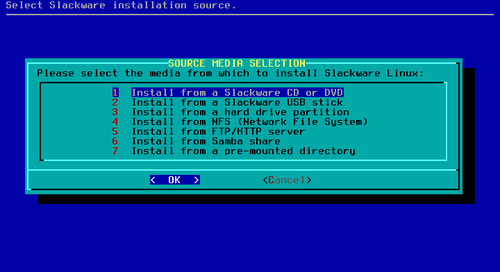](images/VirtualBox_Slackware-14-20.png)

**21** - Deixe como **auto** para scannear a procura da unidade de CD e DVD automaticamente.

[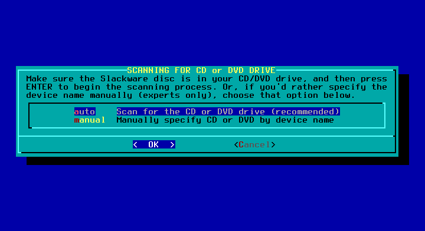](images/VirtualBox_Slackware-14-21.png)

**22** - Selecione os pacotes que deseja instalar, em nosso caso deixe todos marcados.

[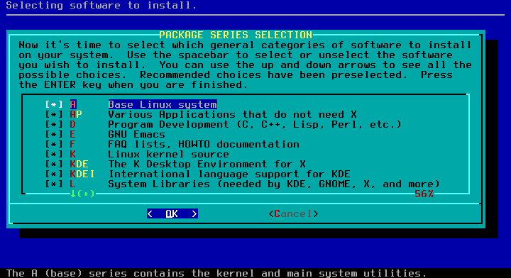](images/VirtualBox_Slackware-14-22.png)

**23** - Selecione o modo de instalação, deixe como **full**.

[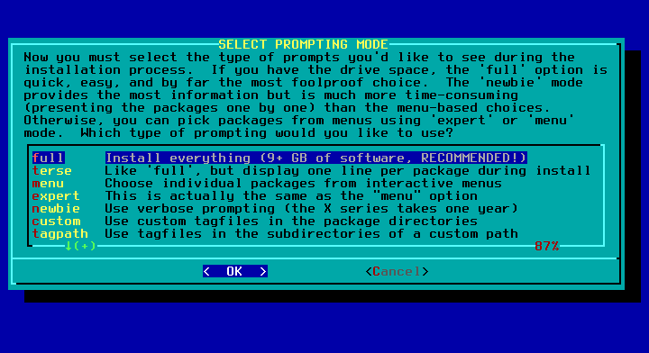](images/VirtualBox_Slackware-14-23.png)

**24** - Após a instalação dos pacotes terminar é possível criarmos um disco **USB FLASH BOOT**, em nosso caso não é necessário, selecione **Skip**.

[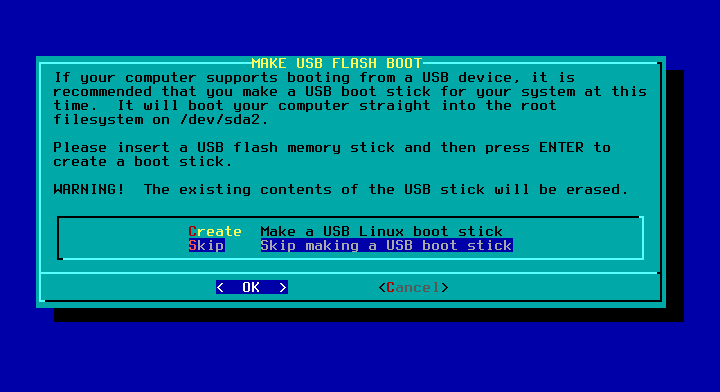](images/VirtualBox_Slackware-14-24.png)

**25** - Selecione o modo de instalação do **LILO**, pode deixar como **simple** mesmo.

[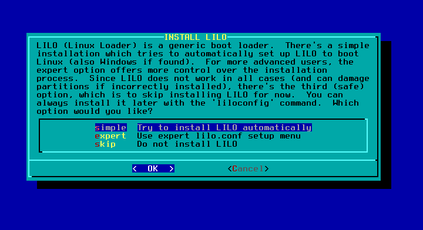](images/VirtualBox_Slackware-14-25.png)

**26** - Configure o frame, deixe como **standard** mesmo.

[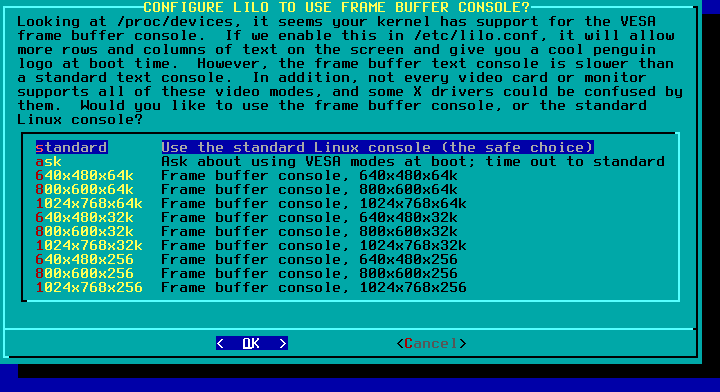](images/VirtualBox_Slackware-14-26.png)

**27** - Aqui podemos passar parâmetros de inicialização do **LILO**.

[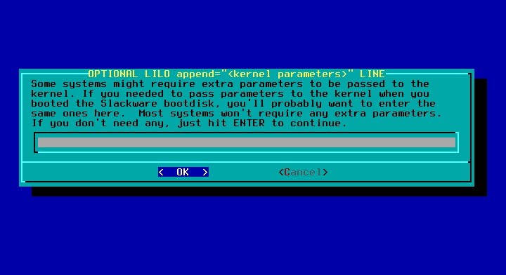](images/VirtualBox_Slackware-14-27.png)

**28** - Selecione o uso de **UTF-8** no console.

[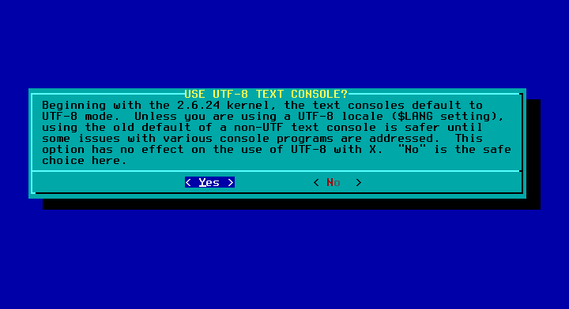](images/VirtualBox_Slackware-14-28.png)

**29** - Selecione o local de instalaçãodo **LILO**, em nosso caso **MBR**.

[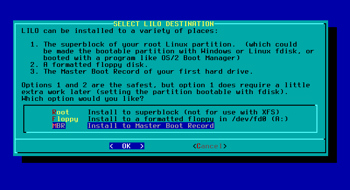](images/VirtualBox_Slackware-14-29.png)

**30** - Selecione a configuração do mouse, pode deixar no padrão, **imps2**.

[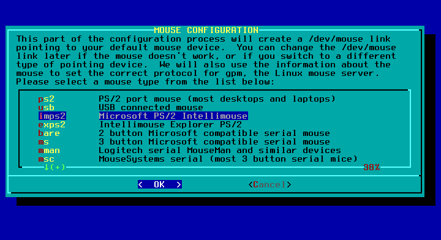](images/VirtualBox_Slackware-14-30.png)

**31** - Se desejar habilite o **GPM**, em nosso caso vamos deixar como **Yes**.

[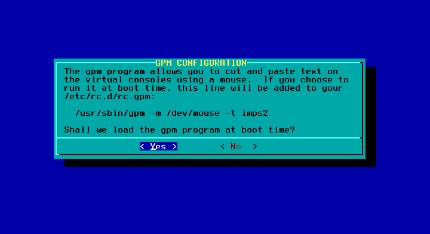](images/VirtualBox_Slackware-14-31.png)

**32** - Selecione **Yes** para realizar as configurações de rede.

[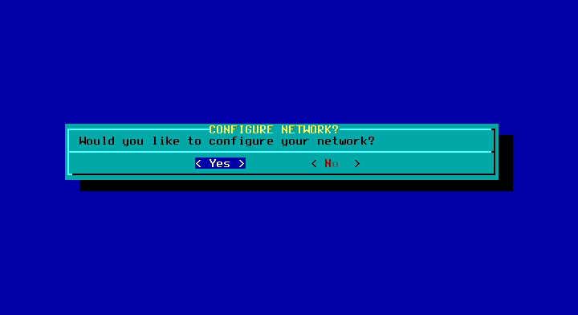](images/VirtualBox_Slackware-14-32.png)

**33** - Configure o **hostname**.

[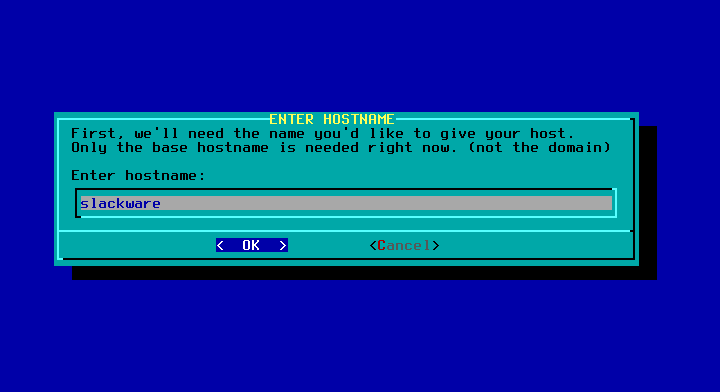](images/VirtualBox_Slackware-14-33.png)

**34** - Configure o **domain name**.

[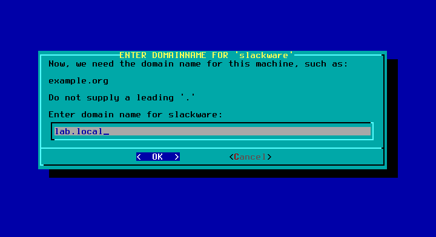](images/VirtualBox_Slackware-14-34.png)

**35** - Selecione o tipo de configuração, **DHCP**, **IP estático** e etc, em nosso caso, vamos utilizar o **NetwokManager**, em outros momentos vamos ver outras configurações.

[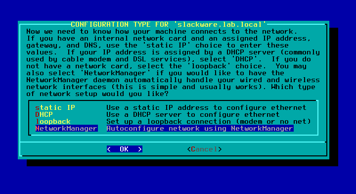](images/VirtualBox_Slackware-14-35.png)

**36** - Selecione **Yes** para confirmar as configurações.

[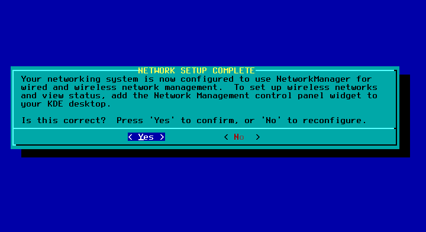](images/VirtualBox_Slackware-14-36.png)

**37** - Selecione os serviços que deseja que sejam iniciados junto com o sistema, vamos deixar no padrão.

[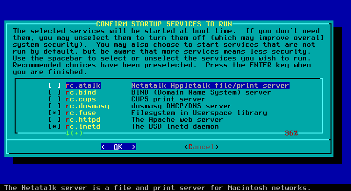](images/VirtualBox_Slackware-14-37.png)

**38** - Caso deseje configurar uma fonte especifica para o console, selecione **Yes**, no nosso caso vamos deixar como **No**.

[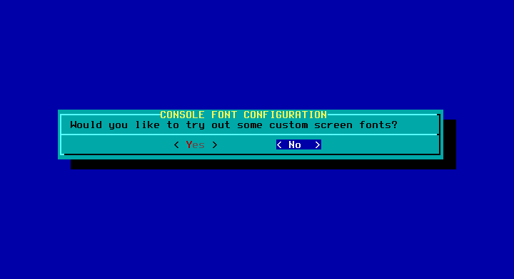](images/VirtualBox_Slackware-14-38.png)

**39** - Vamos configurar a hora usando a localidade, selecione **NO**.

[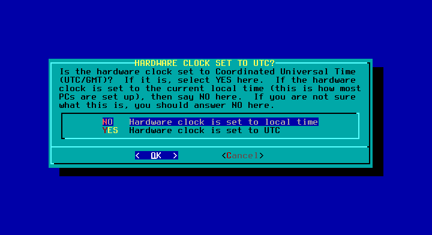](images/VirtualBox_Slackware-14-39.png)

**40** - Selecione o seu **timezone**, no meu caso é **America/Recife**, não tem João Pessoa/PB :P

[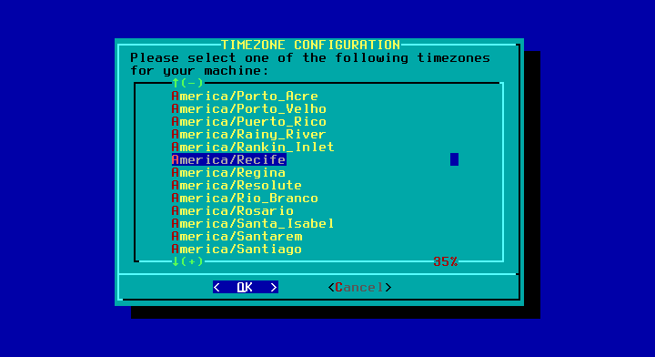](images/VirtualBox_Slackware-14-40.png)

**41** - Selecione o ambiente gráfico desejado, vamos deixar como **XFCE** por enquanto.

[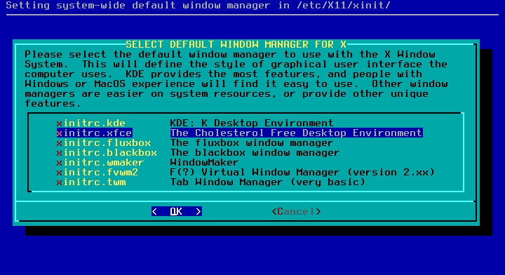](images/VirtualBox_Slackware-14-41.png)

**42** - Selecione **Yes** para configurar a senha de root.

[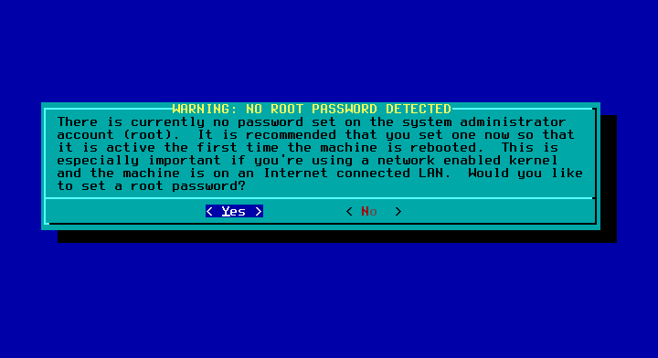](images/VirtualBox_Slackware-14-42.png)

**43** - Digite a senha para o usuário root.

[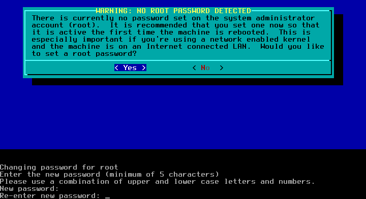](images/VirtualBox_Slackware-14-43.png)

**44** - Instalação Finalizada :D

[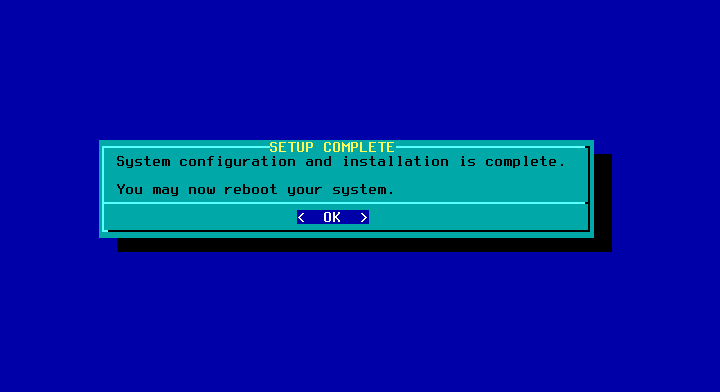](images/VirtualBox_Slackware-14-44.png)

**45** - Selecione **EXIT** para sair da instalação.

[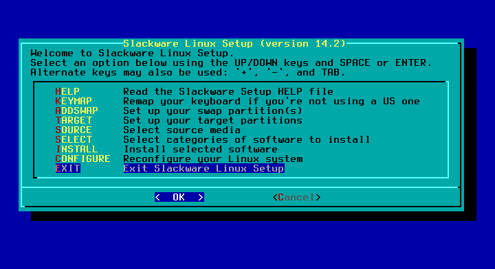](images/VirtualBox_Slackware-14-45.png)

**46** - Por fim, **OK** para remover o disco de instalação.

[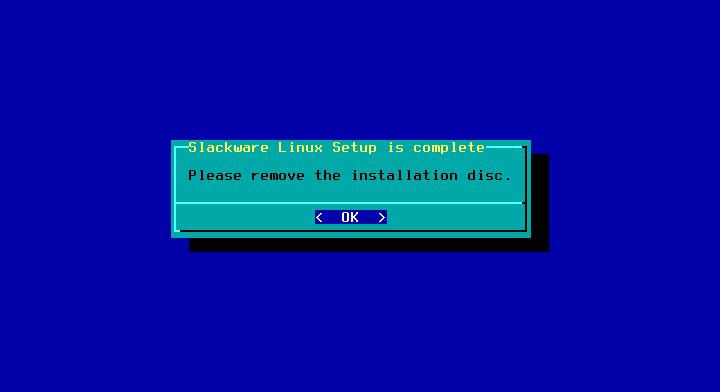](images/VirtualBox_Slackware-14-47.png)

**47** - Selecione **Yes** para reiniciar o sistema.

[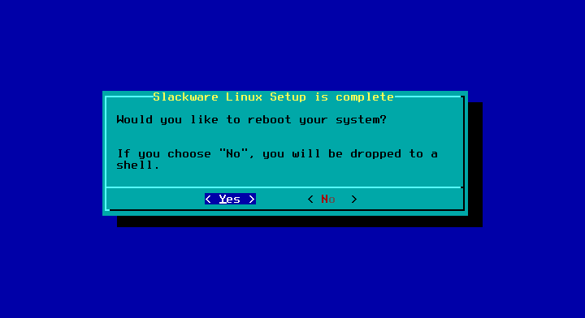](images/VirtualBox_Slackware-14-48.png)

Pronto, Slackware instalado com sucesso!

No próximos post vamos ver como configurar a atualizar o sistema, traduzir para português e inicializar em modo gráfico.

Mais detalhes sobre os passos de instalação do Slackware no link abaixo:

[http://slackbook.org/html/installation.html](http://slackbook.org/html/installation.html)

Até a próxima! :D
