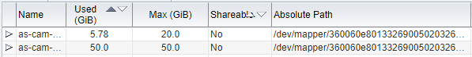
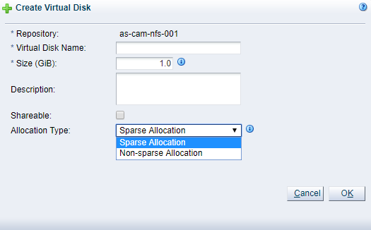
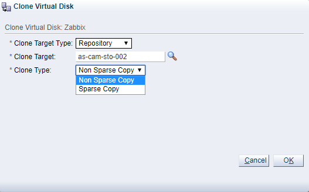
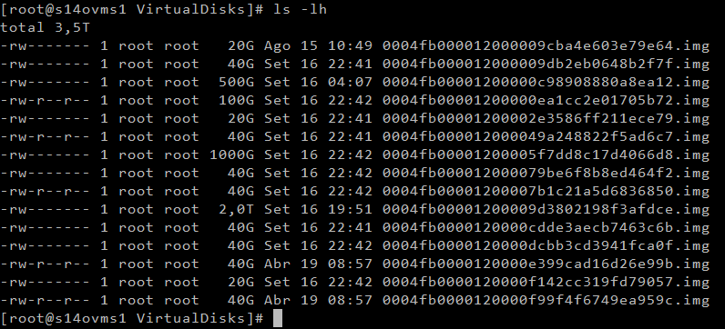
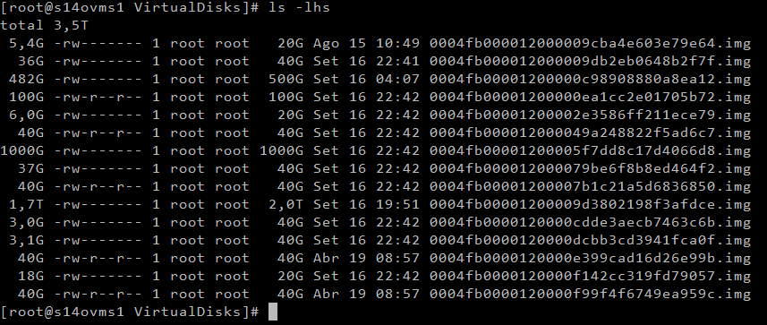
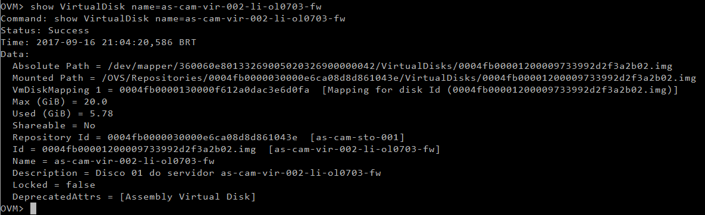

Salve Salve Pessoal!

No Oracle VM quando criamos um disco virtual para uma maquina virtual, é possível escolhermos entre dois tipos, sparse ou non-sparse, mas qual a diferença entre esses dois tipos de discos virtuais?

**sparse** - é um arquivo de imagem de disco de um disco físico, ocupando apenas a quantidade de espaço realmente em uso, não o tamanho de disco especificado.

**non-sparse** -  é um arquivo de imagem de disco de um disco físico, ocupando o espaço equivalente ao tamanho de disco especificado, incluindo blocos vazios.

A imagem abaixo simplifica um pouco, a primeira vm está com o disco no formato sparse e a segunda vm está com o disco no formato non-sparse.

[](http://rodrigolira.eti.br/wp-content/uploads/2017/09/01.png)

Por padrão quando vamos criar os discos, eles são criados como sparse.

[](http://rodrigolira.eti.br/wp-content/uploads/2017/09/02.png)

O padrão de clone de disco é o contrário de quando criamos um disco, é como non-sparse.

[](http://rodrigolira.eti.br/wp-content/uploads/2017/09/03.png)

Nós também podemos verificar se o disco está em sparse ou non-sparse usando o comando **ls**. Usando o **ls -lh** ele lista os discos e mostra o tamanho em formato humano. Porém apenas o tamanho total do arquivo.

```
# ls -lh
```

[](http://rodrigolira.eti.br/wp-content/uploads/2017/09/04.png)

Mas se colocamos a opção **\-s** o **ls** mostrará também o tamanho em blocos alocados.

```
# ls -lhs
```

[](http://rodrigolira.eti.br/wp-content/uploads/2017/09/05.png)

Também podemos verificar o tamanho dos discos usando a CLI do Oracle VM Manager.

```
OVM> show VirtualDisk name=as-cam-vir-002-li-ol0703-fw
```

[](http://rodrigolira.eti.br/wp-content/uploads/2017/09/06.png)

Bem, é isso ai, espero que tenham gostado, em caso de dúvidas escreva um comentário.

Até a próxima :D
