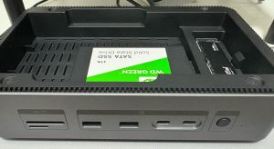
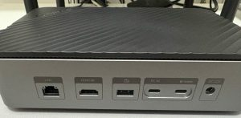
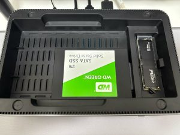

**Salve Salve Pessoal!**

Recentemente comprei um **MacBook Air com chip M4**, e uma das minhas maiores dificuldades está sendo me acostumar com a **falta de espaço em disco**.

No meu antigo ThinkPad E490, eu usava um **SSD NVMe** de **4TB**, então dava pra guardar tudo com folga, projetos, backups, máquinas virtuais, vídeos, etc, sem stress.

Quando fiz a troca, retirei o SSD do ThinkPad e comecei a usá-lo através de um adaptador USB-C. Quebrou o galho por um tempo, mas não era o ideal, esquentava demais, e a estética era algo que me pertubava e não combinava com o meu setup. :D

Foi então que, durante minhas andanças pela internet, me deparei com o **Docking Station ORICO D35M2**.

O que mais me chamou a atenção, e fez toda a diferença no meu caso, foi a possiblidade de armazenamento, tanto para discos **NVMe** quanto **SATA**, além da grande variedade de portas disponíveis.

Algumas fotos dele abaixo:

  

Alguns detalhes sobre ele.

**Modelo:** ORICO-D35M2 **Cor:** Black **Material:** Aluminium Alloy, ABS **Interface de Comunicação:** Type-C **Interfaces de Conexão:**  Type-C 10Gbps\*2, USB-A 10Gbps\*3, HDMI 4K@60Hz\*1, 1000M RJ45\*1, SD 3.0 Slot\*1, TF 3.0 Slot\*1, SATA3.0\*1, M.2 Biprotocol Interface\*1 **Taxa de Transmissão:** 10Gbps **Power Interface:** DC 12V/3A, Type-C PD100W **Suporte da Capacidade de Armazenamento:** 8TB M.2 SSD, 18TB 2.5"/3.5" HDD **Suporte a Sistemas Operacionais:** Windows, Linux, Mac OS, Android **Dimensões:** 220\*141\*59.5mm

Para maiores informação de velocidades de conexão, suporte, etc, acessem o link abaixo.

[https://orico.cc/index/product/detail/3560.html](https://orico.cc/index/product/detail/3560.html)

Até o próximo post!

:D
