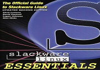

Salve Salve Pessoal!

Vim aqui para falar um pouco sobre a documentação do Slackware, ao contrario do que todo mundo pensa e fala o Slackware não é um Sistema Operacional difícil de utilizar, eu particularmente considero fácil, o problema é que grande parte das pessoas que começam a utilizar o sistema não tem a coragem de ler a documentação, isso não é exclusividade do Slackware e sim de todas as distros Linux que temos no mercado hoje, ler a documentação da sua distribuição deveria ser a primeira coisa a ser feita antes de utiliza-la.

O Slackware possui o "Slackware Book Project" que está disponível online e ao alcance de todos no seguinte endereço:

[http://www.slackbook.org/](http://www.slackbook.org/)

Existe também um projeto de tradução para português Brasil que fica no endereço abaixo:

[http://slackbookptbr.sourceforge.net/](http://slackbookptbr.sourceforge.net/)

E você tem a opção de comprar o livro oficial na loja do Slackware no endereço abaixo:

[https://store.slackware.com/cgi-bin/store](https://store.slackware.com/cgi-bin/store)

Pois bem, agora você não tem mais como reclamar.

Até a próxima!
