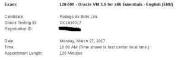

Salve Salve Pessoal

Depois de um tempinho sem postar nada e sem estudar também, estou de volta.

Para começar bem o ano, vamos começar fazendo mais uma prova, o exame do Oracle VM, o 1Z0-590 - Oracle VM 3.0 for x86 Essentials.

Fazia tempo que vinha querendo fazer essa prova :D

Tentarei fazer um bom resumo e colocar tudo aqui no blog.

Me desejem sorte, até a próxima ;)
