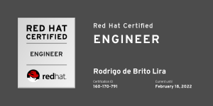
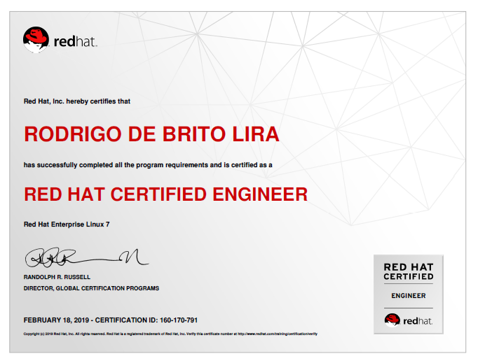

Salve Salve Pessoal!

É com muito prazer, muito prazer mesmo que escrevo esse post, quem segue meu blog há algum tempo, deve ter visto um post meu quando fiquei reprovado no Exame RHCE, se você não viu esse post e tem interesse, acesse o link abaixo:

https://rodrigolira.eti.br/exame-rhce-reprovado/

Porém o post de hoje é para informar que fiz o exame novamente e dessa vez eu passei :D

Agradeço muito a todos vocês que seguem meu blog e que torcem por mim.

As dicas que posso comentar sobre o exame, falei no post quando fui reprovado, por enquanto é apenas isso.

Até a próxima!

:D

