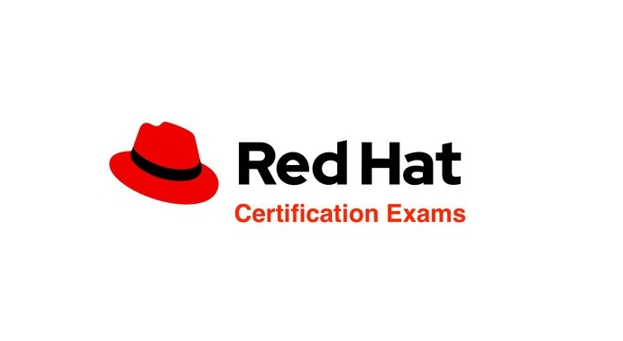

Salve Salve Pessoal!

Passando aqui rapidinho para informar que a partir de agosto a Red Hat vai começar a disponibilizar seus exames online.

Começara oferecendo quatro exames:

- **Red Hat Certified System Administrator exam (EX200)**
- **Red Hat Certified Engineer exam (EX294)**
- **Red Hat Certified Specialist in OpenShift Administration (EX280)**
- **Red Hat Certified Specialist in OpenShift Application Development (EX288)**

Particularmente fico muito feliz com isso, como moro em João Pessoa/PB quando quero fazer um exame preciso ir até São Paulo/SP para fazer o exame, ou seja, além do custo com a prova que não é barata (**R$ 1.200,00**) ainda tinha o custo com, passagens, hospedagem, alimentação e transporte.

Para mais informações acessem o link abaixo:

https://servicesblog.redhat.com/2020/05/15/first-look-at-red-hat-remote-certification-exams/

Até o próximo post!

:D
