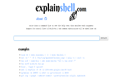

Salve Salve pessoa!

Seguinte, o site explainshell.com é um site onde você pode digitar a linha de comando em shell e ele retorna a ajuda que corresponde a cada argumento, o site é muito bacana vale a pena dar uma olhada.

Segue o link abaixo:

[http://explainshell.com/](http://explainshell.com/)

Até a próxima!
