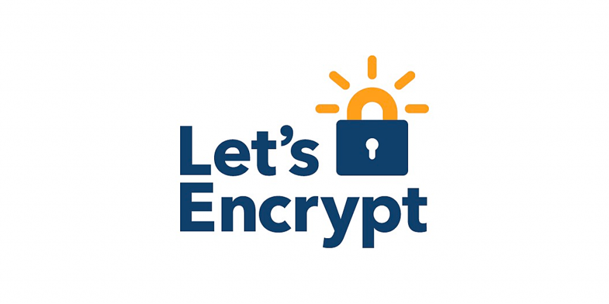

Salve Salve Pessoal!

A ferramenta de hoje é sem dúvida nenhuma, umas das mais essenciais para quem trabalha com **Linux** e precisa trabalhar com certificados **Let’s Encrypt**, vamos falar do **acme.sh**.

O **acme.sh** é um script que torna fácil a emissão e gerenciamento de certificados **Let’s** **Encrypt**, está disponível para diversos sistemas operacionais, entre eles **Linux**, **Windows**, **BSDs**, **Solaris**, etc.

É uma ferramenta muito versátil e com certeza vai facilitar sua vida se você usa **Let’s Encrypt**.

É desenvolvida puramente em **Shell Script**, não precisa ser executada com permissão de root ou com sudo, tem suporte a docker, ipv6, certificados coringas e etc.

Acessem o link do projeto abaixo e sejam felizes.

[https://github.com/acmesh-official/acme.sh](https://github.com/acmesh-official/acme.sh)

Até o próximo post!

:D
