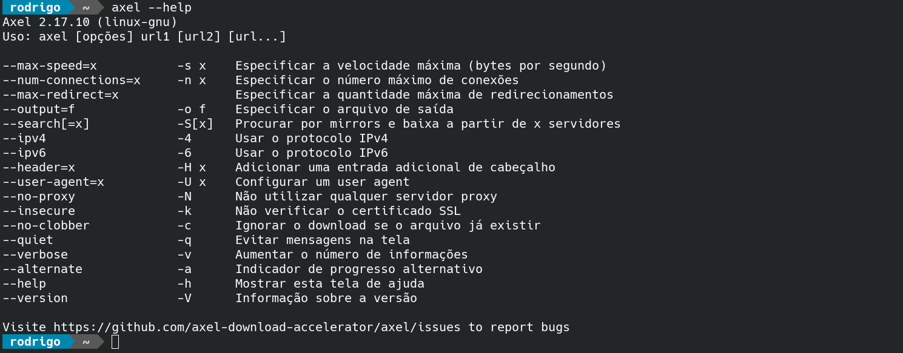

Salve Salve Pessoal!

O dia a dia está bem corrido ultimamente, então decide fazer pequenos posts sobre as ferramentas que uso no meu dia a dia para manter o blog atualizado, serão textos rápidos e bem diretos que podem acabar ajudando alguém.

Para começar vou falar sobre o **Axel**.

**Axel** é uma ferramenta de linha de comandos para fazer download de arquivos, nada demais nisso né! :)

Porém o que mais gosto dele é a possibilidade de especificar o número de conexões simultâneas.

Para fazer o download de uma ISO podemos especificar e abrir 100 conexões ao mesmo tempo com o servidor de destino.

**\# axel -n 100 URL**

Exemplo:

```
# axel -n 100 https://slackware.uk/people/alien-current-iso/slackware64-current-iso/slackware64-current-mini-install.iso
```

Existe diversas outras possibilidades de utilização do **Axel**, para saber mais basta executar o **help**.

```
# axel --help
```

[](images/axel.png)

Até a próxima!

:D
