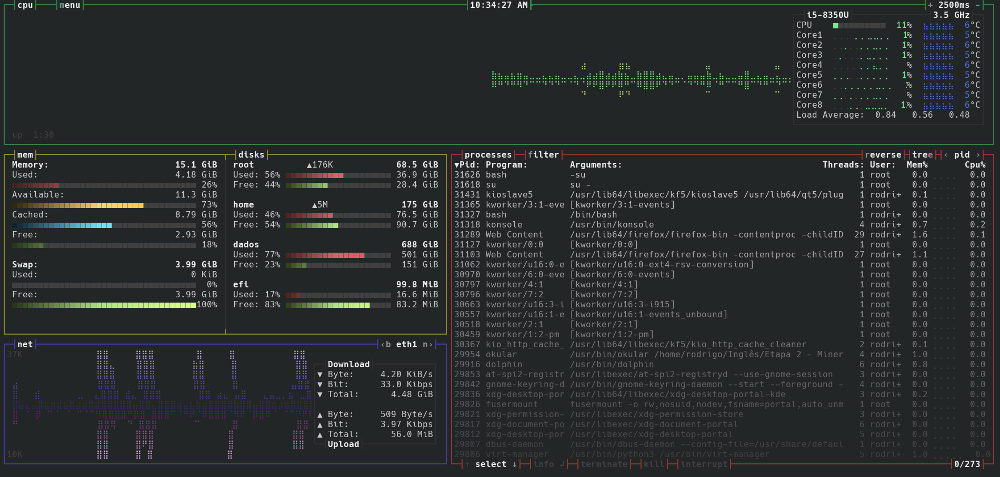

Salve Salve Pessoal!

Dando continuidade as ferramentas do dia a dia com Linux, hoje eu vou falar do **BASHTOP**.

**BASHTOP** é um monitor de recursos do sistema operacional.

Com ele você consegui visualizar o uso de recursos do processador, disco, memória, rede e processos em execução.

Além de possuir uma interface bem amigável.

Apesar de parecer uma ferramenta simples ela é bem interessante pois temos várias opções de filtros e configurações.

Além de estar disponível para **Linux**, **BSD** e **MacOS**.

Segue abaixo o link para o projeto.

[https://github.com/aristocratos/bashtop/](https://github.com/aristocratos/bashtop/)

Até o próximo post!
